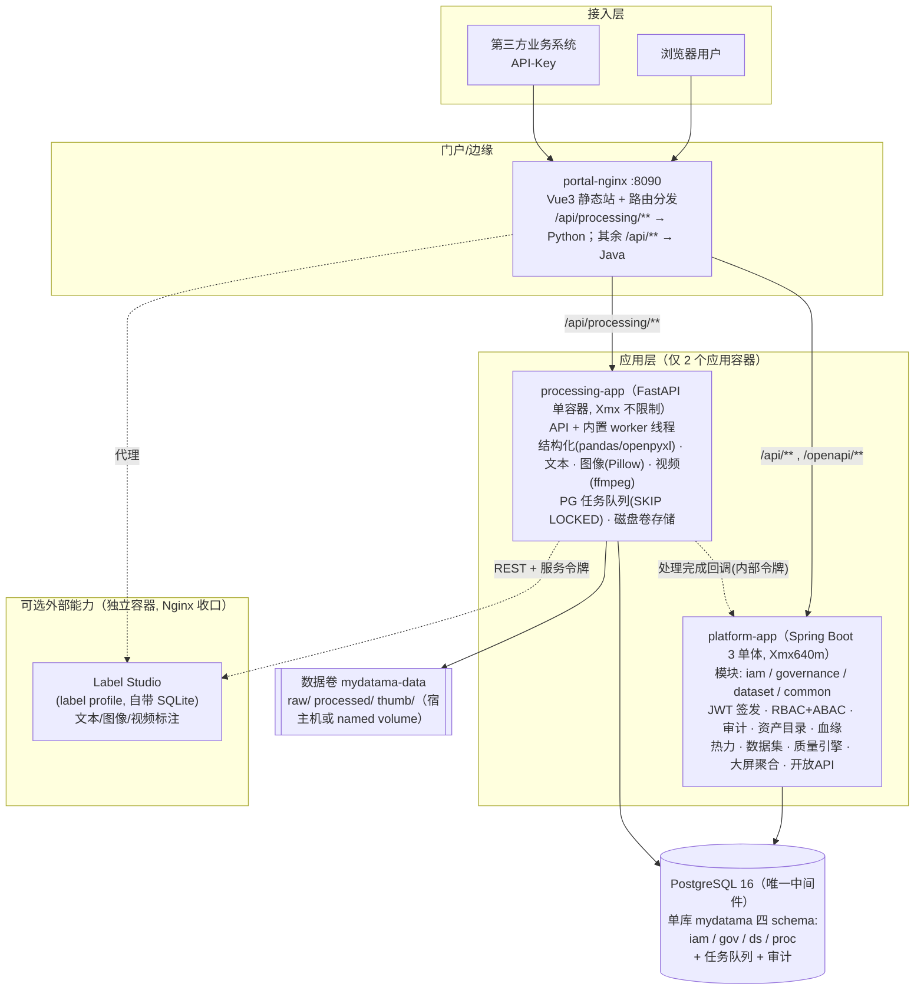
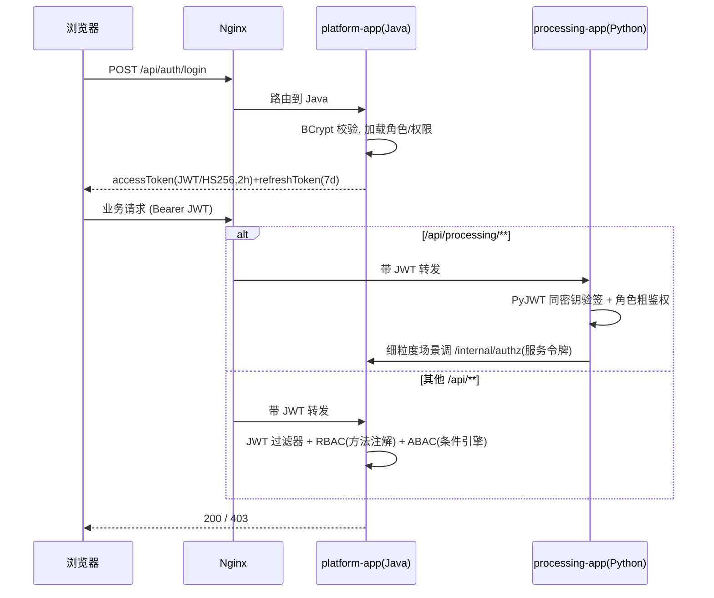
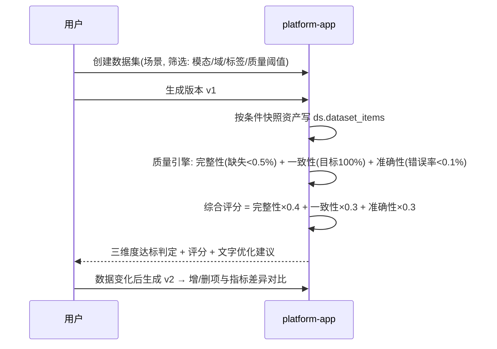
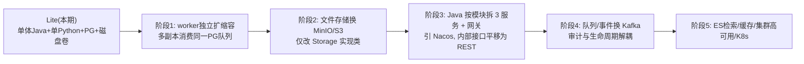

# 企业级多模态数据中台 MVP（Lite 演示架构）— 详细设计文档

> 版本：v1.0（评审稿）　日期：2026-09-29
> 架构定位：**极简演示优先**——全系统容器稳态内存 ≤ 2.5GB（整机含 OS/Docker ≤ 6GB，8GB 内存机器可流畅运行），外部中间件仅 1 个 PostgreSQL；模块边界保持清晰，可平滑演进到微服务版。
> 配套文档：[02-部署文档与演示指南-V0.1.md](./02-部署文档与演示指南-V0.1.md)、[03-系统部署开销评估报告.md](./03-系统部署开销评估报告.md)

---

## 1. 文档目的与范围

本文档描述数据中台 MVP 的技术架构、模块职责、核心业务流程、数据模型、接口设计、安全审计设计与扩展点，作为编码实施与评审的直接依据。

**MVP 范围内（本期必交付）**：
- 用户登录认证（JWT）、RBAC 权限、ABAC 简单条件判定、操作审计；
- **结构化数据**：CSV / JSON / Excel（xlsx/xls）上传、解析、标准化、按列自动脱敏；
- **多模态数据**：文本、图像、视频的接收、存储、基础处理（清洗/标准化/脱敏/元数据提取/缩略图）；
- 智能标注（Label Studio 容器集成，**可选 profile，开启后整机仍 ≤ 8GB**）；
- 自动化处理流水线（进程内异步、五阶段可观测、失败可重试）；
- 资产目录（自动盘点、检索、分类、密级、血缘、使用热力）；
- 训练数据集构建、版本管理、质量报告（完整性/一致性/准确性 + 评分建议）；
- **自研可视化大屏**（实时指标、趋势、交互，零外部 BI 依赖）；
- Docker Compose 一键部署（仅依赖 PostgreSQL 一个外部组件）。

**MVP 范围外（预留扩展，不在本期验收）**：微服务拆分（Nacos/Kafka）、MinIO/对象存储、Elasticsearch、字段级血缘、大数据分布式抽样、DataEase 容器（8GB 预算外的独立增强项）、OIDC 单点、Kubernetes/生产高可用、AllData 全量治理栈。

---

## 2. 总体架构（Lite）

### 2.1 架构图



**全系统运行容器（core 档）只有 4 个**：`postgres`、`platform-app`（Java）、`processing-app`（Python）、`portal-nginx`；label 档再加 1 个 `label-studio`。

### 2.2 与微服务版的取舍对照

| 能力 | 微服务版做法 | Lite 版做法（本期） | 为什么演示场景成立 |
|---|---|---|---|
| 服务发现/配置 | Nacos | 固定容器名 + 环境变量，Compose 内部 DNS | 4 个容器，地址不变 |
| 异步任务 | Kafka | PostgreSQL 队列表 `proc.job_queue` + `FOR UPDATE SKIP LOCKED` 轮询（1–2s） | 演示任务量小，PG 行锁足够，且天然持久化、重启不丢任务 |
| 缓存/限流/登录锁定 | Redis | Java 进程内 Caffeine 缓存 + 本地令牌桶限流器 + 数据库失败计数 | 单实例无状态诉求弱 |
| 文件存储 | MinIO | 宿主机挂载卷 `/data`（raw/processed/thumb 三目录），FastAPI 受控下载 | 单机演示足够；代码走 `Storage` 接口，生产可换 S3/MinIO |
| Java 服务 | gateway+iam+governance+dataset 四个 JVM | **一个可执行 Jar**，Maven 多模块（包级隔离，模块间只走接口） | 省约 1.5GB 内存与启动时间；模块边界保留 |
| 认证 | 网关统一 JWT | Nginx 按路径分发；Java 签发 JWT，**Python 用同一 HMAC 密钥本地验签**（PyJWT） | 对称密钥仅容器内环境变量持有 |
| 检索 | Elasticsearch | PostgreSQL ILIKE + pg_trgm 索引 | MVP 数据量（万级资产）毫秒响应 |
| 生命周期事件 | Kafka topic | Python 处理完成后**同步回调** Java 内部接口 `/internal/assets/register`（失败指数退避重试 5 次） | 只有两个应用，同步回调最简单可观测 |
| 审计 | Kafka 汇聚 | Java 审计过滤器直写 PG；Python 侧动作调 Java `/internal/audit` | 同上 |

### 2.3 模块清单（部署形态 vs 逻辑模块）

| 逻辑模块 | 所在部署单元 | 主要职责 |
|---|---|---|
| common | platform-app | 统一响应/异常/JWT/RBAC 注解/ABAC 引擎/审计/MyBatis 基类 |
| iam | platform-app | 用户、角色、权限、ABAC 策略、API Key、登录、审计落库与检索 |
| governance | platform-app | 资产目录、元数据、标准、血缘、热力、质量规则、开放 API、**大屏聚合接口** |
| dataset | platform-app | 数据集选取、版本快照、质检引擎、评分建议、版本对比 |
| processing-api | processing-app | 上传、文件/任务/标注查询、重试、受控文件下载 |
| processing-worker | processing-app（同容器后台线程） | 抢队列任务，执行五阶段流水线，回调资产登记，回拉标注 |
| portal-web | portal-nginx | Vue3 门户 + ECharts 大屏 |
| Label Studio | 独立容器（可选） | 标注 UI/存储，Nginx 代理 + 令牌注入，**端口不对外** |

---

## 3. 核心业务流程

### 3.1 登录认证与鉴权流程



### 3.2 数据上传与自动化处理流程（结构化 + 多模态统一链路）

```mermaid
flowchart LR
    A["上传文件<br/>CSV/JSON/Excel/TXT/图像/视频"] --> B["processing-app<br/>存 /data/raw, 写 proc.data_files"]
    B --> Q["插入 proc.job_queue(status=PENDING)"]
    Q --> W["worker 线程<br/>SKIP LOCKED 抢占"]
    W --> S1["①采集校验<br/>类型/编码/大小白名单"]
    S1 --> S2["②清洗<br/>去BOM/空行/去重/坏行隔离"]
    S2 --> S3["③标准化<br/>UTF-8/列名归一/格式统一/转码"]
    S3 --> S4["④脱敏<br/>敏感列/正则掩码, EXIF/视频标签剥离"]
    S4 --> S5["⑤标注登记<br/>建LS任务(可选)/缩略图/元数据"]
    S5 --> E["成品写 /data/processed"]
    E --> CB["回调 Java /internal/assets/register<br/>(资产入库+血缘边+使用统计)"]
    CB --> OK["任务置 SUCCEEDED, 写指标"]
    CB -.失败.-> RT["退避重试, 5次失败置 FAILED 并记录原因"]
```



任务状态：`PENDING → RUNNING（五阶段逐步更新）→ SUCCEEDED / FAILED`，前端 3s 轮询；队列并发：worker 线程数默认 2（环境变量可调），同一时刻处理 2 个任务。

**各类型处理动作明细（MVP）**：

| 类型 | 格式 | 清洗/标准化 | 脱敏动作 | 产出指标 |
|---|---|---|---|---|
| 结构化 | csv、json、xlsx、xls | pandas 解析；chardet 编码探测转 UTF-8；列名 trim/下划线归一；去全空行列；去重；日期/数值格式归一；坏行入隔离记录 | **列名+内容双识别敏感列**（手机/身份证/银行卡/邮箱/姓名），支持掩码、sha256 哈希、置空三策略，逐列可配 | 行数/列数、缺失率、重复率、格式一致率、敏感列数、错误行数 |
| 文本 | txt、md、log | 编码归一、去 BOM/控制字符、空白规范化、去重行 | 正则识别手机/身份证/银行卡/邮箱并掩码 | 字符数、有效行率、敏感命中数 |
| 图像 | jpg、png、webp | Pillow 校验、转 RGB、归一为 jpg/png | 剥离全部 EXIF/GPS 元数据 | 分辨率、格式、大小、是否含 EXIF |
| 视频 | mp4、mov、webm | ffprobe 登记；ffmpeg 抽首帧缩略图；mp4 源执行 `-map_metadata -1` 重封装 | 清除容器/流元数据标签 | 时长、分辨率、码率、编码、缩略图 |

### 3.3 资产自动盘点与血缘

- 触发：processing 完成后回调 `/internal/assets/register`，消息体含文件信息、模态、域、密级、指标、上下游引用。
- 结构化文件额外回调列信息（列名、类型、是否敏感、脱敏策略），写 `gov.metadata_columns`。
- Java 侧 upsert 资产、写血缘边（raw 文件 → processed 成品 → 标注任务）、累加 `gov.asset_usage_stats(域×日)`。
- 血缘查询：上游溯源 + 下游影响分析（某资产被哪些数据集引用）；前端 ECharts graph 渲染。
- 热力图：域×日 count，ECharts heatmap。

### 3.4 数据集构建与质量报告



### 3.5 大屏数据流（纯库查询，无额外组件）

- 前端 `/screen` 每 10s 轮询 4 个聚合接口（走 Java，单条 SQL 走索引 + 进程内缓存 5s）：
  - `/api/screen/overview`：资产总量、今日新增、处理任务总量/成功率、脱敏命中总数、质量平均分、数据集数；
  - `/api/screen/trend?days=7`：每日处理量/成功率折线；
  - `/api/screen/distribution`：按模态、按业务域分布；
  - `/api/screen/ops`：近 24h 操作审计流（来自 iam.audit_logs）。
- 交互：时间范围切换、业务域筛选、点击图表项下钻资产列表。

### 3.6 审计

- Java 侧 servlet 过滤器记录所有 `/api/**`（除白名单）请求：用户、IP、方法、路径、状态码、耗时；关键动作（登录、上传、权限变更、数据集发布、脱敏策略变更）打动作标签。
- Python 侧动作（上传、重试、人工标注保存）调 `/internal/audit` 上报；Label Studio 代理操作由 Nginx 无法记录——处理办法：标注结果回拉/保存动作经 Python 落审计（记录真实平台用户），LS 页面浏览在门户跳转时记一条"进入标注台"。
- 审计表只追加；审计页支持多条件检索与 CSV 导出，保留期默认 180 天。

---

## 4. 数据模型设计

单个 PostgreSQL 实例、单库 `mydatama`、**四个 schema 隔离**（`iam / gov / ds / proc`），应用账号按 schema 授权；逻辑上仍等同四个私有库，未来拆库只需改连接配置。公共字段：`created_at/updated_at/create_by/update_by/deleted`。

### 4.1 iam schema

```mermaid
erDiagram
    users ||--o{ user_roles : has
    roles ||--o{ user_roles : assigned
    roles ||--o{ role_permissions : grants
    permissions ||--o{ role_permissions : in
    users ||--o{ api_keys : owns
    users {
        bigint id PK
        string username UK
        string password_hash
        string real_name
        string dept_code
        int secret_level
        bool enabled
    }
    roles { bigint id PK; string code UK; string name }
    permissions { bigint id PK; string code; string resource; string action }
    policies { bigint id PK; string name; string resource; string action; string effect; jsonb condition_tree; bool enabled }
    api_keys { bigint id PK; bigint user_id; string key_prefix; string key_hash; string scopes; datetime expire_at }
    audit_logs { bigint id PK; string username; string action; string resource; string method; string path; int status_code; string ip; bigint cost_ms; jsonb detail; timestamp created_at }
```

ABAC 条件树示例：
```json
{"all":[{"op":"dept_eq","left":"user.dept_code","right":"asset.owner_dept"},
        {"op":"lte","left":"asset.secret_level","right":"user.secret_level"}]}
```

### 4.2 proc schema

```mermaid
erDiagram
    data_files ||--o{ job_queue : triggers
    data_files ||--o{ annotations : has
    data_files {
        bigint id PK
        string file_name
        string modality "STRUCTURED/TEXT/IMAGE/VIDEO"
        string format
        string raw_path; string processed_path; string thumb_path
        bigint size_bytes
        jsonb meta
        int secret_level
        string biz_domain
        string status
    }
    job_queue {
        bigint id PK
        bigint file_id FK
        string stage
        string status "PENDING/RUNNING/SUCCEEDED/FAILED"
        int retry_count
        timestamp locked_at; bigint locked_by
        jsonb metrics
        jsonb mask_columns
        string error_msg
        string ls_project_id; string ls_task_id
    }
    annotations { bigint id PK; bigint file_id FK; string source "MANUAL/LABEL_STUDIO"; jsonb content; string annotator }
```

队列抢占 SQL（核心）：
```sql
UPDATE proc.job_queue SET status='RUNNING', locked_at=now(), locked_by=$worker
WHERE id = (SELECT id FROM proc.job_queue
            WHERE status='PENDING' ORDER BY id
            FOR UPDATE SKIP LOCKED LIMIT 1)
RETURNING *;
```

### 4.3 gov schema

```mermaid
erDiagram
    assets ||--o{ asset_tags : maps
    assets ||--o{ lineage_edges : "up/down"
    assets ||--o{ asset_usage_stats : stats
    metadata_tables ||--o{ metadata_columns : has
    assets {
        bigint id PK
        string name
        string asset_type "DB_TABLE/DATASET_FILE/FILE"
        string modality
        string biz_domain
        int secret_level
        string owner_dept
        string storage_ref
        bigint source_file_id
        numeric quality_score
        string status
        jsonb ext
    }
    metadata_tables { bigint id PK; string table_name; string comment }
    metadata_columns { bigint id PK; bigint table_id FK; string col_name; string data_type; bool sensitive; string mask_strategy }
    lineage_edges { bigint id PK; bigint from_asset_id; bigint to_asset_id; string rel_type }
    data_standards { bigint id PK; string code; string name; string rule_expr }
    quality_rules { bigint id PK; string target_ref; string check_type; string expr; bool enabled }
    quality_task_results { bigint id PK; bigint rule_id; timestamp run_at; numeric pass_rate; jsonb detail }
    asset_usage_stats { bigint id PK; bigint asset_id; string biz_domain; date stat_date; int cnt }
```

> MVP 不做 JDBC 外部数据源采集（`metadata_tables` 仅承载上传结构化文件的表结构）；连接器为扩展点。

### 4.4 ds schema

```mermaid
erDiagram
    datasets ||--o{ dataset_versions : versions
    dataset_versions ||--o{ dataset_items : contains
    datasets { bigint id PK; string name; string scenario; jsonb filter_cond; string creator }
    dataset_versions { bigint id PK; bigint dataset_id FK; int version_no; int item_count; jsonb quality_report; string change_note }
    dataset_items { bigint id PK; bigint version_id FK; bigint asset_id; jsonb asset_snapshot }
```

---

## 5. 接口设计（REST，节选）

统一前缀 `/api`，响应体 `{code, message, data}`；开放接口 `/openapi/v1` 用 `X-Api-Key`。
Nginx 路由规则：`/api/processing/**` → processing-app:8000；其余 `/api/**`、`/openapi/**` → platform-app:8080。

| 方法/路径 | 归属 | 说明 |
|---|---|---|
| POST /api/auth/login · /refresh | Java | 登录/刷新 |
| GET/POST/PUT /api/iam/users · /roles · /policies · /api-keys | Java | 权限管理 |
| GET /api/audit/logs（/export） | Java | 审计检索/导出 |
| POST /api/processing/files/upload (multipart) | Python | 上传（file, bizDomain, secretLevel, maskPolicy） |
| GET /api/processing/files · /jobs/{id} | Python | 文件/任务状态与阶段指标 |
| GET /api/processing/files/{id}/content?type=raw\|processed | Python | 受控下载（JWT + 权限） |
| POST /api/processing/jobs/{id}/retry | Python | 失败重试（重新入队） |
| GET/PUT /api/processing/annotations/{fileId} | Python | 标注查询/人工保存 |
| /internal/assets/register · /internal/audit · /internal/authz | Java | 内部接口（仅服务令牌，不对外） |
| GET /api/governance/assets?keyword&modality&domain | Java | 资产检索（ILIKE+pg_trgm） |
| GET /api/governance/assets/{id} · /lineage/{id} · /heatmap | Java | 详情/血缘影响/热力 |
| GET/POST /api/governance/standards · /quality-rules | Java | 标准/质量规则 |
| /openapi/v1/assets · /openapi/v1/datasets | Java | 第三方开放 API |
| POST /api/datasets · POST /api/datasets/{id}/versions | Java | 建集/生成版本 |
| GET /api/datasets/{id}/versions/{vid}/report · /compare | Java | 质量报告/版本对比 |
| GET /api/screen/overview · /trend · /distribution · /ops | Java | 大屏聚合 |
| /label-studio/** | Nginx 代理 | Label Studio（可选 profile；注入令牌） |

---

## 6. 前端设计（portal-web）

Vue 3.4 + Vite + TS + Element Plus + Pinia + Vue Router + ECharts 5；构建产物由 portal-nginx 托管。
页面：登录、工作台、数据处理（上传/任务列表/阶段时间线/文件详情/在线预览脱敏结果）、智能标注（iframe，无 label profile 时隐藏菜单）、资产目录（列表/详情/血缘图/热力图/标准/质量规则）、数据集（构建/版本/报告/对比）、**可视化大屏 `/screen`（1920×1080 rem 自适应，可全屏）**、权限管理（用户/角色/ABAC/APIKey）、审计日志。

---

## 7. 安全与合规设计（等保三级技术控制项）

| 控制项 | 设计 |
|---|---|
| 身份鉴别 | BCrypt 口令；JWT HS256 access/refresh；同密钥双端验签；登录失败 5 次锁 10 分钟（DB 计数） |
| 访问控制 | Java 方法级 RBAC 注解 + ABAC 条件引擎；Python JWT 角色粗鉴权 + 细粒度回调 Java；最小权限种子 |
| 安全审计 | Java 全请求审计 + Python/LS 关键动作上报；只追加、检索导出、保留 180 天 |
| 数据保密性 | 演示 HTTP 仅绑 localhost；生产启用 HTTPS（Nginx 证书配置项已预留）；敏感列/文本脱敏；DB 中无明文密码；密钥全走环境变量 |
| 数据完整性 | 上传记录 SHA-256；处理前后指标留痕；数据集版本快照不可变 |
| 入侵防范 | Nginx/Java 双层限流（本地令牌桶）；上传类型/大小白名单（≤200MB）；内部接口仅监听容器网络并要求 `X-Service-Token`；LS 端口不暴露 |
| 剩余信息保护 | 删除文件时 raw/processed/thumb 同步清理（软删 + 启动时清理任务，预留） |

---

## 8. 非功能设计与演进路线

### 8.1 MVP 指标

| 类别 | 目标 |
|---|---|
| 内存 | core 档容器稳态 **≤ 2.5GB**；+label 档 ≤ 3.5GB；整机占用 ≤ 6GB（**8GB 机器流畅**） |
| 镜像与启动 | 镜像总量约 1.5–2GB；`up -d` 到可登录 **≤ 3 分钟**（含首次建表） |
| 性能 | 常规接口 P95 < 300ms（无网络中间件跳数）；小文件任务 ≥ 20 个/分钟；轮询 3s、大屏 10s |
| 可靠性 | 任务落 PG 队列，应用重启自动继续；失败可重试；回调失败自动退避 |
| 可移植 | docker compose 一条命令；数据卷可整体拷贝迁移 |

### 8.2 从 Lite 到微服务的演进路线（本期只预留，不实施）



**保证可演进的代码约束（本期实施时遵守）**：
1. Java 按 Maven 模块 `common / iam / governance / dataset` 分包，模块间只能调用对方定义的 service 接口，不直接访问对方 mapper/表；
2. Python 存储层定义 `Storage` 接口（`save/read/presign/delete`），本期实现 `LocalDiskStorage`；
3. 任务投递/消费走 `JobQueue` 接口，本期实现 `PostgresQueue`；
4. 资产登记走 HTTP 内部接口而非跨 schema 直写 gov 表；
5. 所有可变参数（线程数、轮询间隔、保留期、限流阈值）走环境变量。

### 8.3 其他扩展点（注册表式）

流水线阶段（可加 OCR/语音转写）、脱敏规则、质检规则（NOT_NULL/REGEX/RANGE/FORMAT…）、数据源连接器、检索实现（PG→ES）。

---

## 9. 工程结构

```
mydatama/
├── docker-compose.yml          # 仅 4 容器(core)；profiles: label
├── .env.example
├── infra/
│   ├── postgres/init/          # 建库/四 schema/建表/索引(pg_trgm)/种子数据
│   └── nginx/portal.conf       # 静态站 + /api 路径分流 + LS 代理
├── backend-java/               # Maven 多模块, 单可执行 Jar
│   ├── pom.xml
│   ├── platform-common/
│   ├── module-iam/
│   ├── module-governance/
│   ├── module-dataset/
│   └── platform-boot/          # 启动模块(聚合装配, 唯一 main 类)
├── processing-service/         # 单容器: api + worker 线程
│   ├── Dockerfile              # 基于 python:3.11-slim + apt ffmpeg
│   └── app/services/pipeline/{structured,text,image,video}.py
├── integration/label-studio/   # LS 配置(令牌/禁公开注册), 数据卷挂 lsdata
├── frontend/                   # Vue3 门户与大屏
├── samples/                    # 演示样例
└── scripts/smoke-test.sh
```

---

## 10. 验收标准（MVP Definition of Done）

1. `docker compose up -d`（core）在 **8GB 内存机器**上 3 分钟内全部 healthy，`docker stats` 合计内存 ≤ 2.5GB；
2. 浏览器全程走通：登录 → 上传 CSV/TXT/图像/视频 → 五阶段处理与脱敏 → 资产自动入库与血缘 → 构建数据集出三维度质量报告 → 大屏指标实时刷新 → 审计可查全部动作；
3. CSV 样例手机/身份证/银行卡列掩码正确，指标识别出全部敏感列；图像 EXIF 剥离；视频生成缩略图且元数据标签清除；
4. viewer 越权返回 403；API-Key 调通开放 API；
5. `--profile label` 下可在门户内嵌 Label Studio 完成一次标注并回拉，整机内存仍 ≤ 8GB；
6. 处理过程中重启 processing-app，PENDING 任务不丢、重启后继续；
7. `scripts/smoke-test.sh` 全部 PASS。
