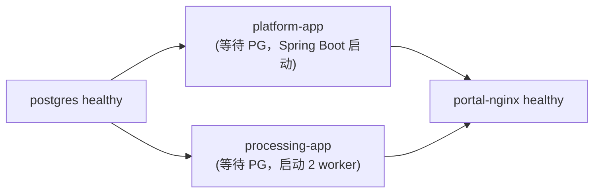

# 企业级多模态数据中台 MVP — 部署文档与演示指南（V0.1）

> 版本：**V0.1**（对应代码标签 `v0.1.0`）　日期：2026-10-01
> 功能基线：[SYS-007-MVP功能演示详细设计](./design/sys/SYS-007-MVP功能演示详细设计.md)
> 架构定位：**4 个容器、1 个数据库（五 schema）、整机 ≤ 8GB 内存**，一条命令完成「数据治理 → 产品生成」全链路演示。

---

## 1. 部署总览

| 项 | 说明 |
|---|---|
| 启动命令 | `docker compose up -d --build` |
| 容器数 | 4 |
| 容器内存预算 | ≤ 2.5GB（postgres 1G + platform-app 768M + processing-app 384M + nginx 64M） |
| 演示入口 | **http://localhost:8090**（唯一对外端口） |
| 演示时长 | 标准脚本 15–20 分钟，共 15 步（见 §5） |

**core 档 4 个容器**：

| 容器 | 镜像/构建 | 职责 |
|---|---|---|
| `postgres` | `postgis/postgis:16-3.4` | 唯一基础设施，五 schema：`iam / proc / gov / ds / prod` |
| `platform-app` | 本地构建（`eclipse-temurin:21-jre`） | Spring Boot 单体：IAM 认证权限、GOV 资产血缘、DS 数据集、PROD 产品加工、SCR 大屏聚合、开放 API |
| `processing-app` | 本地构建（`python:3.12-slim` + ffmpeg） | FastAPI：文件上传与五阶段治理流水线（2 worker 线程） |
| `portal-nginx` | `nginx:1.27-alpine` | 静态前端门户 + API 路径分发 |

### 1.1 端口规划

| 端口 | 容器 | 用途 | 对外 |
|---|---|---|---|
| **8090** | portal-nginx | **唯一演示入口**：门户页面 + 全部 API 分发 | 是（0.0.0.0） |
| 5432 | postgres | 数据库，仅排错时用 | 仅 127.0.0.1 |
| 8080 | platform-app | Java 服务，仅排错时用 | 仅 127.0.0.1 |
| 8000 | processing-app | Python 服务，仅排错时用 | 仅 127.0.0.1 |

### 1.2 数据卷

| 卷 | 挂载点 | 内容 |
|---|---|---|
| `mydatama_pg-data` | postgres `/var/lib/postgresql/data` | 全量业务数据（五 schema） |
| `mydatama_mydatama-data` | platform-app / processing-app 的 `/data` | raw / processed / thumb / products 四类文件，两个服务共享 |

---

## 2. 环境准备

### 2.1 机器要求（实测预算）

| 项 | 最低 | 推荐 |
|---|---|---|
| CPU | 4 核 | 4 核以上 |
| 内存 | **8GB** | 8–16GB |
| 磁盘 | 20GB 可用（镜像 ≈3GB + 数据） | 40GB SSD |
| 系统 | Windows 10/11 + Docker Desktop / macOS 12+ / Ubuntu 22.04 | |
| 软件 | Docker Desktop 4.30+（含 Compose v2）、Chrome/Edge | |
| 浏览器 | 开启 JavaScript；演示前 **Ctrl+F5** 强制刷新一次 | |

### 2.2 环境变量（`.env.example` → `.env`）

```ini
# ===== 数据库 =====
POSTGRES_DB=mydatama
DB_USER=mydatama
DB_PASSWORD=change_me_in_prod

# ===== JWT 与服务令牌（生产请用 openssl rand -hex 32 生成） =====
JWT_HMAC_SECRET=change_me_to_32_bytes_min_length_secret_value_here
SERVICE_TOKEN=change_me_service_token_for_internal_api_calls

# ===== Java 应用 =====
JAVA_OPTS=-Xmx640m -XX:+UseG1GC

# ===== Python 处理服务 =====
WORKER_THREADS=2
POLL_INTERVAL=2
JOB_LOCK_TIMEOUT_MINUTES=10
```

> Java 与 Python 共用同一把 `JWT_HMAC_SECRET`；`SERVICE_TOKEN` 仅用于容器内网的 `/internal/**` 回调。演示环境沿用示例值即可。

### 2.3 国内网络说明（首次构建）

Dockerfile 已内置国内源，无需额外配置即可在国内网络构建：

- Maven 依赖 → 阿里云 maven 镜像；pip → 清华源；容器内 apt → 阿里云 Debian/Ubuntu 源；
- 若 **Docker Hub 拉基础镜像超时**，在 Docker Desktop 的 `daemon.json` 增加镜像加速器后重启 Docker：

```json
{
  "registry-mirrors": [
    "https://docker.m.daocloud.io",
    "https://dockerproxy.net"
  ]
}
```

---

## 3. 一键部署

```bash
cd mydatama
cp .env.example .env            # Windows PowerShell: copy .env.example .env

docker compose up -d --build    # 首次构建约 5–10 分钟（依赖已缓存后秒级）
docker compose ps               # 等待 4 个容器全部 healthy
```

首次启动自动完成：

1. PostgreSQL 建库 + 扩展（pg_trgm / PostGIS）+ 五 schema 全部表/索引（`infra/postgres/init/01~07.sql`）；
2. 种子数据：3 个账号、34 个权限点、角色策略、3 个产品模板；
3. `/data` 下 raw / processed / thumb / products 目录由服务按需创建。

**从启动到可登录 ≤ 3 分钟**（不含首次构建）。浏览器访问 **http://localhost:8090**。

常用命令：

```bash
docker compose logs -f platform-app processing-app   # 看服务日志
docker compose restart processing-app                # 演示"任务不丢"：重启自动续跑
docker compose stop / start                          # 停/启（保留数据）
docker compose down                                  # 删容器保留数据卷
docker compose down -v                               # 恢复出厂（连数据卷一起删）
```

---

## 4. 启动顺序与健康检查



| 容器 | 检查方式 |
|---|---|
| postgres | `pg_isready` |
| platform-app | `GET /actuator/health` → `{"code":0,"message":"success","data":{"status":"UP"}}` |
| processing-app | `GET /health` → `{"code":0,...,"data":{"status":"UP"}}` |
| portal-nginx | 容器内 `wget http://127.0.0.1:8090/`，依赖前两个服务 healthy 后才启动 |

手工验证：

```bash
curl http://localhost:8080/actuator/health     # Java
curl http://localhost:8000/health              # Python
curl -I http://localhost:8090/                 # 门户 200
docker stats --no-stream                       # 实时确认内存合计
```

### 4.1 预置账号

| 账号 | 密码 | 部门/密级 | 角色定位 | 演示用途 |
|---|---|---|---|---|
| **admin** | `Admin@123` | IT / 密级 4 | 管理员（RBAC 直通） | 全功能主演示账号 |
| **operator** | `Operator@123` | DATA / 密级 3 | 运营 | 上传处理、数据集与产品加工 |
| **viewer** | `Viewer@123` | GUEST / 密级 1 | 只读 | 演示越权 403 / ABAC 拦截 |

### 4.2 预置产品模板

| 模板 code | 形态 | 生成物 |
|---|---|---|
| `tpl-data-package-v1` | DATA_PACKAGE | 产品包 zip（数据成品 + README + 质量报告 + PDF 说明书，SHA-256 校验） |
| `tpl-api-service-v1` | API_SERVICE | 开放查询端点 `/openapi/v1/products/{code}/rows` + 计量 API Key |
| `tpl-report-v1` | REPORT | 分析报告 HTML + PDF |

---

## 5. 演示指南：标准 15 步动线（15–20 分钟）

> 本脚本与 SYS-007 §2.2 逐条对应，覆盖 IAM → PROC → GOV → DS → PROD → SCR 六模块。
> 主演示账号 **admin**；样例文件全部在 `samples/`（由固定种子生成，异常注入点见 [samples/README.md](../samples/README.md)）。

### 5.1 演示前准备（2 分钟）

1. `docker compose ps` 确认 4 容器全部 healthy；浏览器 **Ctrl+F5** 打开 http://localhost:8090；
2. 确认 `samples/` 目录就位（首次或重置后执行 `python samples/generator/generate_all.py` 生成）；
3. 建议浏览器提前登录一次 admin 保持会话，大屏页 F11 全屏备用。

| 步骤 | 页面/动作 | 操作与看点 |
|---|---|---|
| **1. 登录 + 大屏空态** | `/login` → `/screen` | admin 登录（JWT 下发），大屏显示骨架与全 0 空态（资产/文件/数据集/产品计数）；换 viewer 登录后访问「用户管理」被 **403 拦截**（RBAC） |
| **2. 上传结构化文件** | 「文件上传」 | 上传 `vehicle_gps_20260901.csv`（5 万行/5.3MB，业务域 TRANSPORT，密级 2），看点：入队后五阶段时间线（接收→质检→脱敏→加工→登记）**逐格点亮**，5 万行全链路 < 60s |
| **3. 查看质检结果** | 「文件详情」 | metrics 表：缺失率 ≈2%（1000 行）、重复率 1%（500 行）、漂移点 50 条入隔离、时间乱序 20 条归一；敏感列清单（driver_phone / driver_idcard）与掩码策略 |
| **4. 一键修复 → 重跑** | 「文件详情」 | 对坏行执行一键修复/去重后重入队，处理完成后对比指标：缺失/重复归零，质量分回升——展示**质量闭环** |
| **5. 多模态脱敏** | 「文件上传」×3 | `driver_notes.txt`（手机/邮箱/身份证正则掩码，命中计数）；`vehicle_photos.zip`（EXIF/GPS 剥离 + 缩略图）；`dashcam_clips.zip`（ffmpeg 抽帧缩略图、元数据清除、mp4 转码） |
| **6. 资产目录 + 血缘** | `/governance/assets` → 详情 → 血缘图 | 上传文件自动入资产目录（处理服务回调 `/internal/assets/register` 幂等登记）；按模态/业务域/关键词检索；详情看字段级敏感标记；血缘图展示 **raw → processed** 自动边，ECharts 力导图可缩放 |
| **7. 热力图 + 质量规则** | `/governance/heatmap`、`/governance/quality-rules` | 域 × 日热力图（资产使用统计聚合，ECharts 三维格式）；质量规则页按 targetRef 查询 |
| **8. 构建数据集 v1** | `/dataset/list` 向导 | 新建「驾驶行为样本集」：筛选条件 modality=STRUCTURED、bizDomain=TRANSPORT、minQualityScore 等；生成版本 v1，展示**三维质检报告**：completeness / consistency / accuracy + overall_score（≥0.85 达标判定）与中文建议 |
| **9. 生成 v2 + 版本对比** | 数据集详情 | 上传 `vehicle_gps_20260902.csv`（**GBK 编码 + 中文乱序列名**，看点：编码探测 + 列名同义词标准化映射）处理完成后，对同一数据集生成 v2；双选 v1/v2 对比：added / removed 资产清单 + metricsDiff 指标差 |
| **10. 产品配置** | `/product/create` | 三步向导：选 `tpl-data-package-v1` 模板 → 选数据集与 v2 版本（级联下拉）→ 填元数据（名称、编码 `PRD-20261001-001`、分类交通物流、密级 ≥ 原料最大密级、定价、说明书四要素：来源/字段/更新频率/交付方式），提交后状态 DRAFT → CONFIGURED |
| **11. 生成 + 合规通过** | 产品详情 | 点「生成」：zip 打包秒级完成并登记 PRODUCT 资产 + 血缘边（dataset → product）；点「合规校验」：**R1 密级 / R2 敏感列脱敏 / R3 质量阈值 0.85 / R4 说明书完整** 四规则全绿，状态 PASSED；「说明书预览」展示八章交易所口径 HTML，可导 PDF（内嵌中文字体） |
| **12. 导出交付物** | 产品详情「导出」 | 下载 `product_{code}_v1.0.zip`（含成品数据 + README.txt + quality_report.json + manual.pdf），响应头带 `X-Checksum-SHA256`；API_SERVICE 形态可在此演示计量 Key 创建（明文仅返回一次） |
| **13. 反面演示：合规拦阻** | 再建一个产品 | 上传 `unmasked_sample.csv`（全字段明文），建产品时刻意**密级倒挂**或直接使用未脱敏原料 → 合规校验 **R1/R2 红色并列**，产品状态 BLOCKED，逐项给出原因文案——演示"合规内生、不合规不可挂牌" |
| **14. 登记 + 挂牌** | 产品详情 | PASSED 产品点「登记」生成凭证号 `REG-20261001-XXXXXX`（状态 REGISTERED）→「挂牌」LISTED；切到大屏产品板块：总数/挂牌数/拦阻数/通过率/形态分布/最新 5 条实时跳动（10s 轮询） |
| **15. 审计回放** | `/iam/audit` | 按用户/模块/时间检索全程操作（登录、上传、导出 EXPORT、登记、挂牌……），可导出 CSV——等保闭环收尾 |

**补刀亮点（按需插入）**：

- **开放 API**：API_SERVICE 形态产品挂牌后，在 `/openapi-demo` 页用 `X-API-Key` 调用 `/openapi/v1/products/{code}/rows` 分页取数（Key 校验 + 状态门控 + 调用量写入 asset_usage_stats，反哺第 7 步热力图）；
- **可靠性**：大文件处理中执行 `docker compose restart processing-app`，任务不丢、自动续跑至 SUCCEEDED（PG 队列 + 锁超时 10 分钟重置）。

### 5.2 一键冒烟（接口级 T01~T10）

```bash
bash scripts/smoke-test.sh
# Windows 用 Git Bash；可用 BASE=http://localhost:8090 指定网关
# 覆盖：登录 → 上传 → 轮询 READY → 资产检索 → 建数据集版本 → 建产品 → 合规 → 挂牌 → 大屏断言 → 审计断言
```

全绿即代表演示环境就绪。

---

## 6. 备份与恢复

演示环境只需备份两样：

```bash
# 1) 数据库逻辑备份（账号/库名取自 .env，默认 mydatama）
docker compose exec postgres pg_dump -U mydatama mydatama > backup/mydatama_$(date +%F).sql

# 2) 文件卷备份（raw/processed/thumb/products）
docker run --rm -v mydatama_mydatama-data:/data -v $PWD/backup:/backup alpine \
  tar czf /backup/files_$(date +%F).tgz -C /data .
```

恢复：`docker compose down` 后重建容器，`psql` 导入 SQL + 解压文件卷即可完整还原。

**空态重置**（每场演示前推荐）：

```bash
docker compose down -v && docker compose up -d --build
```

---

## 7. 离线/内网部署

1. 有网机拉取/构建全部镜像：`postgis/postgis:16-3.4`、`nginx:1.27-alpine` 及两个本地构建镜像；
2. `docker save` 打包镜像连同仓库代码一并拷贝；
3. 内网机 `docker load` 后 `docker compose up -d`，全程不需要 Maven/npm/PyPI/外网（ffmpeg 与中文字体均已固化在镜像层内）。

---

## 8. 常见问题

| 现象 | 处理 |
|---|---|
| 8090 打不开 / 白屏 | 先 `docker compose ps` 查 healthy；白屏多为浏览器缓存旧版前端，**Ctrl+F5** 强刷；仍异常则 `docker compose logs portal-nginx` |
| Docker Hub 拉镜像超时 | 按 §2.3 配置 `registry-mirrors` 后重启 Docker Desktop |
| 平台日志报 jsonb 错误 | 确认数据源 URL 含 `?stringtype=unspecified`（compose 已内置，自行改配置时勿删） |
| 登录提示"用户名或密码错误" | V0.1 种子密码为 Admin@123 / Operator@123 / Viewer@123；若曾使用更早版本的库卷，执行 `docker compose down -v` 重置 |
| 任务卡 PENDING | 查 processing-app 日志与 PG 连通性；worker 每 2s 轮询自动抢任务 |
| 重启后任务一直 RUNNING | worker 启动时把锁超 10 分钟的 RUNNING 重置回 PENDING，等待或手工改状态均可 |
| GBK CSV / 中文列名 | 0902 样例已覆盖：服务自动探测编码并做列名同义词映射，文件详情可看标准化结果 |
| PDF 说明书中文乱码 | 镜像已安装中文字体；如自行精简镜像，保留 fonts-droid-fallback 或挂载 Noto Sans CJK |
| 开放 API 返回 Key 无效 | Key 明文仅创建时返回一次；确认请求头 `X-API-Key` 且产品状态为 PASSED/REGISTERED/LISTED |
| 内存吃紧 | 确认 core 四容器预算（≤2.5GB）；WSL2 在 `%UserProfile%\.wslconfig` 设 `memory=6GB` |
| 恢复出厂 | `docker compose down -v` 后重新 `up -d --build` |

---

## 9. 生产化提示（超出 V0.1）

V0.1 已保留模块化边界：worker 独立扩缩容 → 文件卷换对象存储（MinIO/S3/OSS）→ Java 模块拆微服务并引入网关与注册中心 → 队列换 Kafka → 检索换 ES → Compose 迁 K8s。演进路线详见 SYS-001~006 与 05-MVP功能演示开发工作方案。
