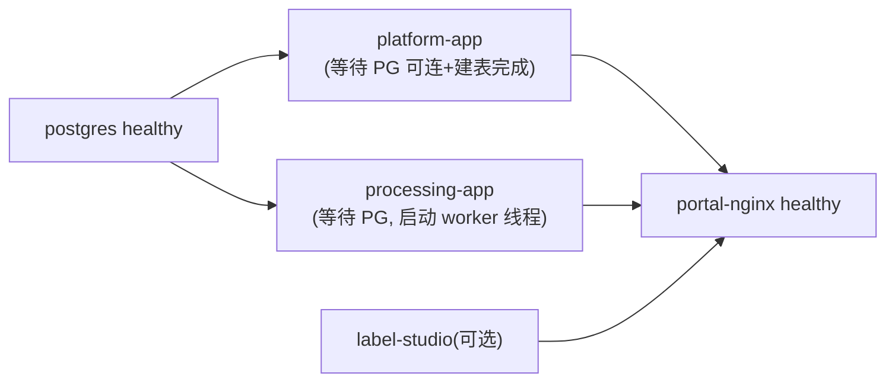

# 企业级多模态数据中台 MVP（Lite 演示架构）— 部署文档与演示指南

> 版本：v1.0（评审稿）　日期：2026-09-29
> 架构定位：**4 个容器、1 个数据库、整机 ≤ 8GB 内存**。
> 配套：[01-详细设计文档.md](./01-详细设计文档.md)、[03-系统部署开销评估报告.md](./03-系统部署开销评估报告.md)

---

## 1. 部署总览

| 启动档位 | 命令 | 容器数 | 容器内存 | 适用 |
|---|---|---|---|---|
| core（默认） | `docker compose up -d` | 4 | **≤ 2.5GB** | 全功能演示（标注走门户内手工标注） |
| core + label | `docker compose --profile label up -d` | 5 | **≤ 3.5GB** | 需要 Label Studio 专业标注台时启用，**8GB 机器仍流畅** |
| bi（独立增强，非本期镜像包） | — | +多个 | +2GB 以上 | 8GB 预算外，大屏已自研内置，无需启用 |

**core 档 4 个容器**：`postgres`（唯一基础设施）、`platform-app`（Java 单体）、`processing-app`（Python，含 worker 与 ffmpeg）、`portal-nginx`（门户+路由+代理）。

### 1.1 端口规划

| 端口 | 容器 | 用途 | 是否需对外 |
|---|---|---|---|
| **8090** | portal-nginx | **唯一演示入口**：门户 + 大屏 + API 路径分发 | 是（localhost） |
| 5432 | postgres | 数据库，仅排错时用 | 本机（默认不对外发布） |
| 无额外端口 | platform-app:8080 / processing-app:8000 | 只在 compose 内网，**不映射宿主** | 否 |
| 不映射 | label-studio:8080 | 仅经 Nginx `/label-studio/` 访问 | **否** |

> Label Studio 不暴露端口，浏览器只能通过已登录的门户访问。

### 1.2 数据卷

| 卷/挂载 | 内容 |
|---|---|
| `pgdata` → `/var/lib/postgresql/data` | 全量业务数据（四 schema） |
| `mydatama-files` → `/data` | raw / processed / thumb 三类文件 |
| `lsdata`（label profile） | Label Studio 自带 SQLite 与上传文件 |

---

## 2. 环境准备

### 2.1 机器要求（实测预算）

| 项 | 最低 | 推荐 |
|---|---|---|
| CPU | 4 核 | 4 核以上 |
| 内存 | **8GB**（core 或 core+label 均可） | 8–16GB |
| 磁盘 | 20GB 可用（镜像 ≈2GB + 数据） | 40GB SSD |
| 系统 | Windows 10/11 + WSL2 / macOS 12+ / Ubuntu 22.04 | |
| 软件 | Docker Desktop 4.30+（含 Compose v2）、Chrome/Edge | |

Windows WSL2 建议配置（`%UserProfile%\.wslconfig`）：

```ini
[wsl2]
memory=6GB
processors=4
swap=2GB
```

### 2.2 环境变量（`.env.example` → `.env`，交付默认值可直接演示）

```ini
# 数据库
POSTGRES_PASSWORD=ChangeMe_Plat_2026
# JWT（Java/Python 共用同一把 HMAC 密钥，>=32 位）
JWT_SECRET=please-change-me-to-a-32+char-random-string
# 服务间内部令牌
SERVICE_TOKEN=please-change-me-internal-token
# 处理 worker
WORKER_THREADS=2
JOB_POLL_INTERVAL_MS=1500
MAX_FILE_SIZE_MB=200
# 可选：Label Studio
LABEL_STUDIO_TOKEN=（首次启动后生成，写入即可被门户代理调用）
# 门户端口避让
PORTAL_PORT=8090
# Java 堆（硬限内存）
JAVA_XMX=640m
```

---

## 3. 一键部署

```bash
cd mydatama-mvp
copy .env.example .env            # macOS/Linux: cp .env.example .env

# core 档（推荐演示档）
docker compose up -d --build

# 需要专业标注台时
docker compose --profile label up -d --build

docker compose ps                 # 等待 4(或5) 个容器全部 healthy
```

首次启动自动完成：PostgreSQL 建库 + 四 schema + 表/索引（pg_trgm）+ 种子数据（admin/analyst/viewer 三账号、角色权限、字典、少量演示资产）；创建 `/data/raw|processed|thumb` 目录。

**启动到可登录 ≤ 3 分钟**（首次拉镜像/构建除外）。访问 **http://localhost:8090**。

常用命令：

```bash
docker compose logs -f platform-app processing-app   # 看日志
docker compose restart processing-app                # 演示"任务不丢"：重启自动续跑
docker compose stop / start                          # 停/启（保留数据）
docker compose down                                  # 删容器保留数据
docker compose down -v                               # 恢复出厂（连数据卷一起删）
```

---

## 4. 启动顺序与健康检查



- postgres：`pg_isready`；
- platform-app：启动时 Flyway/初始化完成后 `/actuator/health` 返回 UP；
- processing-app：`/health` 返回 PG 连通状态；
- portal-nginx：依赖上述 healthy 后启动。

验证：

```bash
curl http://localhost:8090/api/auth/health      # 由 Java 返回 UP（或经 nginx 转发）
docker stats --no-stream                        # 实时确认各容器内存合计
```

---

## 5. 演示指南（标准 15–20 分钟脚本）

### 5.1 演示前准备

`samples/` 目录：
- `customers_demo.csv`：含 name/phone/id_card/bank_card/email/amount，含缺失值与 2 行脏数据；
- `pii_demo.txt`：含手机、身份证号的文本；
- `photo_exif.jpg`：带 GPS EXIF 的照片；
- `meeting_demo.mp4`：带元数据标签的短视频。

预置账号：

| 账号 | 密码 | 角色 | 用途 |
|---|---|---|---|
| admin | Admin@123 | 管理员 | 全功能/权限/审计 |
| analyst | Analyst@123 | 分析师 | 上传、建数据集（无用户管理） |
| viewer | Viewer@123 | 只读 | 演示 403 |

### 5.2 演示流程

**① 登录与安全（2 分钟）**
admin 登录看工作台；换 viewer 点"用户管理"被拦截（403）。

**② 结构化数据处理与脱敏（5 分钟）**
analyst 上传 `customers_demo.csv`（客户域/内部/自动脱敏）→ 任务详情展示五阶段时间线与指标（行列数、缺失率、重复率、格式一致率、敏感列）→ 在线预览/下载脱敏成品验证掩码 → 审计页看到操作记录。

**③ 多模态处理（4 分钟）**
依次上传 txt（敏感命中数+掩码）、jpg（EXIF/GPS 剥离前后对比）、mp4（时长/分辨率/码率 + 首帧缩略图 + 元数据清除）。

**④ 资产目录与血缘（3 分钟）**
4 个文件自动入资产目录；筛选/搜索；资产详情看列信息与敏感标记；血缘图 raw→成品→标注；影响分析看下游数据集；热力图（域×日）。

**⑤ 智能标注（label profile，3 分钟）**
门户"智能标注"无二次登录进入 Label Studio，对图片/文本标注提交；回处理页刷新看到标注回拉（来源 LABEL_STUDIO），审计记录实际操作人。
> 未启用 label profile 时，可用门户内置的简单标注入口（文本标签人工保存）演示同一业务闭环。

**⑥ 数据集与质量报告（3 分钟）**
新建数据集（场景+模态/域/质量分条件）→ 生成 v1：完整性 0.2%（达标 <0.5%）、一致性 100%、准确性 0.05%（达标 <0.1%）、综合评分与优化建议 → 再处理一条数据后生成 v2，展示版本增删对比。

**⑦ 大屏收尾（2 分钟）**
打开 `/screen` 全屏：资产总量/今日新增、模态环形图、业务域分布、7 日处理量与成功率、脱敏命中、质量均分、实时操作流。现场上传一个小文件，≤10 秒（轮询周期）数字刷新；点图项下钻资产列表。

**⑧ 可靠性补刀（可选 1 分钟）**
上传大文件处理中执行 `docker compose restart processing-app`，刷新任务页：任务从 RUNNING/PENDING 自动续跑直至 SUCCEEDED（PG 队列持久化）。

**⑨ 开放 API（可选）**
```bash
curl -H "X-Api-Key: <在APIKey页生成>" http://localhost:8090/openapi/v1/assets?modality=TEXT
```

### 5.3 一键冒烟

```bash
bash scripts/smoke-test.sh
# 登录→上传4类样例→等任务成功→校验掩码/EXIF/缩略图→资产与血缘→建数据集出报告
# →越权403→APIKey→审计存在→内存阈值校验(合计<=2.5GB core档)
```

---

## 6. 备份与恢复

演示环境只需备份两样：

```bash
# 数据库逻辑备份
docker compose exec postgres pg_dump -U plat mydatama > backup/mydatama_$(date +%F).sql
# 文件卷备份（tar 打包 /data 挂载内容）
docker run --rm -v mydatama_mydatama-files:/data -v $PWD/backup:/backup alpine \
  tar czf /backup/files_$(date +%F).tgz -C /data .
```

恢复：`down -v` 后重建容器，`psql < xxx.sql` + 解压文件卷即可完整还原演示环境。

---

## 7. 离线/内网部署

1. 有网机执行 `docker compose --profile label config | grep image:` 取镜像清单，`docker save` 打包（postgres、python:3.11-slim、nginx、eclipse-temurin:17-jre、label-studio）；
2. 自研 Java/Python/前端镜像在有网机 `build` 后一并 `docker save`；
3. 内网机 `docker load` 后 `docker compose up -d`，全程不需要 Maven/npm/PyPI/外网。
4. Python 镜像内 ffmpeg 在构建时由 apt 装层固化，离线机无需 apt 源。

---

## 8. 常见问题

| 现象 | 处理 |
|---|---|
| 8090 打不开 | `docker compose ps` 查 healthy；端口占用改 `.env` 的 `PORTAL_PORT` |
| 内存吃紧 | core 档本身 ≤2.5GB；确认 WSL2 `memory=6GB`；停掉 label profile；`JAVA_XMX` 可调到 512m |
| 任务卡 PENDING | processing-app 未连到 PG：看日志；数据库恢复后 worker 下一次轮询（1.5s）自动抢任务 |
| 重启后任务一直 RUNNING | 非正常退出会留下锁；worker 启动时把 locked_at 超 5 分钟的 RUNNING 重置回 PENDING（启动恢复逻辑） |
| Excel 报错 | 需标准 xlsx/xls，不支持加密文件；CSV 乱码系统自动探测 GBK/UTF-8，异常请另存 UTF-8 |
| 视频处理失败 | 镜像内置 ffmpeg；推荐 H.264/AAC mp4；mov/webm 仅登记+缩略图不重封装 |
| 文件下载 403 | 下载接口校验 JWT 与资产权限，新窗口直开需先登录门户（用令牌 query 仅审计白名单账号，演示可用 admin） |
| Label Studio 401 | 检查 `LABEL_STUDIO_TOKEN` 与 Nginx 代理配置；首次启动需在 LS 内生成服务令牌并回填 `.env` 后重启 nginx |
| 恢复出厂 | `docker compose --profile label down -v` 再 up |
| 镜像拉取慢 | 配置镜像加速器，或走 §7 离线包 |

---

## 9. 生产化提示（超出 MVP）

Lite 架构的模块化边界为生产化预留了路径：worker 独立扩缩容 → 磁盘卷换对象存储（MinIO/S3/OSS）→ Java 模块拆微服务并引入网关与 Nacos → 队列换 Kafka → 检索换 ES → Compose 迁 K8s。具体见设计文档 §8.2 演进路线。
