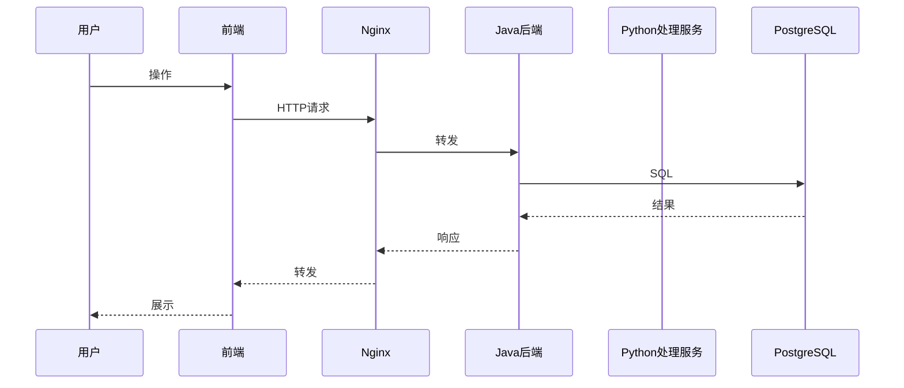
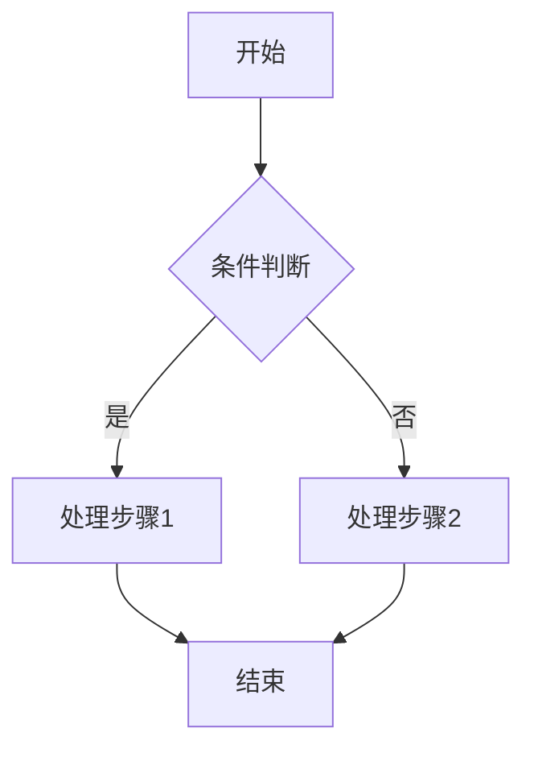
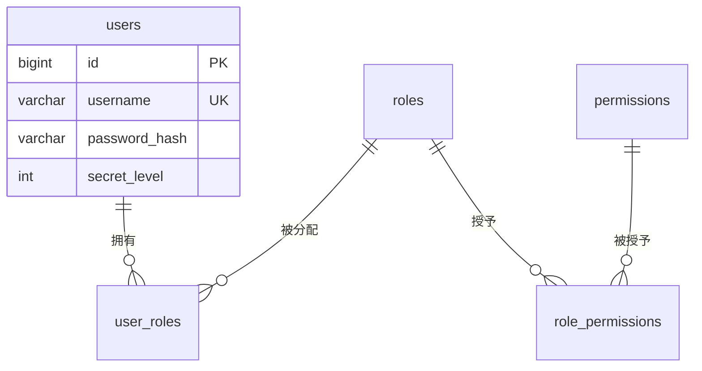
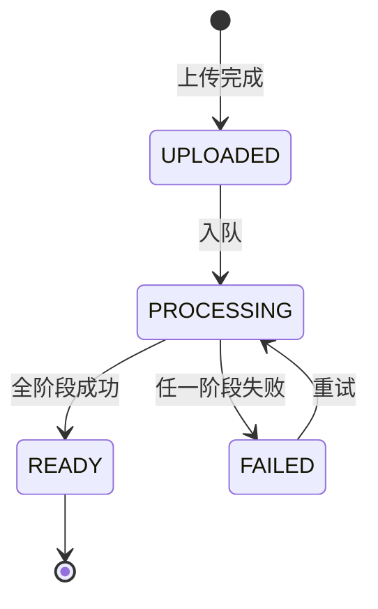

# 详细设计文档体系总览与模板规范

> 版本：v1.0 ｜ 日期：2026-09-30
> 定位：本文档是整个详细设计文档体系的"目录"与"模板标准"，定义所有设计文档的编号规则、分类、内容模板与编写规范。后续每份文档均严格遵循本文档定义的模板。

---

## 1. 文档编号规则

```
<层级>-<模块缩码>-<序号>

层级：
  SYS    系统级（跨模块）
  MOD    模块级（单模块）
  UC     用例级（单业务场景）
  API    接口级（单模块接口规格）
  DDL    数据库级（单 schema）

模块缩码：
  IAM    身份认证与权限管理
  PROC   多模态数据处理
  GOV    数据治理与资产目录
  DS     数据集与质量校验
  SCR    数据可视化大屏
  PROD   数据产品加工生成
  TRAJ   北斗轨迹数据模拟与可视化
  COM    公共基础

序号：三位数字，按模块内顺序编排
```

示例：`MOD-PROC-001` = 数据处理模块的第 1 份设计文档

---

## 2. 完整文档清单

### 2.1 系统级文档（SYS）

| 编号 | 文档名称 | 内容概述 | 状态 |
|---|---|---|---|
| SYS-001 | 系统总体架构设计 | 分层架构、模块划分、技术栈、部署拓扑、技术选型决策 | 已完成 |
| SYS-002 | 系统部署设计 | Docker Compose 编排、容器资源、环境分级、网络分区、监控告警 | 已完成 |
| SYS-003 | 系统安全设计 | 等保三级对标、认证授权体系、数据加密、脱敏策略、审计、隐私保护 | 已完成 |
| SYS-004 | 系统异常处理设计 | 异常分类体系、错误码规范、全局异常处理、降级策略、告警机制 | 已完成 |
| SYS-005 | 数据模型总体设计 | 四 schema 总览、ER 全图、公共字段规范、命名规范、迁移策略 | 已完成 |
| SYS-006 | 系统业务流程总览 | 端到端主链路、跨模块协作时序、状态机汇总 | 已完成 |
| SYS-007 | MVP功能演示详细设计 | 演示动线映射、PROD 模块设计、prod schema DDL、PROD API/错误码、大屏扩展、模拟数据与 DoD | 已完成 |

### 2.2 模块级文档（MOD）

| 编号 | 文档名称 | 所属模块 | 内容概述 | 状态 |
|---|---|---|---|---|
| MOD-IAM-001 | 身份认证与权限管理模块设计 | IAM | 登录/JWT/RBAC/ABAC/审计过滤器/API Key/会话管理 | 待编写 |
| MOD-PROC-001 | 多模态数据处理模块设计 | PROC | 上传/PG队列/五阶段流水线/四模态处理器/脱敏引擎/Storage抽象 | 待编写 |
| MOD-GOV-001 | 数据治理与资产目录模块设计 | GOV | 资产盘点/元数据/血缘/热力图/检索/标准管理 | 待编写 |
| MOD-DS-001 | 数据集与质量校验模块设计 | DS | 数据集构建/版本管理/三维质检/报告生成/版本对比 | 待编写 |
| MOD-SCR-001 | 数据可视化大屏模块设计 | SCR | 四聚合接口/前端大屏布局/轮询/交互下钻/门户聚合 | 待编写 |
| MOD-PROD-001 | 数据产品加工生成模块设计 | PROD | 加工流水线/元数据/合规引擎/登记挂牌/交易对接/模板版本 | 待编写 |
| MOD-COM-001 | 公共基础模块设计 | COM | 统一响应体/异常体系/JWT工具/ABAC引擎/审计框架/MyBatis基类 | 已完成 |
| MOD-TRAJ-001 | 轨迹数据模拟与可视化模块设计 | TRAJ | 模拟器/数据接入/PostGIS存储/Leaflet地图/轨迹回放/查询/大屏/指标计算 | 已完成 |

### 2.3 用例级文档（UC）

| 编号 | 用例名称 | 所属模块 | 前置依赖 | 状态 |
|---|---|---|---|---|
| UC-IAM-001 | 用户登录认证 | IAM | — | 待编写 |
| UC-IAM-002 | 角色与权限配置 | IAM | UC-IAM-001 | 待编写 |
| UC-IAM-003 | ABAC策略配置 | IAM | UC-IAM-002 | 待编写 |
| UC-IAM-004 | 审计日志查询与导出 | IAM | UC-IAM-001 | 待编写 |
| UC-IAM-005 | API Key 生成与管理 | IAM | UC-IAM-001 | 待编写 |
| UC-PROC-001 | 结构化数据上传与处理 | PROC | UC-IAM-001 | 待编写 |
| UC-PROC-002 | 多模态文件上传与处理 | PROC | UC-IAM-001 | 待编写 |
| UC-PROC-003 | 数据脱敏处理 | PROC | UC-PROC-001 | 待编写 |
| UC-PROC-004 | 处理任务状态查询与重试 | PROC | UC-PROC-001 | 待编写 |
| UC-PROC-005 | 标注任务管理（Label Studio集成） | PROC | UC-PROC-002 | 待编写 |
| UC-PROC-006 | 处理任务断点续传与恢复 | PROC | UC-PROC-001 | 待编写 |
| UC-GOV-001 | 资产自动盘点与登记 | GOV | UC-PROC-001 | 待编写 |
| UC-GOV-002 | 资产目录检索与浏览 | GOV | UC-GOV-001 | 待编写 |
| UC-GOV-003 | 数据血缘追踪 | GOV | UC-GOV-001 | 待编写 |
| UC-GOV-004 | 资产使用频率热力图 | GOV | UC-GOV-001 | 待编写 |
| UC-GOV-005 | 数据标准管理 | GOV | UC-IAM-002 | 待编写 |
| UC-DS-001 | 数据集构建 | DS | UC-GOV-001 | 待编写 |
| UC-DS-002 | 数据集版本管理 | DS | UC-DS-001 | 待编写 |
| UC-DS-003 | 数据集质量报告生成 | DS | UC-DS-001 | 待编写 |
| UC-DS-004 | 数据集版本对比 | DS | UC-DS-002 | 待编写 |
| UC-SCR-001 | 大屏数据实时展示 | SCR | UC-GOV-001 | 待编写 |
| UC-SCR-002 | 大屏交互式下钻 | SCR | UC-SCR-001 | 待编写 |
| UC-PROD-001 | 数据产品加工流水线编排 | PROD | UC-GOV-001 | 待编写 |
| UC-PROD-002 | 产品元数据与说明书生成 | PROD | UC-PROD-001 | 待编写 |
| UC-PROD-003 | 合规性校验 | PROD | UC-PROD-001 | 待编写 |
| UC-PROD-004 | 产品登记与挂牌 | PROD | UC-PROD-003 | 待编写 |
| UC-PROD-005 | 交易流程与交付 | PROD | UC-PROD-004 | 待编写 |
| UC-PROD-006 | 产品模板与版本管理 | PROD | UC-PROD-001 | 待编写 |
| UC-TRAJ-001 | 模拟数据生成与启动 | TRAJ | UC-IAM-001 | 已完成 |
| UC-TRAJ-002 | 轨迹回放 | TRAJ | UC-TRAJ-001 | 已完成 |
| UC-TRAJ-003 | 轨迹查询 | TRAJ | UC-TRAJ-001 | 已完成 |
| UC-TRAJ-004 | 轨迹总览大屏 | TRAJ | UC-TRAJ-001 | 已完成 |

### 2.4 接口级文档（API）

| 编号 | 文档名称 | 所属模块 | 端点数量 | 状态 |
|---|---|---|---|---|
| API-IAM-001 | 认证接口规格 | IAM | 4 | 待编写 |
| API-IAM-002 | 用户管理接口规格 | IAM | 5 | 待编写 |
| API-IAM-003 | 角色与权限接口规格 | IAM | 6 | 待编写 |
| API-IAM-004 | ABAC策略接口规格 | IAM | 4 | 待编写 |
| API-IAM-005 | API Key 接口规格 | IAM | 3 | 待编写 |
| API-IAM-006 | 审计日志接口规格 | IAM | 2 | 待编写 |
| API-PROC-001 | 文件上传与管理接口规格 | PROC | 4 | 待编写 |
| API-PROC-002 | 处理任务接口规格 | PROC | 3 | 待编写 |
| API-PROC-003 | 标注接口规格 | PROC | 2 | 待编写 |
| API-GOV-001 | 资产目录接口规格 | GOV | 3 | 待编写 |
| API-GOV-002 | 血缘追踪接口规格 | GOV | 1 | 待编写 |
| API-GOV-003 | 热力图接口规格 | GOV | 1 | 待编写 |
| API-GOV-004 | 数据标准接口规格 | GOV | 4 | 待编写 |
| API-DS-001 | 数据集接口规格 | DS | 3 | 待编写 |
| API-DS-002 | 版本与质量报告接口规格 | DS | 3 | 待编写 |
| API-SCR-001 | 大屏聚合接口规格 | SCR | 4 | 待编写 |
| API-PROD-001 | 产品加工接口规格 | PROD | 5 | 待编写 |
| API-PROD-002 | 合规与登记接口规格 | PROD | 4 | 待编写 |
| API-PROD-003 | 交易与交付接口规格 | PROD | 4 | 待编写 |
| API-COM-001 | 内部接口规格 | COM | 3 | 已完成 |
| API-COM-002 | 开放API接口规格 | COM | 4 | 待编写 |
| API-TRAJ-001 | 轨迹数据接口规格 | TRAJ | 8 | 已完成 |
| API-TRAJ-002 | 模拟器控制接口规格 | TRAJ | 6 | 已完成 |

### 2.5 数据库级文档（DDL）

| 编号 | 文档名称 | schema | 表数量 | 状态 |
|---|---|---|---|---|
| DDL-IAM-001 | IAM schema 数据库设计 | iam | 8 | 已完成 |
| DDL-PROC-001 | PROC schema 数据库设计 | proc | 3 | 已完成 |
| DDL-GOV-001 | GOV schema 数据库设计 | gov | 9 | 已完成 |
| DDL-DS-001 | DS schema 数据库设计 | ds | 3 | 已完成 |
| DDL-TRAJ-001 | TRAJ schema 数据库设计 | traj | 8 | 已完成 |

### 文档总量统计

| 层级 | 数量 |
|---|---|
| 系统级（SYS） | 7 |
| 模块级（MOD） | 8 |
| 用例级（UC） | 32 |
| 接口级（API） | 23 |
| 数据库级（DDL） | 5 |
| **合计** | **75** |

---

## 3. 文档编写优先级

按开发阶段（S0~S6）排序，每阶段所需文档在该阶段开始前完成：

| 优先级 | 开发阶段 | 配套文档 |
|---|---|---|
| P0 | S0 地基 | SYS-001~006 + DDL 全部 + MOD-COM-001 + API-COM-001 |
| P1 | S1 认证审计 | MOD-IAM-001 + UC-IAM-001~005 + API-IAM-001~006 |
| P2 | S2 数据处理 | MOD-PROC-001 + UC-PROC-001~006 + API-PROC-001~003 |
| P3 | S3 资产血缘 | MOD-GOV-001 + UC-GOV-001~005 + API-GOV-001~004 |
| P4 | S4 数据集质量 | MOD-DS-001 + UC-DS-001~004 + API-DS-001~002 |
| P5 | S5 大屏门户 | MOD-SCR-001 + UC-SCR-001~002 + API-SCR-001 |
| P6 | S6 标注可靠性 | UC-PROC-005 补完 |
| P7 | S7 北斗/产品 | MOD-PROD-001 + UC-PROD-001~006 + API-PROD-001~003 + API-COM-002 + MOD-TRAJ-001 + UC-TRAJ-001~004 + API-TRAJ-001~002 + DDL-TRAJ-001 |

---

## 4. 标准文档模板

### 4.1 系统级文档模板（SYS）

```markdown
# [文档编号] [文档名称]

> 版本：v1.0 ｜ 日期：YYYY-MM-DD
> 关联文档：[上下游文档编号列表]

## 1. 概述
### 1.1 文档目的
### 1.2 读者对象
### 1.3 术语与缩略语

## 2. 设计目标与约束
### 2.1 功能目标
### 2.2 非功能目标（性能/可用性/安全性）
### 2.3 技术约束

## 3. 详细设计
### 3.1 [按主题分小节]
### 3.2 [...]
### 3.N

## 4. 与其他模块/文档的关系
| 关联模块 | 关系类型 | 关联文档 | 说明 |

## 5. 设计决策记录
| 决策编号 | 决策内容 | 理由 | 关联 ADR |

## 6. 验收标准
- [ ] 验收项 1
- [ ] 验收项 2

## 7. 修订记录
| 版本 | 日期 | 修订人 | 修订内容 |
```

### 4.2 模块级文档模板（MOD）

```markdown
# [文档编号] [模块名称]模块设计

> 版本：v1.0 ｜ 日期：YYYY-MM-DD
> 关联文档：SYS-001, SYS-005, DDL-xxx, API-xxx

## 1. 模块概述
### 1.1 模块定位与职责边界
### 1.2 技术栈
### 1.3 模块在系统中的位置（架构图引用）

## 2. 模块架构
### 2.1 内部分层结构（类图/包图）
### 2.2 对外发布的接口（api 子包清单）
### 2.3 依赖的其他模块接口
### 2.4 模块依赖规则（ArchUnit 约束）

## 3. 核心类与组件设计
### 3.1 [组件名]
- **职责**：一句话
- **接口定义**：方法签名 + Javadoc 摘要
- **实现类**：实现策略
- **依赖**：调用哪些组件
- **被依赖**：被哪些组件调用

### 3.2 [组件名]
（同上格式）

## 4. 数据模型
### 4.1 涉及的表（引用 DDL 文档）
### 4.2 实体关系（ER 片图）
### 4.3 读写规则与并发控制

## 5. 业务流程
### 5.1 [流程名]
- 触发条件
- 前置条件
- 正常流程（时序图 / 流程图描述）
- 异常流程
- 后置条件
- 关联用例：UC-xxx

### 5.2 [流程名]
（同上）

## 6. 接口清单
| 方法 | 路径 | 说明 | 权限 | 详细文档 |

## 7. 异常处理
### 7.1 模块特有异常
| 异常码 | 异常消息 | 触发条件 | 处理策略 |

### 7.2 降级策略

## 8. 安全设计
### 8.1 权限控制点
### 8.2 数据脱敏点
### 8.3 审计点

## 9. 配置项
| 配置键 | 类型 | 默认值 | 说明 |

## 10. 扩展点
### 10.1 [扩展点名]
- 接口/抽象类
- 现有实现
- 如何新增实现

## 11. 验收标准
## 12. 修订记录
```

### 4.3 用例级文档模板（UC）

```markdown
# [文档编号] [用例名称]

> 版本：v1.0 ｜ 日期：YYYY-MM-DD
> 所属模块：[模块名]
> 关联文档：MOD-xxx, API-xxx

## 1. 用例概述
### 1.1 用例名称
### 1.2 参与者（角色）
### 1.3 前置条件
### 1.4 后置条件（成功）
### 1.5 后置条件（失败）

## 2. 主流程
### 2.1 流程步骤
| 步骤 | 执行者 | 动作 | 系统响应 | 数据变更 |

### 2.2 流程图
（Mermaid sequenceDiagram 或 flowchart）

### 2.3 时序图
（Mermaid sequenceDiagram，含前端/网关/后端/数据库交互）

## 3. 备选流程
### 3.1 [备选场景名]
- 触发条件
- 处理步骤

## 4. 异常流程
### 4.1 [异常场景名]
| 触发条件 | 系统行为 | 用户可见结果 | 错误码 | 数据回滚 |

## 5. 业务规则
| 规则编号 | 规则描述 | 约束值/公式 |

## 6. 界面设计
### 6.1 页面布局描述
### 6.2 交互说明
### 6.3 权限要求

## 7. 接口调用
| 步骤 | 接口 | 方法 | 请求摘要 | 响应摘要 |

## 8. 数据变更
| 表 | 操作 | 字段变更说明 |

## 9. 测试要点
| 测试场景 | 预期结果 | 测试数据 |

## 10. 修订记录
```

### 4.4 接口级文档模板（API）

```markdown
# [文档编号] [接口组名称]接口规格

> 版本：v1.0 ｜ 日期：YYYY-MM-DD
> 所属模块：[模块名]
> 基础路径：/api/xxx 或 /internal/xxx 或 /openapi/v1/xxx

## 1. 概述
### 1.1 认证方式
### 1.2 通用请求头
### 1.3 通用响应体格式

## 2. 接口清单
| 序号 | 方法 | 路径 | 说明 | 权限 |

## 3. 接口详情

### 3.1 [接口名称]
- **方法**：POST
- **路径**：/api/xxx/yyy
- **权限**：module:resource:action
- **描述**：一句话功能说明

#### 请求
- **Content-Type**：multipart/form-data | application/json
- **请求头**：
| 头名 | 必填 | 说明 |
- **路径参数**：
| 参数 | 类型 | 必填 | 说明 |
- **查询参数**：
| 参数 | 类型 | 必填 | 默认 | 说明 |
- **请求体**：
（JSON 示例 + 字段表）
| 字段 | 类型 | 必填 | 校验规则 | 说明 |

#### 响应
- **成功**（200）：
（JSON 示例 + 字段表）
| 字段 | 类型 | 说明 |
- **错误响应**：
| HTTP 状态码 | code | message | 场景 |

#### 示例
- **请求示例**：
（完整 curl 或 JSON）
- **响应示例**：
（完整 JSON）

#### 变更记录
| 版本 | 变更内容 |

### 3.2 [接口名称]
（同上格式）

## 4. 错误码
| code | HTTP | message | 场景 |

## 5. 修订记录
```

### 4.5 数据库级文档模板（DDL）

```markdown
# [文档编号] [schema名称] Schema 数据库设计

> 版本：v1.0 ｜ 日期：YYYY-MM-DD
> 数据库：PostgreSQL 16
> Schema：[schema名]

## 1. 概述
### 1.1 Schema 用途
### 1.2 表清单
| 表名 | 中文名 | 用途 | 行量级 |

## 2. 公共字段规范
（所有表共有的字段定义与说明）

## 3. 表设计详情

### 3.1 [表名]
- **中文名**：xxx
- **用途**：一句话
- **行量级**：预估
- **增长率**：每日/每月增量

#### 字段定义
| 列名 | 类型 | 可空 | 默认 | 注释（业务含义） |
| 主键 | — | — | — | — |
| 索引 | — | — | — | 命中场景说明 |

#### DDL
（完整 CREATE TABLE + COMMENT + INDEX 语句）

#### 软删与唯一约束
（说明 deleted 字段与部分唯一索引策略）

#### 关联关系
| 关联表 | 关联字段 | 关系类型 | 说明 |

#### 读写规则
- **写入方**：哪个服务/模块
- **读取方**：哪些服务/模块
- **并发控制**：乐观锁/悲观锁/SKIP LOCKED
- **归档策略**：保留周期与归档方式

### 3.2 [表名]
（同上格式）

## 4. 种子数据
### 4.1 [数据组名]
（INSERT 语句 + 业务说明）

## 5. ER 片图
（该 schema 内的表关系图，Mermaid erDiagram）

## 6. 迁移脚本
| 版本 | 文件名 | 变更内容 |

## 7. 修订记录
```

---

## 5. 文档编写规范

### 5.1 通用规范

- **语言**：中文；代码/SQL/路径用英文
- **图示**：优先使用 Mermaid 语法（VS Code / GitHub 原生渲染），复杂架构图可用 ASCII
- **交叉引用**：用文档编号引用，如"详见 UC-PROC-001 §3.1"
- **表格优先**：结构化信息用表格，不用长段落
- **一处定义一处引用**：同一概念/规则只在一处详细定义，他处引用

### 5.2 版本管理

- 每份文档独立版本，修订记录在文末
- 破坏性变更升主版本（v2.0），补充性变更升次版本（v1.1）
- 文档与代码同节奏：开发阶段开始前文档定稿 v1.0，开发中可修 v1.x

### 5.3 审阅与验收

- 每份文档完成后由项目评审通过方可作为开发依据
- 文档与实现不符时，**以代码为准并立即更新文档**（不积压技术债）
- PR 合并前检查是否需同步更新设计文档

### 5.4 文件组织

```
docs/design/
├── 00-文档体系总览与模板规范.md   ← 本文档
├── sys/                            系统级
│   ├── SYS-001-系统总体架构设计.md
│   ├── SYS-002-系统部署设计.md
│   └── ...
├── mod/                            模块级
│   ├── MOD-IAM-001-身份认证与权限管理模块设计.md
│   └── ...
├── uc/                             用例级
│   ├── UC-IAM-001-用户登录认证.md
│   └── ...
├── api/                            接口级
│   ├── API-IAM-001-认证接口规格.md
│   └── ...
└── ddl/                            数据库级
    ├── DDL-IAM-001-IAM-schema数据库设计.md
    └── ...
```

---

## 6. Mermaid 图示规范

### 6.1 时序图标准



### 6.2 流程图标准



### 6.3 ER 图标准



### 6.4 状态机标准



---

## 7. 下一步行动

本文档经评审通过后，按 §3 定义的优先级逐批编写：

- **第一批（P0）**：SYS-001~006 + DDL 全部 4 份 + MOD-COM-001 + API-COM-001（共 12 份）
- **第二批（P1）**：MOD-IAM-001 + UC-IAM 全部 5 份 + API-IAM 全部 6 份（共 12 份）
- **第三批（P2）**：MOD-PROC-001 + UC-PROC 全部 6 份 + API-PROC 全部 3 份（共 10 份）
- 以此类推

每批完成后提交 git 并生成 HTML 阅读版。
