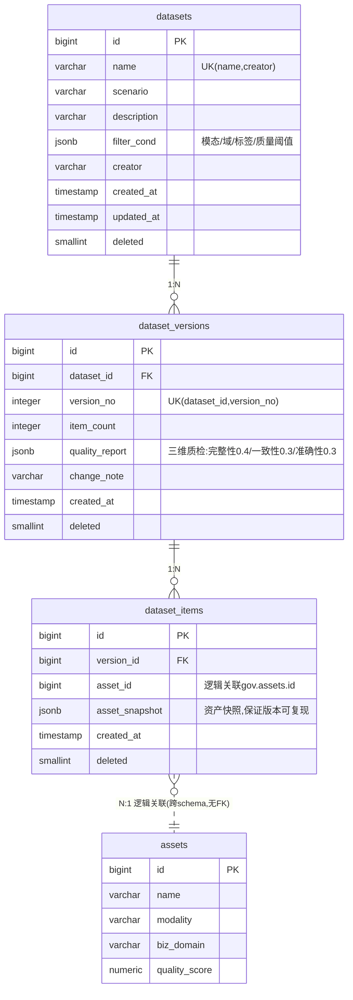

# DDL-DS-001 ds Schema 数据库设计

> 版本：v1.0 ｜ 日期：2026-09-30
> 数据库：PostgreSQL 16
> Schema：ds
> 关联文档：MOD-DS-001, API-DS-001, API-DS-002, SYS-005, UC-DS-001~004

---

## 1. 概述

### 1.1 Schema 用途

`ds` schema 承载数据中台"训练数据集构建与质量校验"子域的全部持久化数据，覆盖数据集定义、数据集版本快照、版本内资产明细三类实体，支撑数据集构建、版本管理、三维质量报告、版本对比四大用例（UC-DS-001~004）。

**设计原则**：
- 数据集定义（`datasets`）与数据集版本（`dataset_versions`）分离：定义可改，版本不可变
- 版本快照不可变：版本生成后 `dataset_versions` 与 `dataset_items` 只插入不更新，保证任意历史版本可复现
- 资产跨 schema 逻辑关联：`dataset_items.asset_id` 仅逻辑指向 `gov.assets.id`，不建物理外键，遵循"模块间不跨 schema 直写/直依赖"的 Lite 版演进约束（详见 01-详细设计文档 §8.2）
- 资产快照冗余：`dataset_items.asset_snapshot jsonb` 冗余当时资产的关键元数据，即使 `gov.assets` 后续被修改或软删，历史版本仍可完整回放与对比
- 三维质检结果落库：`quality_report jsonb` 持久化完整性 / 一致性 / 准确性三维得分、达标判定与文字优化建议，避免重复计算

### 1.2 表清单

| 表名 | 中文名 | 用途 | 行量级 |
|---|---|---|---|
| datasets | 数据集定义表 | 训练数据集的逻辑容器与筛选条件定义 | 百级 |
| dataset_versions | 数据集版本表 | 数据集某一时刻的快照版本，含三维质量报告 | 千级（每集平均 5~10 个版本） |
| dataset_items | 数据集项表 | 版本内包含的资产明细，含资产快照 | 万级（每版本 100~1000 项） |

---

## 2. 公共字段规范

以下字段在所有三张表中统一出现，含义一致：

| 字段名 | 类型 | 可空 | 默认 | 含义 |
|---|---|---|---|---|
| id | bigserial | 否 | — | 主键，自增 |
| created_at | timestamp | 否 | CURRENT_TIMESTAMP | 创建时间 |
| updated_at | timestamp | 否 | CURRENT_TIMESTAMP | 最后更新时间（不可变表仅记录元信息变更时间） |
| create_by | varchar(64) | 否 | — | 创建人（用户名） |
| update_by | varchar(64) | 是 | NULL | 最后修改人 |
| deleted | smallint | 否 | 0 | 软删除标志：0=正常，1=已删除 |

**命名与约束规范**：
- 表名：snake_case，不带 schema 前缀（schema 由 search_path 提供）
- 索引名：`idx_<表名>_<字段名>`；唯一索引：`uk_<表名>_<字段名>`
- 跨 schema 关联不建物理外键，由应用层保证完整性
- 软删除统一使用 `deleted smallint`（0/1），唯一约束配套使用部分唯一索引 `WHERE deleted = 0`
- `updated_at` 由应用层 `@PreUpdate` 或 MyBatis 拦截器维护，PostgreSQL 不使用触发器

---

## 3. 表设计详情

### 3.1 datasets

- **中文名**：数据集定义表
- **用途**：定义一个训练数据集的逻辑容器，包含名称、业务场景与筛选条件；版本生成时按 `filter_cond` 从 `gov.assets` 中圈选资产
- **行量级**：百级
- **增长率**：低频，日均新增 <5

#### 字段定义

| 列名 | 类型 | 可空 | 默认 | 注释（业务含义） |
|---|---|---|---|---|
| id | bigserial | 否 | — | 主键 |
| name | varchar(128) | 否 | — | 数据集名称（同一创建人下唯一） |
| scenario | varchar(64) | 是 | NULL | 业务场景标识（如 defect_detection / face_recognition） |
| description | varchar(512) | 是 | NULL | 数据集用途描述 |
| filter_cond | jsonb | 否 | — | 筛选条件（模态/业务域/标签/质量阈值等），见下方示例 |
| creator | varchar(64) | 否 | — | 创建人用户名（冗余，便于按人查询） |
| created_at | timestamp | 否 | CURRENT_TIMESTAMP | 创建时间 |
| updated_at | timestamp | 否 | CURRENT_TIMESTAMP | 最后更新时间 |
| create_by | varchar(64) | 否 | — | 创建人 |
| update_by | varchar(64) | 是 | NULL | 最后修改人 |
| deleted | smallint | 否 | 0 | 软删除标志 |

**`filter_cond` JSON 结构示例**：

```json
{
  "modality": ["IMAGE", "TEXT"],
  "biz_domain": ["finance", "retail"],
  "tags": ["cleaned", "labeled"],
  "min_quality_score": 0.8,
  "secret_level_max": 2,
  "asset_type": ["DATASET_FILE"]
}
```

| 子字段 | 类型 | 含义 |
|---|---|---|
| modality | string[] | 模态过滤：STRUCTURED / TEXT / IMAGE / VIDEO |
| biz_domain | string[] | 业务域过滤 |
| tags | string[] | 资产标签过滤（匹配 `gov.asset_tags`） |
| min_quality_score | number | 资产质量分下限（0~1） |
| secret_level_max | int | 密级上限（ABAC 联动） |
| asset_type | string[] | 资产类型过滤 |

#### 索引

| 索引名 | 类型 | 字段 | 命中场景 |
|---|---|---|---|
| pk_datasets | 主键 | id | 单集详情 |
| uk_datasets_name_creator | 部分唯一 | name, creator（WHERE deleted=0） | 同人名下唯一 |
| idx_datasets_creator | B树 | creator | 我的数据集列表 |
| idx_datasets_scenario | B树 | scenario | 按场景检索 |
| idx_datasets_filter_cond | GIN | filter_cond | 按筛选条件反查数据集（运营分析） |

#### DDL

```sql
CREATE TABLE IF NOT EXISTS ds.datasets (
    id          bigserial     PRIMARY KEY,
    name        varchar(128)  NOT NULL,
    scenario    varchar(64),
    description varchar(512),
    filter_cond jsonb         NOT NULL,
    creator     varchar(64)   NOT NULL,
    created_at  timestamp     NOT NULL DEFAULT CURRENT_TIMESTAMP,
    updated_at  timestamp     NOT NULL DEFAULT CURRENT_TIMESTAMP,
    create_by   varchar(64)   NOT NULL,
    update_by   varchar(64),
    deleted     smallint      NOT NULL DEFAULT 0
);

COMMENT ON TABLE  ds.datasets              IS '数据集定义表';
COMMENT ON COLUMN ds.datasets.name         IS '数据集名称（同一创建人下唯一）';
COMMENT ON COLUMN ds.datasets.scenario     IS '业务场景标识';
COMMENT ON COLUMN ds.datasets.description  IS '数据集用途描述';
COMMENT ON COLUMN ds.datasets.filter_cond  IS '筛选条件 jsonb：modality/biz_domain/tags/min_quality_score/secret_level_max/asset_type';
COMMENT ON COLUMN ds.datasets.creator      IS '创建人用户名（冗余便于查询）';
COMMENT ON COLUMN ds.datasets.deleted      IS '软删除标志 0=正常 1=已删除';

CREATE UNIQUE INDEX uk_datasets_name_creator
    ON ds.datasets (name, creator) WHERE deleted = 0;
CREATE INDEX idx_datasets_creator  ON ds.datasets (creator);
CREATE INDEX idx_datasets_scenario ON ds.datasets (scenario);
CREATE INDEX idx_datasets_filter_cond ON ds.datasets USING GIN (filter_cond);
```

#### 软删与唯一约束

- 软删除：删除数据集仅将 `deleted` 置 1，**不级联删除版本与项**（历史版本仍需可追溯）。
- 唯一约束：`(name, creator)` 在 `deleted=0` 范围内唯一；软删后同名数据集可被重新创建。

#### 关联关系

| 关联表 | 关联字段 | 关系类型 | 说明 |
|---|---|---|---|
| ds.dataset_versions | id ← dataset_id | 一对多 | 一个数据集可生成多个版本 |
| gov.assets | filter_cond → 资产查询条件 | 逻辑筛选 | 版本生成时按条件圈选资产，非外键关联 |

#### 读写规则

- **写入方**：仅 platform-app 的 dataset 模块（`DatasetService`）
- **读取方**：platform-app 的 dataset 模块、governance 模块（血缘影响分析：某资产被哪些数据集引用时仅读 `dataset_items`，不读本表）
- **并发控制**：乐观锁（应用层基于 `updated_at` 比对）；同一用户同时编辑同一数据集时后写覆盖前写
- **归档策略**：不归档；软删保留至少 180 天后再由运维任务物理清理（与审计保留期对齐）

---

### 3.2 dataset_versions

- **中文名**：数据集版本表
- **用途**：记录数据集在某一时刻生成的版本快照元信息及三维质量报告；版本号在数据集内单调递增
- **行量级**：千级
- **增长率**：日均新增 10~50（用户手动触发生成）

#### 字段定义

| 列名 | 类型 | 可空 | 默认 | 注释（业务含义） |
|---|---|---|---|---|
| id | bigserial | 否 | — | 主键 |
| dataset_id | bigint | 否 | — | 所属数据集 ID（逻辑关联 ds.datasets.id） |
| version_no | integer | 否 | — | 版本号，数据集内从 1 开始单调递增 |
| item_count | integer | 否 | 0 | 版本内资产条数（冗余自 dataset_items 统计） |
| quality_report | jsonb | 是 | NULL | 三维质量报告（得分/达标判定/文字建议），结构见下 |
| change_note | varchar(512) | 是 | NULL | 版本说明（用户填写） |
| created_at | timestamp | 否 | CURRENT_TIMESTAMP | 版本生成时间 |
| updated_at | timestamp | 否 | CURRENT_TIMESTAMP | 元信息更新时间（业务字段不可变） |
| create_by | varchar(64) | 否 | — | 创建人 |
| update_by | varchar(64) | 是 | NULL | 最后修改人（仅允许修改 change_note） |
| deleted | smallint | 否 | 0 | 软删除标志 |

**`quality_report` JSON 结构**：

```json
{
  "completeness": {
    "score": 0.998,
    "missing_rate": 0.002,
    "pass": true,
    "threshold": 0.005,
    "suggestion": "完整性达标"
  },
  "consistency": {
    "score": 1.0,
    "inconsistent_count": 0,
    "pass": true,
    "target": 1.0,
    "suggestion": "一致性达标"
  },
  "accuracy": {
    "score": 0.9995,
    "error_rate": 0.0005,
    "pass": true,
    "threshold": 0.001,
    "suggestion": "准确性达标"
  },
  "overall_score": 0.8994,
  "weights": {"completeness": 0.4, "consistency": 0.3, "accuracy": 0.3},
  "overall_pass": true,
  "overall_suggestion": "三维质检全部达标，可用于训练",
  "generated_at": "2026-09-30T10:00:00"
}
```

| 维度 | 权重 | 达标阈值 | 说明 |
|---|---|---|---|
| 完整性 completeness | 0.4 | 缺失率 < 0.5% | 关键字段非空率 |
| 一致性 consistency | 0.3 | 目标 100% | 跨字段/跨记录逻辑一致 |
| 准确性 accuracy | 0.3 | 错误率 < 0.1% | 数据值域/格式校验通过率 |
| **综合评分** | — | — | 三维加权求和（0~1） |

#### 索引

| 索引名 | 类型 | 字段 | 命中场景 |
|---|---|---|---|
| pk_dataset_versions | 主键 | id | 单版本详情 |
| uk_dataset_versions_ds_no | 唯一 | dataset_id, version_no | 数据集内版本号唯一 |
| idx_dataset_versions_dataset | B树 | dataset_id, version_no DESC | 数据集版本列表（倒序） |

#### DDL

```sql
CREATE TABLE IF NOT EXISTS ds.dataset_versions (
    id             bigserial    PRIMARY KEY,
    dataset_id     bigint       NOT NULL,
    version_no     integer      NOT NULL,
    item_count     integer      NOT NULL DEFAULT 0,
    quality_report jsonb,
    change_note    varchar(512),
    created_at     timestamp    NOT NULL DEFAULT CURRENT_TIMESTAMP,
    updated_at     timestamp    NOT NULL DEFAULT CURRENT_TIMESTAMP,
    create_by      varchar(64)  NOT NULL,
    update_by      varchar(64),
    deleted        smallint     NOT NULL DEFAULT 0
);

COMMENT ON TABLE  ds.dataset_versions                IS '数据集版本表（快照不可变）';
COMMENT ON COLUMN ds.dataset_versions.dataset_id     IS '所属数据集 ID（逻辑关联 ds.datasets.id）';
COMMENT ON COLUMN ds.dataset_versions.version_no     IS '版本号，数据集内从 1 开始单调递增';
COMMENT ON COLUMN ds.dataset_versions.item_count     IS '版本内资产条数（冗余统计）';
COMMENT ON COLUMN ds.dataset_versions.quality_report IS '三维质量报告 jsonb：completeness/consistency/accuracy/overall_score/达标判定/文字建议';
COMMENT ON COLUMN ds.dataset_versions.change_note    IS '版本说明（用户填写，唯一允许修改的业务字段）';
COMMENT ON COLUMN ds.dataset_versions.updated_at     IS '元信息更新时间（业务字段不可变）';

CREATE UNIQUE INDEX uk_dataset_versions_ds_no
    ON ds.dataset_versions (dataset_id, version_no);
CREATE INDEX idx_dataset_versions_dataset
    ON ds.dataset_versions (dataset_id, version_no DESC);
```

#### 软删与唯一约束

- **快照不可变**：`quality_report`、`item_count`、`version_no`、`dataset_id` 一经写入**永不更新**；仅允许修改 `change_note`（用户补充说明），此时 `updated_at`/`update_by` 记录元信息变更。
- **唯一约束**：`(dataset_id, version_no)` 全局唯一（不区分 `deleted`），保证版本号永不复用，即使父数据集被软删，历史版本号也不被占用。
- **软删除**：仅当父级 `datasets` 被强制清理时才级联软删，常规业务流不删版本。

#### 关联关系

| 关联表 | 关联字段 | 关系类型 | 说明 |
|---|---|---|---|
| ds.datasets | dataset_id → id | 多对一 | 多个版本归属一个数据集 |
| ds.dataset_items | id ← version_id | 一对多 | 一个版本包含多个资产项 |

#### 读写规则

- **写入方**：仅 platform-app 的 dataset 模块（`DatasetVersionService`），仅在"生成新版本"与"修改版本说明"两个入口写入
- **读取方**：platform-app 的 dataset 模块（报告/对比）、governance 模块（资产被引用统计）、screen 大屏聚合接口（数据集数与平均质量分）
- **并发控制**：版本号生成走 `SELECT COALESCE(MAX(version_no),0)+1 FROM ds.dataset_versions WHERE dataset_id=? FOR UPDATE`（在父数据集行上加锁）保证单调递增；业务字段不允许 UPDATE，由应用层代码与数据库 CHECK 之外的代码评审双重保证
- **归档策略**：不归档；版本是审计与回溯依据，保留期 ≥ 数据集生命周期 + 180 天

---

### 3.3 dataset_items

- **中文名**：数据集项表
- **用途**：记录某个版本包含的资产明细及资产当时的快照；是版本可复现的关键载体
- **行量级**：万级（演示场景），生产可达百万级
- **增长率**：随版本生成批量插入，单次 100~1000 行

#### 字段定义

| 列名 | 类型 | 可空 | 默认 | 注释（业务含义） |
|---|---|---|---|---|
| id | bigserial | 否 | — | 主键 |
| version_id | bigint | 否 | — | 所属版本 ID（逻辑关联 ds.dataset_versions.id） |
| asset_id | bigint | 否 | — | 资产 ID（逻辑关联 gov.assets.id，**跨 schema 不加物理外键**） |
| asset_snapshot | jsonb | 否 | — | 资产在版本生成时刻的关键元数据快照，结构见下 |
| created_at | timestamp | 否 | CURRENT_TIMESTAMP | 创建时间 |
| updated_at | timestamp | 否 | CURRENT_TIMESTAMP | 元信息更新时间（业务字段不可变） |
| create_by | varchar(64) | 否 | — | 创建人（继承版本创建人） |
| update_by | varchar(64) | 是 | NULL | 最后修改人 |
| deleted | smallint | 否 | 0 | 软删除标志 |

**`asset_snapshot` JSON 结构示例**：

```json
{
  "asset_id": 1024,
  "name": "2026Q3_交易明细.csv",
  "asset_type": "DATASET_FILE",
  "modality": "STRUCTURED",
  "biz_domain": "finance",
  "secret_level": 2,
  "quality_score": 0.95,
  "storage_ref": "/data/processed/2026/09/abc123.csv",
  "size_bytes": 2048576,
  "row_count": 15000,
  "col_count": 24,
  "tags": ["cleaned", "masked"],
  "snapshot_at": "2026-09-30T10:00:00"
}
```

#### 索引

| 索引名 | 类型 | 字段 | 命中场景 |
|---|---|---|---|
| pk_dataset_items | 主键 | id | 单项详情 |
| uk_dataset_items_ver_asset | 唯一 | version_id, asset_id | 同一版本内资产不重复 |
| idx_dataset_items_version | B树 | version_id | 版本内资产列表 |
| idx_dataset_items_asset | B树 | asset_id | 资产被哪些版本引用（血缘影响分析） |

#### DDL

```sql
CREATE TABLE IF NOT EXISTS ds.dataset_items (
    id             bigserial    PRIMARY KEY,
    version_id     bigint       NOT NULL,
    asset_id       bigint       NOT NULL,
    asset_snapshot jsonb        NOT NULL,
    created_at     timestamp    NOT NULL DEFAULT CURRENT_TIMESTAMP,
    updated_at     timestamp    NOT NULL DEFAULT CURRENT_TIMESTAMP,
    create_by      varchar(64)  NOT NULL,
    update_by      varchar(64),
    deleted        smallint     NOT NULL DEFAULT 0
);

COMMENT ON TABLE  ds.dataset_items                 IS '数据集项表（版本内资产明细，快照不可变）';
COMMENT ON COLUMN ds.dataset_items.version_id      IS '所属版本 ID（逻辑关联 ds.dataset_versions.id）';
COMMENT ON COLUMN ds.dataset_items.asset_id        IS '资产 ID（逻辑关联 gov.assets.id，跨 schema 不加物理外键）';
COMMENT ON COLUMN ds.dataset_items.asset_snapshot  IS '资产生成时刻的快照 jsonb：name/type/modality/domain/quality_score/storage_ref/行数列数等';
COMMENT ON COLUMN ds.dataset_items.updated_at      IS '元信息更新时间（业务字段不可变）';

CREATE UNIQUE INDEX uk_dataset_items_ver_asset
    ON ds.dataset_items (version_id, asset_id);
CREATE INDEX idx_dataset_items_version ON ds.dataset_items (version_id);
CREATE INDEX idx_dataset_items_asset   ON ds.dataset_items (asset_id);
```

#### 软删与唯一约束

- **快照不可变**：`asset_snapshot`、`asset_id`、`version_id` 一经写入**永不更新**；`updated_at` 仅用于记录元信息时间戳，业务上视为只读。
- **唯一约束**：`(version_id, asset_id)` 全局唯一，保证同一资产在同一版本中仅出现一次；版本对比（增/删项 diff）依赖此约束。
- **软删除**：版本项随父版本级联软删；不单独删除单项。
- **跨 schema 关联说明**：`asset_id` 指向 `gov.assets.id`，**不建物理外键**——ds 与 gov 分属不同模块，遵循 Lite 版"模块间不跨 schema 直写/直依赖"约束，未来拆库时无需解外键；引用完整性由 dataset 模块在生成版本时校验（资产必须存在且 `deleted=0`）。

#### 关联关系

| 关联表 | 关联字段 | 关系类型 | 说明 |
|---|---|---|---|
| ds.dataset_versions | version_id → id | 多对一 | 多个项归属一个版本 |
| gov.assets | asset_id → id | 多对一（逻辑） | 跨 schema 逻辑关联，不加 FK；资产被软删后通过 `asset_snapshot` 仍可回放历史版本 |

#### 读写规则

- **写入方**：仅 platform-app 的 dataset 模块（`DatasetItemService`），仅在版本生成事务内批量插入
- **读取方**：platform-app 的 dataset 模块（版本明细/对比）、governance 模块（血缘下游影响分析：某资产被哪些数据集版本引用）
- **并发控制**：纯追加写入（版本内一次性批量插入后不再变更），无并发冲突；查询走 `version_id` 或 `asset_id` 索引
- **归档策略**：随版本一同保留；生产场景可按版本生成时间做按月分区（`PARTITION BY RANGE (created_at)`）以控制单表规模

---

## 4. 种子数据

本 schema **无种子数据**。演示所需数据集由用户通过平台界面"创建数据集 → 生成版本"流程自然产生，避免预设数据掩盖真实业务路径。

---

## 5. ER 片图



> 说明：`assets` 表归属 `gov` schema，此处仅作关联示意；ds → gov 之间无物理外键。

---

## 6. 迁移脚本

| 版本 | 文件名 | 变更内容 |
|---|---|---|
| v1.0 | V1__init_ds.sql | 创建 ds schema + 3 张表 + 全部索引 + COMMENT（占位，待 S0 阶段实施） |

**迁移脚本规范**：
- 存放目录：`infra/postgres/init/`（与 iam/gov/proc 初始化脚本同目录，按字母序执行）
- 文件命名：`V{序号}__{描述}.sql`，与项目其他 schema 保持一致
- 幂等性：全部使用 `CREATE TABLE IF NOT EXISTS`、`CREATE INDEX IF NOT EXISTS`（PostgreSQL 16 支持）
- 授权：脚本尾部追加 `GRANT USAGE ON SCHEMA ds TO mydatama_app; GRANT SELECT,INSERT,UPDATE,DELETE ON ALL TABLES IN SCHEMA ds TO mydatama_app;`（账号名以 SYS-002 部署文档为准）

---

## 7. 验收标准

- [ ] `ds` schema 创建成功，3 张表（datasets / dataset_versions / dataset_items）存在
- [ ] `datasets.filter_cond` 字段类型为 `jsonb` 且存在 GIN 索引
- [ ] `dataset_versions` 上 `(dataset_id, version_no)` 唯一约束生效
- [ ] `dataset_items` 上 `(version_id, asset_id)` 唯一约束生效
- [ ] `dataset_items.asset_id` **不存在**指向 `gov.assets.id` 的物理外键（`\d+ ds.dataset_items` 验证）
- [ ] 三张表均有 `COMMENT ON TABLE`，关键字段（filter_cond / quality_report / asset_snapshot）均有 `COMMENT ON COLUMN`
- [ ] `datasets` 软删后可重建同名数据集（部分唯一索引生效）
- [ ] 版本业务字段（quality_report / item_count / asset_snapshot）在应用层无 UPDATE 路径（代码评审确认）
- [ ] 版本对比 SQL 可基于 `(version_id, asset_id)` 唯一索引高效完成 diff

---

## 8. 修订记录

| 版本 | 日期 | 修订人 | 修订内容 |
|---|---|---|---|
| v1.0 | 2026-09-30 | system | 初版：定义 ds schema 3 张表（datasets / dataset_versions / dataset_items），明确版本快照不可变与跨 schema 逻辑关联原则 |
