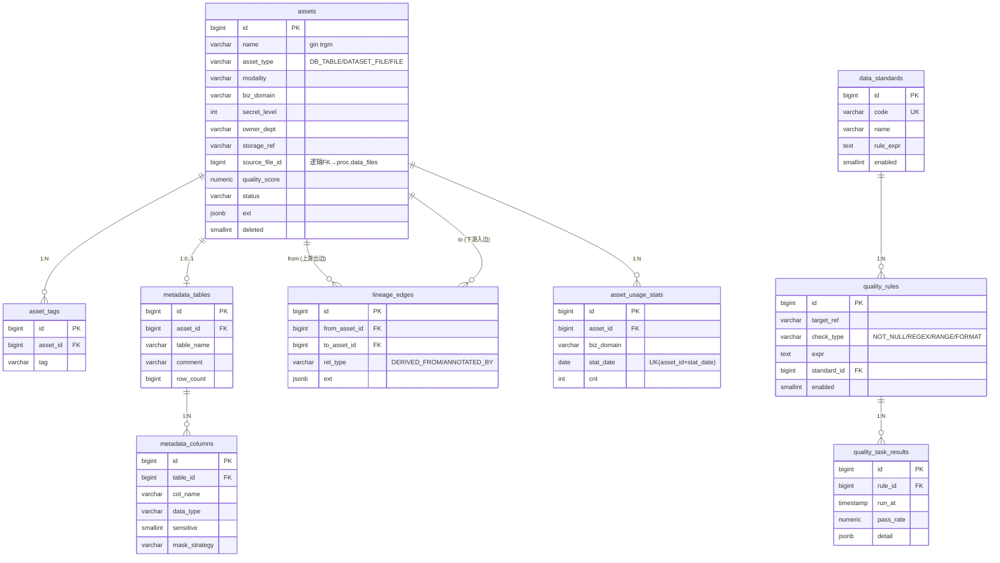

# DDL-GOV-001 gov Schema 数据库设计

> 版本：v1.0 ｜ 日期：2026-09-30
> 数据库：PostgreSQL 16
> Schema：gov
> 关联文档：MOD-GOV-001, API-GOV-001~004, SYS-005, 01-详细设计文档 §3.3/§3.5/§4.3

---

## 1. 概述

### 1.1 Schema 用途

`gov` schema 是数据治理与资产目录（GOV）模块的唯一持久化层，承载资产自动盘点、元数据登记、数据血缘、数据标准、质量规则与执行结果、资产使用统计六类核心数据，支撑以下用例：

- UC-GOV-001 资产自动盘点与登记（`/internal/assets/register` 回调入库）
- UC-GOV-002 资产目录检索与浏览（ILIKE + pg_trgm 模糊检索）
- UC-GOV-003 数据血缘追踪（上游溯源 + 下游影响分析）
- UC-GOV-004 资产使用频率热力图（域×日 count，ECharts heatmap）
- UC-GOV-005 数据标准管理
- 大屏聚合接口 `/api/screen/overview · /trend · /distribution`（详见 01-详细设计文档 §3.5）

**设计原则**：
- 全库不使用物理外键约束，跨表/跨 schema 关联均为逻辑外键，由应用层（platform-app governance 模块）保证完整性
- `assets.source_file_id` 逻辑关联 `proc.data_files.id`，跨 schema 不加物理 FK
- 检索型字段（`assets.name`）建立 `pg_trgm` GIN 索引，支撑 ILIKE 模糊检索
- MVP 不做 JDBC 外部数据源采集，`metadata_tables`/`metadata_columns` 仅承载上传结构化文件的表结构，连接器为后续扩展点
- 公共字段遵循 SYS-005 统一规范：`created_at / updated_at / create_by / update_by / deleted`

### 1.2 表清单

| 表名 | 中文名 | 用途 | 行量级 |
|---|---|---|---|
| assets | 数据资产表 | 资产目录主表，登记所有治理对象（库表/数据集文件/普通文件） | 万级 |
| asset_tags | 资产标签表 | 资产与标签的多对多映射 | 十万级 |
| metadata_tables | 元数据表结构表 | 上传结构化文件解析出的逻辑表结构 | 万级 |
| metadata_columns | 元数据字段表 | 逻辑表的字段明细，含敏感标记与脱敏策略 | 十万级 |
| lineage_edges | 血缘边表 | 资产间有向血缘边（raw → processed → 标注/数据集） | 十万级 |
| data_standards | 数据标准表 | 数据标准定义（编码、命名、格式规则） | 百级 |
| quality_rules | 质量规则表 | 质量校验规则定义（NOT_NULL/REGEX/RANGE/FORMAT 等） | 百级 |
| quality_task_results | 质量任务结果表 | 质量规则每次执行的结果与明细 | 万级 |
| asset_usage_stats | 资产使用统计表 | 资产×业务域×日 的使用次数，服务热力图 | 十万级 |

---

## 2. 公共字段规范

以下字段出现在本 schema 所有表中（`asset_usage_stats`、`quality_task_results` 为统计/结果表，不含 `update_by`/`updated_at`/`deleted`，见各表说明），定义统一含义：

| 字段名 | 类型 | 可空 | 默认 | 含义 |
|---|---|---|---|---|
| id | bigserial | 否 | — | 主键，自增 |
| create_by | varchar(64) | 否 | 'system' | 创建人（用户名；系统自动登记时为 `system`） |
| created_at | timestamp | 否 | CURRENT_TIMESTAMP | 创建时间 |
| update_by | varchar(64) | 是 | NULL | 最后修改人 |
| updated_at | timestamp | 是 | NULL | 最后修改时间（应用层 `@PreUpdate` 维护） |
| deleted | smallint | 否 | 0 | 软删标志：0=正常，1=已删除 |

**命名规范**：
- 表名：业务实体名（snake_case），本 schema 内不加前缀（schema 即命名空间）
- 布尔/标志位字段：用 `smallint`（0/1），与全库规范一致
- 索引名：`idx_<表名>_<字段名>`；唯一索引：`uk_<表名>_<字段名>`；部分唯一索引统一带 `WHERE deleted = 0`
- 外键：不建物理外键，关联完整性由应用层校验

**读写方总约定**：
- `gov` schema 仅 platform-app（Java governance 模块）直接读写
- Python processing-app 不直连 gov，通过内部接口 `POST /internal/assets/register` 间接写入（资产 upsert + 血缘边 + 使用统计，详见 01-详细设计文档 §3.3）

---

## 3. 表设计详情

### 3.1 assets

- **中文名**：数据资产表
- **用途**：资产目录主表，登记平台内全部治理对象；处理流水线完成后由 `/internal/assets/register` 回调 upsert
- **行量级**：万级
- **增长率**：随上传/加工链路增长，演示场景日均百级

#### 字段定义

| 列名 | 类型 | 可空 | 默认 | 注释（业务含义） |
|---|---|---|---|---|
| id | bigserial | 否 | — | 主键 |
| name | varchar(255) | 否 | — | 资产名称（模糊检索主字段，建 pg_trgm 索引） |
| asset_type | varchar(32) | 否 | — | 资产类型：DB_TABLE / DATASET_FILE / FILE |
| modality | varchar(32) | 是 | NULL | 模态：STRUCTURED / TEXT / IMAGE / VIDEO |
| biz_domain | varchar(64) | 是 | NULL | 业务域（如 FINANCE / TRANSPORT / HR） |
| secret_level | int | 否 | 1 | 密级（1~5，与 iam.users.secret_level 对齐，ABAC 判权依据） |
| owner_dept | varchar(64) | 是 | NULL | 归属部门编码（ABAC `dept_eq` 条件字段） |
| storage_ref | varchar(512) | 是 | NULL | 存储引用（MinIO 路径或库表定位符） |
| source_file_id | bigint | 是 | NULL | 来源文件 ID，逻辑关联 proc.data_files.id（跨 schema，无物理 FK） |
| quality_score | numeric(5,2) | 是 | NULL | 质量综合评分（0~100，由质量任务回写） |
| status | varchar(32) | 否 | 'ACTIVE' | 状态：ACTIVE / OFFLINE |
| ext | jsonb | 是 | NULL | 扩展属性（模态特有指标、缩略图、行列数等） |
| create_by | varchar(64) | 否 | 'system' | 创建人 |
| created_at | timestamp | 否 | CURRENT_TIMESTAMP | 创建时间 |
| update_by | varchar(64) | 是 | NULL | 最后修改人 |
| updated_at | timestamp | 是 | NULL | 最后修改时间 |
| deleted | smallint | 否 | 0 | 软删标志 |

#### 索引

| 索引名 | 类型 | 字段 | 命中场景 |
|---|---|---|---|
| pk_assets | 主键 | id | 资产详情 |
| idx_assets_name_trgm | GIN(pg_trgm) | name | 资产检索 `name ILIKE '%kw%'`（`/api/governance/assets?keyword`） |
| idx_assets_type_domain | 复合B树 | asset_type, biz_domain | 目录按类型+域过滤、大屏 distribution 聚合 |
| idx_assets_modality | B树 | modality | 按模态筛选 |
| idx_assets_source_file | B树 | source_file_id | 由 proc 文件反查资产 |
| idx_assets_ext | GIN | ext | ext jsonb 内含查询（扩展场景） |

#### DDL

```sql
-- 启用 pg_trgm 扩展（数据库级执行一次）
CREATE EXTENSION IF NOT EXISTS pg_trgm;

CREATE TABLE IF NOT EXISTS gov.assets (
    id             bigserial     PRIMARY KEY,
    name           varchar(255)  NOT NULL,
    asset_type     varchar(32)   NOT NULL,
    modality       varchar(32),
    biz_domain     varchar(64),
    secret_level   int           NOT NULL DEFAULT 1,
    owner_dept     varchar(64),
    storage_ref    varchar(512),
    source_file_id bigint,
    quality_score  numeric(5,2),
    status         varchar(32)   NOT NULL DEFAULT 'ACTIVE',
    ext            jsonb,
    create_by      varchar(64)   NOT NULL DEFAULT 'system',
    created_at     timestamp     NOT NULL DEFAULT CURRENT_TIMESTAMP,
    update_by      varchar(64),
    updated_at     timestamp,
    deleted        smallint      NOT NULL DEFAULT 0
);

COMMENT ON TABLE  gov.assets IS '数据资产表';
COMMENT ON COLUMN gov.assets.asset_type     IS '资产类型 DB_TABLE/DATASET_FILE/FILE';
COMMENT ON COLUMN gov.assets.modality       IS '模态 STRUCTURED/TEXT/IMAGE/VIDEO';
COMMENT ON COLUMN gov.assets.biz_domain     IS '业务域';
COMMENT ON COLUMN gov.assets.secret_level   IS '密级 1~5 ABAC判权依据';
COMMENT ON COLUMN gov.assets.owner_dept     IS '归属部门编码';
COMMENT ON COLUMN gov.assets.storage_ref    IS '存储引用 MinIO路径或库表定位符';
COMMENT ON COLUMN gov.assets.source_file_id IS '来源文件ID 逻辑关联proc.data_files.id 无物理FK';
COMMENT ON COLUMN gov.assets.quality_score  IS '质量综合评分 0~100';
COMMENT ON COLUMN gov.assets.status         IS '状态 ACTIVE/OFFLINE';
COMMENT ON COLUMN gov.assets.ext            IS '扩展属性 jsonb';
COMMENT ON COLUMN gov.assets.deleted        IS '软删标志 0=正常 1=已删除';

CREATE INDEX idx_assets_name_trgm  ON gov.assets USING GIN (name gin_trgm_ops);
CREATE INDEX idx_assets_type_domain ON gov.assets (asset_type, biz_domain);
CREATE INDEX idx_assets_modality   ON gov.assets (modality);
CREATE INDEX idx_assets_source_file ON gov.assets (source_file_id);
CREATE INDEX idx_assets_ext        ON gov.assets USING GIN (ext);
```

#### 软删与唯一约束

软删通过 `deleted=1` 实现，查询统一带 `deleted = 0`。不建业务唯一索引：同名资产允许存在（不同域/类型），upsert 由应用层按 `source_file_id + asset_type` 判定。

#### 关联关系

| 关联表 | 关联字段 | 关系类型 | 说明 |
|---|---|---|---|
| proc.data_files | source_file_id → id | 多对一（逻辑） | 跨 schema 逻辑外键，无物理 FK |
| asset_tags | id ← asset_id | 一对多 | 资产标签 |
| metadata_tables | id ← asset_id | 一对一（DB_TABLE 类型时） | 结构化资产的表结构 |
| lineage_edges | id ← from_asset_id / to_asset_id | 一对多 | 血缘出边/入边 |
| asset_usage_stats | id ← asset_id | 一对多 | 使用统计 |

#### 读写规则

- **写入方**：platform-app governance 模块（`/internal/assets/register` 处理资产 upsert；质量任务回写 `quality_score`；管理界面维护状态/标签）
- **读取方**：platform-app（资产检索/详情/血缘/大屏聚合）、开放 API `/openapi/v1/assets`
- **并发控制**：register 回调为 upsert 语义（按 `source_file_id + asset_type` 定位），重试幂等；人工编辑走乐观锁（`updated_at` 比对）
- **归档策略**：不归档，软删除保留

---

### 3.2 asset_tags

- **中文名**：资产标签表
- **用途**：资产与标签的多对多映射，支持目录按标签筛选
- **行量级**：十万级
- **增长率**：随资产登记与人工打标增长

#### 字段定义

| 列名 | 类型 | 可空 | 默认 | 注释（业务含义） |
|---|---|---|---|---|
| id | bigserial | 否 | — | 主键 |
| asset_id | bigint | 否 | — | 资产 ID，逻辑关联 assets.id |
| tag | varchar(64) | 否 | — | 标签值（如 `客户`、`脱敏完成`） |
| create_by | varchar(64) | 否 | 'system' | 创建人 |
| created_at | timestamp | 否 | CURRENT_TIMESTAMP | 创建时间 |
| update_by | varchar(64) | 是 | NULL | 最后修改人 |
| updated_at | timestamp | 是 | NULL | 最后修改时间 |
| deleted | smallint | 否 | 0 | 软删标志 |

#### DDL

```sql
CREATE TABLE IF NOT EXISTS gov.asset_tags (
    id         bigserial    PRIMARY KEY,
    asset_id   bigint       NOT NULL,
    tag        varchar(64)  NOT NULL,
    create_by  varchar(64)  NOT NULL DEFAULT 'system',
    created_at timestamp    NOT NULL DEFAULT CURRENT_TIMESTAMP,
    update_by  varchar(64),
    updated_at timestamp,
    deleted    smallint     NOT NULL DEFAULT 0
);

COMMENT ON TABLE  gov.asset_tags IS '资产标签表';
COMMENT ON COLUMN gov.asset_tags.asset_id IS '资产ID 逻辑关联assets.id';
COMMENT ON COLUMN gov.asset_tags.tag      IS '标签值';

CREATE INDEX idx_asset_tags_asset ON gov.asset_tags (asset_id);
CREATE INDEX idx_asset_tags_tag   ON gov.asset_tags (tag);
CREATE UNIQUE INDEX uk_asset_tags_asset_tag
    ON gov.asset_tags (asset_id, tag) WHERE deleted = 0;
```

#### 软删与唯一约束

`deleted=0` 时 `asset_id + tag` 唯一（部分唯一索引）；移除标签走软删，允许重新打标。

#### 关联关系

| 关联表 | 关联字段 | 关系类型 | 说明 |
|---|---|---|---|
| assets | asset_id → id | 多对一 | 标签归属资产 |

#### 读写规则

- **写入方**：platform-app（登记回调自动打标、人工打标）
- **读取方**：platform-app（资产检索按标签过滤、详情展示）
- **并发控制**：唯一索引防重，重复打标 `ON CONFLICT DO NOTHING`
- **归档策略**：不归档

---

### 3.3 metadata_tables

- **中文名**：元数据表结构表
- **用途**：登记上传结构化文件解析出的逻辑表结构；MVP 不做 JDBC 外部采集，连接器为扩展点
- **行量级**：万级
- **增长率**：随结构化文件上传增长

#### 字段定义

| 列名 | 类型 | 可空 | 默认 | 注释（业务含义） |
|---|---|---|---|---|
| id | bigserial | 否 | — | 主键 |
| asset_id | bigint | 否 | — | 所属资产 ID（asset_type=DB_TABLE），逻辑关联 assets.id |
| table_name | varchar(128) | 否 | — | 逻辑表名 |
| comment | varchar(512) | 是 | NULL | 表中文说明 |
| row_count | bigint | 是 | NULL | 行数（解析时快照） |
| create_by | varchar(64) | 否 | 'system' | 创建人 |
| created_at | timestamp | 否 | CURRENT_TIMESTAMP | 创建时间 |
| update_by | varchar(64) | 是 | NULL | 最后修改人 |
| updated_at | timestamp | 是 | NULL | 最后修改时间 |
| deleted | smallint | 否 | 0 | 软删标志 |

#### DDL

```sql
CREATE TABLE IF NOT EXISTS gov.metadata_tables (
    id         bigserial    PRIMARY KEY,
    asset_id   bigint       NOT NULL,
    table_name varchar(128) NOT NULL,
    comment    varchar(512),
    row_count  bigint,
    create_by  varchar(64)  NOT NULL DEFAULT 'system',
    created_at timestamp    NOT NULL DEFAULT CURRENT_TIMESTAMP,
    update_by  varchar(64),
    updated_at timestamp,
    deleted    smallint     NOT NULL DEFAULT 0
);

COMMENT ON TABLE  gov.metadata_tables IS '元数据表结构表（MVP仅承载上传结构化文件）';
COMMENT ON COLUMN gov.metadata_tables.asset_id   IS '所属资产ID 逻辑关联assets.id';
COMMENT ON COLUMN gov.metadata_tables.table_name IS '逻辑表名';
COMMENT ON COLUMN gov.metadata_tables.comment    IS '表中文说明';
COMMENT ON COLUMN gov.metadata_tables.row_count  IS '行数快照';

CREATE UNIQUE INDEX uk_metadata_tables_asset
    ON gov.metadata_tables (asset_id) WHERE deleted = 0;
CREATE INDEX idx_metadata_tables_name ON gov.metadata_tables (table_name);
```

#### 软删与唯一约束

一个资产对应一条表结构记录：`asset_id` 部分唯一索引 `WHERE deleted = 0`。资产软删时联动软删本表。

#### 关联关系

| 关联表 | 关联字段 | 关系类型 | 说明 |
|---|---|---|---|
| assets | asset_id → id | 一对一 | 结构化资产的元数据 |
| metadata_columns | id ← table_id | 一对多 | 表拥有字段 |

#### 读写规则

- **写入方**：platform-app（register 回调中处理结构化文件回调的表结构部分）
- **读取方**：platform-app（资产详情-结构页签、质量规则配置选目标）
- **并发控制**：register upsert 幂等
- **归档策略**：随资产软删，不单独归档

---

### 3.4 metadata_columns

- **中文名**：元数据字段表
- **用途**：登记逻辑表的字段明细，含敏感标记与脱敏策略（结构化文件回调列信息时写入）
- **行量级**：十万级
- **增长率**：随结构化文件上传增长

#### 字段定义

| 列名 | 类型 | 可空 | 默认 | 注释（业务含义） |
|---|---|---|---|---|
| id | bigserial | 否 | — | 主键 |
| table_id | bigint | 否 | — | 所属表 ID，逻辑关联 metadata_tables.id |
| col_name | varchar(128) | 否 | — | 字段名 |
| data_type | varchar(64) | 是 | NULL | 数据类型（如 varchar/int/timestamp） |
| ordinal | int | 是 | NULL | 字段序号 |
| sensitive | smallint | 否 | 0 | 是否敏感：0=否，1=是 |
| mask_strategy | varchar(64) | 是 | NULL | 脱敏策略（如 PHONE_MASK / IDCARD_MASK / NAME_MASK） |
| comment | varchar(512) | 是 | NULL | 字段中文说明 |
| create_by | varchar(64) | 否 | 'system' | 创建人 |
| created_at | timestamp | 否 | CURRENT_TIMESTAMP | 创建时间 |
| update_by | varchar(64) | 是 | NULL | 最后修改人 |
| updated_at | timestamp | 是 | NULL | 最后修改时间 |
| deleted | smallint | 否 | 0 | 软删标志 |

#### DDL

```sql
CREATE TABLE IF NOT EXISTS gov.metadata_columns (
    id            bigserial    PRIMARY KEY,
    table_id      bigint       NOT NULL,
    col_name      varchar(128) NOT NULL,
    data_type     varchar(64),
    ordinal       int,
    sensitive     smallint     NOT NULL DEFAULT 0,
    mask_strategy varchar(64),
    comment       varchar(512),
    create_by     varchar(64)  NOT NULL DEFAULT 'system',
    created_at    timestamp    NOT NULL DEFAULT CURRENT_TIMESTAMP,
    update_by     varchar(64),
    updated_at    timestamp,
    deleted       smallint     NOT NULL DEFAULT 0
);

COMMENT ON TABLE  gov.metadata_columns IS '元数据字段表';
COMMENT ON COLUMN gov.metadata_columns.table_id      IS '所属表ID 逻辑关联metadata_tables.id';
COMMENT ON COLUMN gov.metadata_columns.col_name      IS '字段名';
COMMENT ON COLUMN gov.metadata_columns.data_type     IS '数据类型';
COMMENT ON COLUMN gov.metadata_columns.ordinal       IS '字段序号';
COMMENT ON COLUMN gov.metadata_columns.sensitive     IS '是否敏感 0=否 1=是';
COMMENT ON COLUMN gov.metadata_columns.mask_strategy IS '脱敏策略 PHONE_MASK/IDCARD_MASK/NAME_MASK等';

CREATE INDEX idx_metadata_columns_table ON gov.metadata_columns (table_id);
CREATE UNIQUE INDEX uk_metadata_columns_table_col
    ON gov.metadata_columns (table_id, col_name) WHERE deleted = 0;
```

#### 软删与唯一约束

`deleted=0` 时 `table_id + col_name` 唯一；文件重新处理时按列名 upsert，消失的列软删。

#### 关联关系

| 关联表 | 关联字段 | 关系类型 | 说明 |
|---|---|---|---|
| metadata_tables | table_id → id | 多对一 | 字段归属表 |

#### 读写规则

- **写入方**：platform-app（register 回调写入列信息；敏感标记/脱敏策略可由治理界面人工修订）
- **读取方**：platform-app（资产详情、脱敏策略核对、质量规则配置）
- **并发控制**：upsert 按 `table_id + col_name` 幂等
- **归档策略**：随表软删，不单独归档

---

### 3.5 lineage_edges

- **中文名**：血缘边表
- **用途**：资产间有向血缘边，支撑上游溯源与下游影响分析（前端 ECharts graph 渲染）
- **行量级**：十万级
- **增长率**：随处理链路（raw 文件 → processed 成品 → 标注任务/数据集引用）增长

#### 字段定义

| 列名 | 类型 | 可空 | 默认 | 注释（业务含义） |
|---|---|---|---|---|
| id | bigserial | 否 | — | 主键 |
| from_asset_id | bigint | 否 | — | 上游资产 ID，逻辑关联 assets.id |
| to_asset_id | bigint | 否 | — | 下游资产 ID，逻辑关联 assets.id |
| rel_type | varchar(32) | 否 | — | 关系类型：DERIVED_FROM / ANNOTATED_BY / REFERENCED_BY 等 |
| ext | jsonb | 是 | NULL | 关系扩展信息（如加工任务 ID、时间窗口） |
| create_by | varchar(64) | 否 | 'system' | 创建人 |
| created_at | timestamp | 否 | CURRENT_TIMESTAMP | 创建时间 |
| update_by | varchar(64) | 是 | NULL | 最后修改人 |
| updated_at | timestamp | 是 | NULL | 最后修改时间 |
| deleted | smallint | 否 | 0 | 软删标志 |

#### 索引

| 索引名 | 类型 | 字段 | 命中场景 |
|---|---|---|---|
| pk_lineage_edges | 主键 | id | — |
| idx_lineage_edges_from | B树 | from_asset_id | 下游影响分析（查某资产被谁引用） |
| idx_lineage_edges_to | B树 | to_asset_id | 上游溯源（查某资产来源于谁） |
| uk_lineage_edges_edge | 部分唯一 | from_asset_id, to_asset_id, rel_type | 防重复血缘边 |

> 双向均建索引：血缘查询两个方向（up/down）都是高频操作，见 `/api/governance/assets/lineage/{id}`。

#### DDL

```sql
CREATE TABLE IF NOT EXISTS gov.lineage_edges (
    id            bigserial    PRIMARY KEY,
    from_asset_id bigint       NOT NULL,
    to_asset_id   bigint       NOT NULL,
    rel_type      varchar(32)  NOT NULL,
    ext           jsonb,
    create_by     varchar(64)  NOT NULL DEFAULT 'system',
    created_at    timestamp    NOT NULL DEFAULT CURRENT_TIMESTAMP,
    update_by     varchar(64),
    updated_at    timestamp,
    deleted       smallint     NOT NULL DEFAULT 0
);

COMMENT ON TABLE  gov.lineage_edges IS '血缘边表（有向：上游→下游）';
COMMENT ON COLUMN gov.lineage_edges.from_asset_id IS '上游资产ID 逻辑关联assets.id';
COMMENT ON COLUMN gov.lineage_edges.to_asset_id   IS '下游资产ID 逻辑关联assets.id';
COMMENT ON COLUMN gov.lineage_edges.rel_type      IS '关系类型 DERIVED_FROM/ANNOTATED_BY/REFERENCED_BY';
COMMENT ON COLUMN gov.lineage_edges.ext           IS '关系扩展信息 jsonb';

CREATE INDEX idx_lineage_edges_from ON gov.lineage_edges (from_asset_id);
CREATE INDEX idx_lineage_edges_to   ON gov.lineage_edges (to_asset_id);
CREATE UNIQUE INDEX uk_lineage_edges_edge
    ON gov.lineage_edges (from_asset_id, to_asset_id, rel_type) WHERE deleted = 0;
```

#### 软删与唯一约束

`deleted=0` 时 `(from_asset_id, to_asset_id, rel_type)` 唯一；血缘边不物理删除，链路重建时软删旧边。应用层需防环（写入前校验不产生 from→to 已存在的反向路径）。

#### 关联关系

| 关联表 | 关联字段 | 关系类型 | 说明 |
|---|---|---|---|
| assets | from_asset_id → id | 多对一 | 出边上端 |
| assets | to_asset_id → id | 多对一 | 入边下端 |

#### 读写规则

- **写入方**：platform-app（register 回调写血缘边：raw → processed → 标注任务；数据集生成版本时写 REFERENCED_BY 边）
- **读取方**：platform-app（血缘接口，递归 CTE 做多层溯源/影响分析）
- **并发控制**：唯一索引防重，回调重试幂等（`ON CONFLICT DO NOTHING`）
- **归档策略**：不归档

---

### 3.6 data_standards

- **中文名**：数据标准表
- **用途**：数据标准定义（编码、命名、格式规则），供质量规则引用与目录展示
- **行量级**：百级
- **增长率**：低频，人工维护

#### 字段定义

| 列名 | 类型 | 可空 | 默认 | 注释（业务含义） |
|---|---|---|---|---|
| id | bigserial | 否 | — | 主键 |
| code | varchar(64) | 否 | — | 标准编码（唯一，如 STD-PHONE-001） |
| name | varchar(128) | 否 | — | 标准名称 |
| rule_expr | text | 是 | NULL | 标准规则表达式（正则/取值范围说明） |
| description | varchar(512) | 是 | NULL | 标准说明 |
| enabled | smallint | 否 | 1 | 是否启用：0=否，1=是 |
| create_by | varchar(64) | 否 | 'system' | 创建人 |
| created_at | timestamp | 否 | CURRENT_TIMESTAMP | 创建时间 |
| update_by | varchar(64) | 是 | NULL | 最后修改人 |
| updated_at | timestamp | 是 | NULL | 最后修改时间 |
| deleted | smallint | 否 | 0 | 软删标志 |

#### DDL

```sql
CREATE TABLE IF NOT EXISTS gov.data_standards (
    id          bigserial    PRIMARY KEY,
    code        varchar(64)  NOT NULL,
    name        varchar(128) NOT NULL,
    rule_expr   text,
    description varchar(512),
    enabled     smallint     NOT NULL DEFAULT 1,
    create_by   varchar(64)  NOT NULL DEFAULT 'system',
    created_at  timestamp    NOT NULL DEFAULT CURRENT_TIMESTAMP,
    update_by   varchar(64),
    updated_at  timestamp,
    deleted     smallint     NOT NULL DEFAULT 0
);

COMMENT ON TABLE  gov.data_standards IS '数据标准表';
COMMENT ON COLUMN gov.data_standards.code      IS '标准编码 唯一';
COMMENT ON COLUMN gov.data_standards.rule_expr IS '标准规则表达式';
COMMENT ON COLUMN gov.data_standards.enabled   IS '是否启用 0=否 1=是';

CREATE UNIQUE INDEX uk_data_standards_code
    ON gov.data_standards (code) WHERE deleted = 0;
```

#### 软删与唯一约束

`deleted=0` 时 `code` 唯一；标准下线建议改 `enabled=0` 而非删除，保留历史引用可读性。

#### 关联关系

| 关联表 | 关联字段 | 关系类型 | 说明 |
|---|---|---|---|
| quality_rules | id ← standard_id | 一对多 | 质量规则可引用标准 |

#### 读写规则

- **写入方**：platform-app（`/api/governance/standards` 管理接口）
- **读取方**：platform-app（标准列表、质量规则配置）
- **并发控制**：乐观锁（`updated_at` 比对）
- **归档策略**：不归档

---

### 3.7 quality_rules

- **中文名**：质量规则表
- **用途**：质量校验规则定义，挂载在校验目标（资产/表/字段）上
- **行量级**：百级
- **增长率**：低频，人工/模板配置

#### 字段定义

| 列名 | 类型 | 可空 | 默认 | 注释（业务含义） |
|---|---|---|---|---|
| id | bigserial | 否 | — | 主键 |
| target_ref | varchar(255) | 否 | — | 校验目标引用（如 `asset:{id}` 或 `table:{table_id}.col:{col_name}`） |
| check_type | varchar(32) | 否 | — | 校验类型：NOT_NULL / REGEX / RANGE / FORMAT 等 |
| expr | text | 是 | NULL | 校验表达式（正则、范围 `min,max`、格式串） |
| standard_id | bigint | 是 | NULL | 引用的数据标准 ID，逻辑关联 data_standards.id |
| enabled | smallint | 否 | 1 | 是否启用：0=否，1=是 |
| create_by | varchar(64) | 否 | 'system' | 创建人 |
| created_at | timestamp | 否 | CURRENT_TIMESTAMP | 创建时间 |
| update_by | varchar(64) | 是 | NULL | 最后修改人 |
| updated_at | timestamp | 是 | NULL | 最后修改时间 |
| deleted | smallint | 否 | 0 | 软删标志 |

#### DDL

```sql
CREATE TABLE IF NOT EXISTS gov.quality_rules (
    id          bigserial    PRIMARY KEY,
    target_ref  varchar(255) NOT NULL,
    check_type  varchar(32)  NOT NULL,
    expr        text,
    standard_id bigint,
    enabled     smallint     NOT NULL DEFAULT 1,
    create_by   varchar(64)  NOT NULL DEFAULT 'system',
    created_at  timestamp    NOT NULL DEFAULT CURRENT_TIMESTAMP,
    update_by   varchar(64),
    updated_at  timestamp,
    deleted     smallint     NOT NULL DEFAULT 0
);

COMMENT ON TABLE  gov.quality_rules IS '质量规则表';
COMMENT ON COLUMN gov.quality_rules.target_ref  IS '校验目标引用 asset:{id}/table:{tid}.col:{cname}';
COMMENT ON COLUMN gov.quality_rules.check_type  IS '校验类型 NOT_NULL/REGEX/RANGE/FORMAT等';
COMMENT ON COLUMN gov.quality_rules.expr        IS '校验表达式';
COMMENT ON COLUMN gov.quality_rules.standard_id IS '引用数据标准ID 逻辑关联data_standards.id';
COMMENT ON COLUMN gov.quality_rules.enabled     IS '是否启用 0=否 1=是';

CREATE INDEX idx_quality_rules_target ON gov.quality_rules (target_ref);
CREATE INDEX idx_quality_rules_type   ON gov.quality_rules (check_type);
```

#### 软删与唯一约束

不建唯一索引：同一目标允许配置多条同类型规则（不同表达式）。停用走 `enabled=0`，删除走 `deleted=1`。

#### 关联关系

| 关联表 | 关联字段 | 关系类型 | 说明 |
|---|---|---|---|
| data_standards | standard_id → id | 多对一 | 规则引用标准 |
| quality_task_results | id ← rule_id | 一对多 | 规则的执行结果 |

#### 读写规则

- **写入方**：platform-app（`/api/governance/quality-rules` 管理接口）
- **读取方**：platform-app（质量引擎加载启用规则、规则管理界面）
- **并发控制**：乐观锁
- **归档策略**：不归档

---

### 3.8 quality_task_results

- **中文名**：质量任务结果表
- **用途**：记录质量规则每次执行的结果（通过率 + 明细），供质量报告与资产 `quality_score` 回写
- **行量级**：万级
- **增长率**：每次质量任务每规则一行

#### 字段定义

| 列名 | 类型 | 可空 | 默认 | 注释（业务含义） |
|---|---|---|---|---|
| id | bigserial | 否 | — | 主键 |
| rule_id | bigint | 否 | — | 规则 ID，逻辑关联 quality_rules.id |
| run_at | timestamp | 否 | CURRENT_TIMESTAMP | 执行时间 |
| total_count | bigint | 是 | NULL | 校验样本总数 |
| pass_count | bigint | 是 | NULL | 通过数 |
| pass_rate | numeric(5,2) | 是 | NULL | 通过率（0~100） |
| detail | jsonb | 是 | NULL | 执行明细（失败样本示例、分布统计等） |
| create_by | varchar(64) | 否 | 'system' | 创建人 |
| created_at | timestamp | 否 | CURRENT_TIMESTAMP | 创建时间 |

#### DDL

```sql
CREATE TABLE IF NOT EXISTS gov.quality_task_results (
    id          bigserial    PRIMARY KEY,
    rule_id     bigint       NOT NULL,
    run_at      timestamp    NOT NULL DEFAULT CURRENT_TIMESTAMP,
    total_count bigint,
    pass_count  bigint,
    pass_rate   numeric(5,2),
    detail      jsonb,
    create_by   varchar(64)  NOT NULL DEFAULT 'system',
    created_at  timestamp    NOT NULL DEFAULT CURRENT_TIMESTAMP
);

COMMENT ON TABLE  gov.quality_task_results IS '质量任务结果表';
COMMENT ON COLUMN gov.quality_task_results.rule_id  IS '规则ID 逻辑关联quality_rules.id';
COMMENT ON COLUMN gov.quality_task_results.run_at   IS '执行时间';
COMMENT ON COLUMN gov.quality_task_results.pass_rate IS '通过率 0~100';
COMMENT ON COLUMN gov.quality_task_results.detail   IS '执行明细 jsonb';

CREATE INDEX idx_quality_results_rule_time ON gov.quality_task_results (rule_id, run_at DESC);
CREATE INDEX idx_quality_results_run_at    ON gov.quality_task_results (run_at DESC);
```

#### 软删与唯一约束

结果表只追加、不更新、不软删（无 `deleted` 字段），同一次任务同一规则只写一行（应用层保证）。

#### 关联关系

| 关联表 | 关联字段 | 关系类型 | 说明 |
|---|---|---|---|
| quality_rules | rule_id → id | 多对一 | 结果归属规则 |

#### 读写规则

- **写入方**：platform-app（质量引擎执行后写入，并回写 `assets.quality_score`）
- **读取方**：platform-app（质量报告、大屏质量平均分聚合）
- **并发控制**：纯追加，无冲突
- **归档策略**：保留 180 天热数据，超出可归档导出

---

### 3.9 asset_usage_stats

- **中文名**：资产使用统计表
- **用途**：资产×业务域×日 的使用次数累计，服务资产热力图（ECharts heatmap，域×日 count）
- **行量级**：十万级
- **增长率**：每日每活跃资产×域一行（upsert 累加）

#### 字段定义

| 列名 | 类型 | 可空 | 默认 | 注释（业务含义） |
|---|---|---|---|---|
| id | bigserial | 否 | — | 主键 |
| asset_id | bigint | 否 | — | 资产 ID，逻辑关联 assets.id |
| biz_domain | varchar(64) | 否 | — | 业务域（冗余自 assets，避免聚合时回表） |
| stat_date | date | 否 | — | 统计日 |
| cnt | int | 否 | 0 | 当日使用次数 |
| created_at | timestamp | 否 | CURRENT_TIMESTAMP | 创建时间 |

#### DDL

```sql
CREATE TABLE IF NOT EXISTS gov.asset_usage_stats (
    id         bigserial   PRIMARY KEY,
    asset_id   bigint      NOT NULL,
    biz_domain varchar(64) NOT NULL,
    stat_date  date        NOT NULL,
    cnt        int         NOT NULL DEFAULT 0,
    created_at timestamp   NOT NULL DEFAULT CURRENT_TIMESTAMP
);

COMMENT ON TABLE  gov.asset_usage_stats IS '资产使用统计表（域×日count 服务热力图）';
COMMENT ON COLUMN gov.asset_usage_stats.asset_id   IS '资产ID 逻辑关联assets.id';
COMMENT ON COLUMN gov.asset_usage_stats.biz_domain IS '业务域（冗余 免回表聚合）';
COMMENT ON COLUMN gov.asset_usage_stats.stat_date  IS '统计日';
COMMENT ON COLUMN gov.asset_usage_stats.cnt        IS '当日使用次数';

CREATE UNIQUE INDEX uk_asset_usage_stats_asset_date
    ON gov.asset_usage_stats (asset_id, stat_date);
CREATE INDEX idx_asset_usage_stats_domain_date
    ON gov.asset_usage_stats (biz_domain, stat_date);
```

#### 软删与唯一约束

不使用软删。`(asset_id, stat_date)` 物理唯一索引，累加用 upsert：

```sql
INSERT INTO gov.asset_usage_stats (asset_id, biz_domain, stat_date, cnt)
VALUES ($1, $2, CURRENT_DATE, 1)
ON CONFLICT (asset_id, stat_date) DO UPDATE SET cnt = asset_usage_stats.cnt + 1;
```

#### 关联关系

| 关联表 | 关联字段 | 关系类型 | 说明 |
|---|---|---|---|
| assets | asset_id → id | 多对一 | 统计归属资产 |

#### 读写规则

- **写入方**：platform-app（register 回调及资产访问埋点 upsert 累加）
- **读取方**：platform-app（`/api/governance/assets/heatmap` 按 `biz_domain × stat_date` 聚合，走 `idx_asset_usage_stats_domain_date`）
- **并发控制**：`ON CONFLICT DO UPDATE` 原子累加，无锁冲突
- **归档策略**：保留 1 年，超出按月聚合归档

---

## 4. 种子数据

### 4.1 数据标准示例

```sql
INSERT INTO gov.data_standards (code, name, rule_expr, description, enabled, create_by)
VALUES
('STD-PHONE-001',  '手机号格式标准',   '^1[3-9]\d{9}$',                    '中国大陆手机号 11 位数字',          1, 'system'),
('STD-IDCARD-001', '身份证号格式标准', '^\d{17}[\dXx]$',                    '18 位身份证号，末位可为 X',        1, 'system'),
('STD-DATE-001',   '日期格式标准',     'YYYY-MM-DD',                        '日期统一 ISO 格式',               1, 'system'),
('STD-AMOUNT-001', '金额取值标准',     '0,999999999.99',                    '金额非负，两位小数',              1, 'system'),
('STD-PLATE-001',  '车牌号格式标准',   '^[京津沪渝冀豫云辽黑湘皖鲁新苏浙赣鄂桂甘晋蒙陕吉闽贵粤青藏川宁琼使领][A-HJ-NP-Z][A-HJ-NP-Z0-9]{4,5}[A-HJ-NP-Z0-9挂学警港澳]$', '中国大陆民用号牌', 1, 'system')
ON CONFLICT (code) WHERE deleted = 0 DO NOTHING;
```

### 4.2 质量规则示例

```sql
INSERT INTO gov.quality_rules (target_ref, check_type, expr, standard_id, enabled, create_by)
VALUES
('asset:1',                  'NOT_NULL', NULL,               NULL, 1, 'system'),
('table:1.col:phone',        'REGEX',    '^1[3-9]\d{9}$',    1,    1, 'system'),
('table:1.col:id_card',      'REGEX',    '^\d{17}[\dXx]$',   2,    1, 'system'),
('table:1.col:amount',       'RANGE',    '0,999999999.99',   4,    1, 'system'),
('table:1.col:create_date',  'FORMAT',   'YYYY-MM-DD',       3,    1, 'system')
ON CONFLICT DO NOTHING;
```

> 说明：种子中 `target_ref` 的 ID 为演示占位，实际部署时由 register 回调或治理界面按真实资产生成。

---

## 5. ER 片图



---

## 6. 迁移脚本

| 版本 | 文件名 | 变更内容 |
|---|---|---|
| V1 | V1__init_gov.sql | 创建 gov schema、pg_trgm 扩展、9 张表 + COMMENT + 全部索引（占位，随 Flyway 首个版本提交） |
| V2 | V2__seed_gov_data.sql | 数据标准与质量规则种子数据（占位） |

迁移脚本规范与 Flyway 约定详见 DDL-TRAJ-001 §6.1（目录 `backend/src/main/resources/db/migration/`、幂等写法）。

---

## 7. 验收标准

- [ ] gov schema 创建成功，9 张表存在且均有 `COMMENT ON TABLE`
- [ ] `pg_trgm` 扩展已启用，`idx_assets_name_trgm` GIN 索引存在，`name ILIKE '%kw%'` 可命中
- [ ] `lineage_edges` 双向索引（from/to）存在，`(from_asset_id, to_asset_id, rel_type)` 部分唯一索引生效
- [ ] `asset_usage_stats` 的 `(asset_id, stat_date)` 唯一索引存在，upsert 累加验证通过
- [ ] `metadata_columns` 含 `sensitive` 与 `mask_strategy` 字段
- [ ] 种子数据（5 条标准 + 5 条质量规则）插入成功且幂等
- [ ] 无物理外键约束（含跨 schema 的 `source_file_id`）
- [ ] 公共字段（`create_by/created_at/update_by/updated_at/deleted`）在业务表中齐全

---

## 8. 修订记录

| 版本 | 日期 | 修订人 | 修订内容 |
|---|---|---|---|
| v1.0 | 2026-09-30 | system | 初版：定义 gov schema 9 张表（资产/标签/元数据/血缘/标准/质量/使用统计），含种子数据与 ER 图 |
