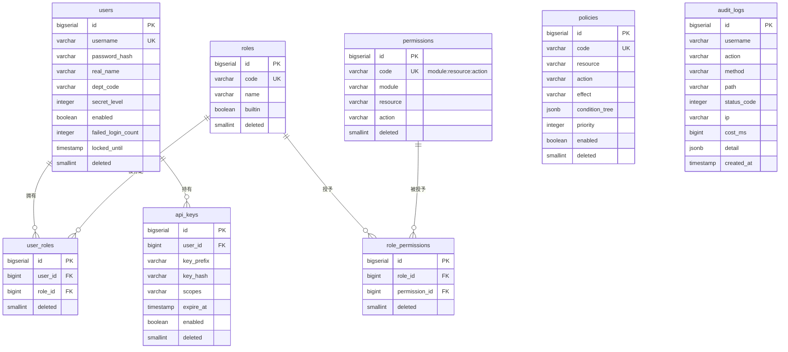

# DDL-IAM-001 iam Schema 数据库设计

> 版本：v1.0 ｜ 日期：2026-09-30
> 数据库：PostgreSQL 16
> Schema：iam
> 关联文档：MOD-IAM-001, API-IAM-001~006, SYS-003, SYS-005, 01-详细设计文档 §4.1

---

## 1. 概述

### 1.1 Schema 用途

`iam` schema 是企业级多模态数据中台 MVP（Lite 演示架构）的身份认证与权限管理持久化层，承担以下核心职责：

- **用户与凭证**：用户主数据、BCrypt 口令哈希、登录失败锁定、密级（ABAC 比较依据）
- **RBAC**：角色、权限点、用户-角色绑定、角色-权限绑定
- **ABAC**：基于 jsonb 条件树的属性策略（如部门一致、密级不越权）
- **API 接入**：第三方系统 API Key（仅存哈希 + 前缀索引）
- **安全审计**：全量操作审计（只追加，保留 180 天）

**设计原则**：
- 详细设计文档 §4.1 定义了 7 张表，本文档为完整覆盖 RBAC 多对多关系与权限管理，实际拆分为 **8 张表**：将权限点从 `roles` 内联拆出独立的 `permissions` 表、补充 `user_roles`/`role_permissions` 两张中间表，与 ER 图保持一致
- 所有口令、API Key **绝不存明文**，只存不可逆哈希
- `audit_logs` 仅追加不更新不删除（应用层约束），通过 `created_at` 分区/索引支持时间范围检索
- 登录锁定状态（`failed_login_count` / `locked_until`）内嵌在 `users` 表，避免引入 Redis
- 不建立物理外键约束，关联完整性由应用层校验（遵循 SYS-005 统一规范）

### 1.2 表清单

| 表名 | 中文名 | 用途 | 行量级 |
|---|---|---|---|
| users | 用户表 | 平台用户主数据，含口令哈希、密级、登录锁定状态 | 百级 |
| roles | 角色表 | RBAC 角色定义（admin/operator/viewer 等） | 十级 |
| permissions | 权限点表 | 细粒度权限码，形如 `module:resource:action` | 百级 |
| user_roles | 用户-角色关联表 | 用户与角色多对多绑定 | 百级 |
| role_permissions | 角色-权限关联表 | 角色与权限多对多绑定 | 百级 |
| policies | ABAC 策略表 | 基于属性（部门/密级）的条件策略，jsonb 条件树 | 十级 |
| api_keys | API Key 表 | 第三方系统接入凭证，仅存哈希与前缀 | 十级 |
| audit_logs | 操作审计表 | 全量请求与关键动作审计，只追加 | 千万级（180 天累计） |

> **数量说明**：详细设计文档 §2.5 表清单中标注 DDL-IAM-001 为 7 张表，但 §4.1 ER 图实际包含 `users/roles/permissions/user_roles/role_permissions/policies/api_keys/audit_logs` 共 8 个实体（user_roles、role_permissions 在 ER 图中作为关系节点）。本文档以 §4.1 ER 图为准，落地 8 张表。

---

## 2. 公共字段规范

以下字段出现在除 `audit_logs` 之外的所有业务表中（`audit_logs` 为只追加时序日志，只保留 `created_at`），统一定义如下：

| 字段名 | 类型 | 可空 | 默认 | 含义 |
|---|---|---|---|---|
| id | bigserial | 否 | — | 主键，自增 |
| created_at | timestamp | 否 | CURRENT_TIMESTAMP | 创建时间 |
| updated_at | timestamp | 否 | CURRENT_TIMESTAMP | 最后修改时间（应用层 `@PreUpdate` 维护） |
| create_by | varchar(64) | 是 | NULL | 创建人用户名（系统初始化为 `system`） |
| update_by | varchar(64) | 是 | NULL | 最后修改人用户名 |
| deleted | smallint | 否 | 0 | 软删除标志：0=正常，1=已删除 |

**命名规范**：
- 表名：snake_case，单数形式（`users` 沿用习惯复数例外）
- 索引名：`idx_<表>_<字段>`（普通）、`uk_<表>_<字段>`（唯一）
- 唯一约束配合软删除：使用**部分唯一索引** `WHERE deleted = 0`，允许软删后重建同名记录
- 不建立物理外键，通过应用层 Service 校验关联完整性

**软删除约定**：
- 所有查询必须显式带 `WHERE deleted = 0`（MyBatis 拦截器自动追加）
- 软删除 = `UPDATE ... SET deleted=1, updated_at=now(), update_by=<operator>`
- `audit_logs` 例外：永不删除，由定时任务按 `created_at < now() - interval '180 days'` 物理清理

---

## 3. 表设计详情

### 3.1 users

- **中文名**：用户表
- **用途**：平台用户主数据，存储登录凭证（BCrypt 哈希）、密级、登录锁定状态
- **行量级**：百级（MVP 演示场景）
- **增长率**：低频，管理员手工维护

#### 字段定义

| 列名 | 类型 | 可空 | 默认 | 注释（业务含义） |
|---|---|---|---|---|
| id | bigserial | 否 | — | 用户ID，主键 |
| username | varchar(64) | 否 | — | 登录名，全局唯一（软删后可重用） |
| password_hash | varchar(100) | 否 | — | BCrypt 哈希（60 字符，含 salt，永不明文） |
| real_name | varchar(64) | 是 | NULL | 真实姓名 |
| email | varchar(128) | 是 | NULL | 邮箱（通知/找回密码，预留） |
| phone | varchar(32) | 是 | NULL | 手机号（脱敏存储，预留） |
| dept_code | varchar(64) | 是 | NULL | 部门编码，ABAC `dept_eq` 条件左值 |
| secret_level | integer | 否 | 1 | 数据密级：1=公开 2=内部 3=秘密 4=机密，ABAC `lte` 比较右值上限 |
| enabled | boolean | 否 | true | 启用状态：false 时禁止登录 |
| failed_login_count | integer | 否 | 0 | 连续登录失败次数，≥5 触发锁定 |
| locked_until | timestamp | 是 | NULL | 锁定截止时间，NULL 表示未锁定；超过此时刻自动解锁 |
| last_login_at | timestamp | 是 | NULL | 最近登录成功时间 |
| last_login_ip | varchar(64) | 是 | NULL | 最近登录来源 IP |
| created_at | timestamp | 否 | CURRENT_TIMESTAMP | 创建时间 |
| updated_at | timestamp | 否 | CURRENT_TIMESTAMP | 更新时间 |
| create_by | varchar(64) | 是 | NULL | 创建人 |
| update_by | varchar(64) | 是 | NULL | 修改人 |
| deleted | smallint | 否 | 0 | 软删除标志 |

#### 索引

| 索引名 | 类型 | 字段 | 命中场景 |
|---|---|---|---|
| pk_users | 主键 | id | 用户详情 |
| uk_users_username | 部分唯一 | username WHERE deleted=0 | 登录按 username 查用户 |
| idx_users_dept | B树 | dept_code | 按部门统计/筛选 |
| idx_users_enabled | B树 | enabled WHERE deleted=0 | 仅查有效启用账号 |

#### DDL

```sql
CREATE TABLE IF NOT EXISTS iam.users (
    id                  bigserial     PRIMARY KEY,
    username            varchar(64)   NOT NULL,
    password_hash       varchar(100)  NOT NULL,
    real_name           varchar(64),
    email               varchar(128),
    phone               varchar(32),
    dept_code           varchar(64),
    secret_level        integer       NOT NULL DEFAULT 1,
    enabled             boolean       NOT NULL DEFAULT true,
    failed_login_count  integer       NOT NULL DEFAULT 0,
    locked_until        timestamp,
    last_login_at       timestamp,
    last_login_ip       varchar(64),
    created_at          timestamp     NOT NULL DEFAULT CURRENT_TIMESTAMP,
    updated_at          timestamp     NOT NULL DEFAULT CURRENT_TIMESTAMP,
    create_by           varchar(64),
    update_by           varchar(64),
    deleted             smallint      NOT NULL DEFAULT 0
);

COMMENT ON TABLE  iam.users                  IS '用户表';
COMMENT ON COLUMN iam.users.username         IS '登录名 全局唯一（软删后可重用）';
COMMENT ON COLUMN iam.users.password_hash    IS 'BCrypt 哈希 含盐 60字符 永不明文';
COMMENT ON COLUMN iam.users.dept_code        IS '部门编码 ABAC dept_eq 条件属性';
COMMENT ON COLUMN iam.users.secret_level     IS '数据密级 1=公开 2=内部 3=秘密 4=机密 ABAC lte 比较';
COMMENT ON COLUMN iam.users.failed_login_count IS '连续登录失败次数 >=5 触发锁定10分钟';
COMMENT ON COLUMN iam.users.locked_until     IS '锁定截止时间 NULL=未锁定 超过后自动解锁';

CREATE UNIQUE INDEX uk_users_username
    ON iam.users (username) WHERE deleted = 0;
CREATE INDEX idx_users_dept
    ON iam.users (dept_code) WHERE deleted = 0;
CREATE INDEX idx_users_enabled
    ON iam.users (enabled) WHERE deleted = 0;
```

#### 软删与唯一约束

`username` 部分唯一索引 `WHERE deleted = 0`，软删后允许新建同名用户。`enabled=false` 不等同软删：禁用是业务状态，软删是数据生命周期。

#### 关联关系

| 关联表 | 关联字段 | 关系类型 | 说明 |
|---|---|---|---|
| user_roles | id ← user_id | 一对多 | 一个用户可绑定多个角色 |
| api_keys | id ← user_id | 一对多 | 一个用户可申请多个 API Key |
| audit_logs | username → username | 逻辑关联 | 审计表冗余 username，无外键 |

#### 读写规则

- **写入方**：IAM 模块 `UserService`（管理员维护）、`AuthService`（登录时更新 `failed_login_count`/`locked_until`/`last_login_*`）
- **读取方**：`AuthService`（登录校验）、`UserService`（用户管理）、`AbacEngine`（读取 `dept_code`/`secret_level` 做条件求值）
- **并发控制**：登录失败计数使用 `UPDATE ... SET failed_login_count = failed_login_count + 1 WHERE id = ?` 原子自增；用户资料修改使用乐观锁（`updated_at` 比对）
- **归档策略**：不归档；软删用户保留至少 180 天以配合审计追溯

#### 安全要点

- `password_hash` 使用 BCrypt（cost=10），由 Spring Security `BCryptPasswordEncoder` 生成，应用层绝不调用 `password_hash` 的 SELECT 返回给前端
- 登录失败 5 次锁 10 分钟：事务内 `failed_login_count++`，≥5 时 `locked_until = now() + interval '10 minutes'`；登录成功重置 `failed_login_count=0, locked_until=NULL`
- `secret_level` 仅允许管理员修改，普通用户不可自助变更

---

### 3.2 roles

- **中文名**：角色表
- **用途**：RBAC 角色定义，权限的聚合单元
- **行量级**：十级
- **增长率**：极低，初始化后基本只读

#### 字段定义

| 列名 | 类型 | 可空 | 默认 | 注释（业务含义） |
|---|---|---|---|---|
| id | bigserial | 否 | — | 角色ID，主键 |
| code | varchar(64) | 否 | — | 角色编码（如 admin/operator/viewer），全局唯一 |
| name | varchar(64) | 否 | — | 角色显示名（如 系统管理员） |
| description | varchar(255) | 是 | NULL | 角色职责说明 |
| builtin | boolean | 否 | false | 是否内置角色：true 时禁止删除/改 code |
| created_at | timestamp | 否 | CURRENT_TIMESTAMP | 创建时间 |
| updated_at | timestamp | 否 | CURRENT_TIMESTAMP | 更新时间 |
| create_by | varchar(64) | 是 | NULL | 创建人 |
| update_by | varchar(64) | 是 | NULL | 修改人 |
| deleted | smallint | 否 | 0 | 软删除标志 |

#### DDL

```sql
CREATE TABLE IF NOT EXISTS iam.roles (
    id          bigserial    PRIMARY KEY,
    code        varchar(64)  NOT NULL,
    name        varchar(64)  NOT NULL,
    description varchar(255),
    builtin     boolean      NOT NULL DEFAULT false,
    created_at  timestamp    NOT NULL DEFAULT CURRENT_TIMESTAMP,
    updated_at  timestamp    NOT NULL DEFAULT CURRENT_TIMESTAMP,
    create_by   varchar(64),
    update_by   varchar(64),
    deleted     smallint     NOT NULL DEFAULT 0
);

COMMENT ON TABLE  iam.roles         IS '角色表';
COMMENT ON COLUMN iam.roles.code    IS '角色编码 全局唯一 如 admin/operator/viewer';
COMMENT ON COLUMN iam.roles.builtin IS '内置角色 true 时禁止删除或修改 code';

CREATE UNIQUE INDEX uk_roles_code
    ON iam.roles (code) WHERE deleted = 0;
```

#### 软删与唯一约束

`code` 部分唯一索引 `WHERE deleted=0`。`builtin=true` 的角色（admin/viewer 等）应用层禁止软删。

#### 关联关系

| 关联表 | 关联字段 | 关系类型 | 说明 |
|---|---|---|---|
| user_roles | id ← role_id | 一对多 | 一个角色可分配给多个用户 |
| role_permissions | id ← role_id | 一对多 | 一个角色可拥有多个权限点 |

#### 读写规则

- **写入方**：IAM 模块 `RoleService`（管理员维护）；初始化由种子脚本完成
- **读取方**：`AuthService`（登录时加载用户角色）、`RbacAnnotationInterceptor`（方法级鉴权）、前端权限管理页
- **并发控制**：低频写，乐观锁（`updated_at`）
- **归档策略**：不归档，软删保留

---

### 3.3 permissions

- **中文名**：权限点表
- **用途**：细粒度权限点定义，编码格式 `module:resource:action`
- **行量级**：百级
- **增长率**：随功能上线追加，运行时不变

#### 字段定义

| 列名 | 类型 | 可空 | 默认 | 注释（业务含义） |
|---|---|---|---|---|
| id | bigserial | 否 | — | 权限ID，主键 |
| code | varchar(128) | 否 | — | 权限码，全局唯一，格式 `module:resource:action`（如 `proc:file:upload`） |
| name | varchar(128) | 否 | — | 权限显示名 |
| module | varchar(32) | 否 | — | 所属模块（iam/proc/gov/ds/scr/prod/traj） |
| resource | varchar(64) | 否 | — | 资源名（file/asset/dataset 等） |
| action | varchar(32) | 否 | — | 动作（create/read/update/delete/export 等） |
| description | varchar(255) | 是 | NULL | 权限说明 |
| created_at | timestamp | 否 | CURRENT_TIMESTAMP | 创建时间 |
| updated_at | timestamp | 否 | CURRENT_TIMESTAMP | 更新时间 |
| create_by | varchar(64) | 是 | NULL | 创建人 |
| update_by | varchar(64) | 是 | NULL | 修改人 |
| deleted | smallint | 否 | 0 | 软删除标志 |

#### 索引

| 索引名 | 类型 | 字段 | 命中场景 |
|---|---|---|---|
| pk_permissions | 主键 | id | 详情 |
| uk_permissions_code | 部分唯一 | code WHERE deleted=0 | 按 code 查找 |
| idx_permissions_module | B树 | module, resource | 按模块分组列出权限点 |

#### DDL

```sql
CREATE TABLE IF NOT EXISTS iam.permissions (
    id          bigserial    PRIMARY KEY,
    code        varchar(128) NOT NULL,
    name        varchar(128) NOT NULL,
    module      varchar(32)  NOT NULL,
    resource    varchar(64)  NOT NULL,
    action      varchar(32)  NOT NULL,
    description varchar(255),
    created_at  timestamp    NOT NULL DEFAULT CURRENT_TIMESTAMP,
    updated_at  timestamp    NOT NULL DEFAULT CURRENT_TIMESTAMP,
    create_by   varchar(64),
    update_by   varchar(64),
    deleted     smallint     NOT NULL DEFAULT 0
);

COMMENT ON TABLE  iam.permissions        IS '权限点表';
COMMENT ON COLUMN iam.permissions.code   IS '权限码 格式 module:resource:action 全局唯一';
COMMENT ON COLUMN iam.permissions.module IS '所属模块 iam/proc/gov/ds/scr/prod/traj';

CREATE UNIQUE INDEX uk_permissions_code
    ON iam.permissions (code) WHERE deleted = 0;
CREATE INDEX idx_permissions_module
    ON iam.permissions (module, resource);
```

#### 软删与唯一约束

`code` 部分唯一索引。权限点通常只增不删（删除会导致历史角色绑定失效），软删仅用于纠错。

#### 关联关系

| 关联表 | 关联字段 | 关系类型 | 说明 |
|---|---|---|---|
| role_permissions | id ← permission_id | 一对多 | 一个权限点可被多个角色引用 |

#### 读写规则

- **写入方**：种子脚本初始化；运行时仅管理员通过权限管理界面追加
- **读取方**：`RbacAnnotationInterceptor`（每次方法调用校验 `@PreAuthorize` 表达式中的权限码）、权限管理页
- **并发控制**：极低频写，无需特殊控制；高频读取走应用内缓存（Caffeine，5 分钟 TTL）
- **归档策略**：不归档

---

### 3.4 user_roles

- **中文名**：用户-角色关联表
- **用途**：用户与角色的多对多绑定关系
- **行量级**：百级（平均 1 用户 1-2 角色）
- **增长率**：低频

#### 字段定义

| 列名 | 类型 | 可空 | 默认 | 注释（业务含义） |
|---|---|---|---|---|
| id | bigserial | 否 | — | 主键 |
| user_id | bigint | 否 | — | 用户ID（逻辑外键 → users.id） |
| role_id | bigint | 否 | — | 角色ID（逻辑外键 → roles.id） |
| created_at | timestamp | 否 | CURRENT_TIMESTAMP | 绑定时间 |
| updated_at | timestamp | 否 | CURRENT_TIMESTAMP | 更新时间 |
| create_by | varchar(64) | 是 | NULL | 操作人（管理员） |
| update_by | varchar(64) | 是 | NULL | 修改人 |
| deleted | smallint | 否 | 0 | 软删除标志 |

#### DDL

```sql
CREATE TABLE IF NOT EXISTS iam.user_roles (
    id         bigserial PRIMARY KEY,
    user_id    bigint    NOT NULL,
    role_id    bigint    NOT NULL,
    created_at timestamp NOT NULL DEFAULT CURRENT_TIMESTAMP,
    updated_at timestamp NOT NULL DEFAULT CURRENT_TIMESTAMP,
    create_by  varchar(64),
    update_by  varchar(64),
    deleted    smallint  NOT NULL DEFAULT 0
);

COMMENT ON TABLE iam.user_roles IS '用户-角色关联表';

CREATE UNIQUE INDEX uk_user_roles_user_role
    ON iam.user_roles (user_id, role_id) WHERE deleted = 0;
CREATE INDEX idx_user_roles_user
    ON iam.user_roles (user_id) WHERE deleted = 0;
CREATE INDEX idx_user_roles_role_id
    ON iam.user_roles (role_id) WHERE deleted = 0;
```

#### 软删与唯一约束

`(user_id, role_id)` 部分唯一索引 `WHERE deleted=0`，软删后允许重新绑定。

#### 关联关系

| 关联表 | 关联字段 | 关系类型 | 说明 |
|---|---|---|---|
| users | user_id → id | 多对一 | — |
| roles | role_id → id | 多对一 | — |

#### 读写规则

- **写入方**：`RoleService.grantRoles` / `revokeRoles`
- **读取方**：`AuthService`（登录加载角色列表）
- **并发控制**：先软删后插入，事务内完成；同一 `(user_id, role_id)` 靠部分唯一索引防重
- **归档策略**：不归档

---

### 3.5 role_permissions

- **中文名**：角色-权限关联表
- **用途**：角色与权限点的多对多绑定
- **行量级**：百级
- **增长率**：低频

#### 字段定义

| 列名 | 类型 | 可空 | 默认 | 注释（业务含义） |
|---|---|---|---|---|
| id | bigserial | 否 | — | 主键 |
| role_id | bigint | 否 | — | 角色ID |
| permission_id | bigint | 否 | — | 权限ID |
| created_at | timestamp | 否 | CURRENT_TIMESTAMP | 创建时间 |
| updated_at | timestamp | 否 | CURRENT_TIMESTAMP | 更新时间 |
| create_by | varchar(64) | 是 | NULL | 操作人 |
| update_by | varchar(64) | 是 | NULL | 修改人 |
| deleted | smallint | 否 | 0 | 软删除标志 |

#### DDL

```sql
CREATE TABLE IF NOT EXISTS iam.role_permissions (
    id            bigserial PRIMARY KEY,
    role_id       bigint    NOT NULL,
    permission_id bigint    NOT NULL,
    created_at    timestamp NOT NULL DEFAULT CURRENT_TIMESTAMP,
    updated_at    timestamp NOT NULL DEFAULT CURRENT_TIMESTAMP,
    create_by     varchar(64),
    update_by     varchar(64),
    deleted       smallint  NOT NULL DEFAULT 0
);

COMMENT ON TABLE iam.role_permissions IS '角色-权限关联表';

CREATE UNIQUE INDEX uk_role_permissions_rp
    ON iam.role_permissions (role_id, permission_id) WHERE deleted = 0;
CREATE INDEX idx_role_permissions_role
    ON iam.role_permissions (role_id) WHERE deleted = 0;
CREATE INDEX idx_role_permissions_perm
    ON iam.role_permissions (permission_id) WHERE deleted = 0;
```

#### 软删与唯一约束

`(role_id, permission_id)` 部分唯一索引，软删后可重新授权。

#### 关联关系

| 关联表 | 关联字段 | 关系类型 | 说明 |
|---|---|---|---|
| roles | role_id → id | 多对一 | — |
| permissions | permission_id → id | 多对一 | — |

#### 读写规则

- **写入方**：`RoleService.grantPermissions` / `revokePermissions`
- **读取方**：`AuthService`（登录加载权限码集合）、`RbacAnnotationInterceptor`（鉴权时读取缓存）
- **并发控制**：事务内先软删后插入；登录时读取走 Caffeine 缓存（角色ID 变更时主动失效）
- **归档策略**：不归档

---

### 3.6 policies

- **中文名**：ABAC 策略表
- **用途**：基于属性的访问控制策略，jsonb 条件树描述复杂规则
- **行量级**：十级
- **增长率**：极低

#### 字段定义

| 列名 | 类型 | 可空 | 默认 | 注释（业务含义） |
|---|---|---|---|---|
| id | bigserial | 否 | — | 策略ID，主键 |
| code | varchar(64) | 否 | — | 策略编码，全局唯一 |
| name | varchar(128) | 否 | — | 策略名称 |
| description | varchar(255) | 是 | NULL | 策略说明 |
| resource | varchar(64) | 否 | — | 作用资源（如 asset、dataset、file） |
| action | varchar(32) | 否 | — | 作用动作（read/write/download 等） |
| effect | varchar(8) | 否 | 'ALLOW' | 决策结果：ALLOW / DENY |
| condition_tree | jsonb | 否 | — | ABAC 条件树（详见下方示例） |
| priority | integer | 否 | 100 | 优先级，数字小者优先；DENY 通常置高优先级 |
| enabled | boolean | 否 | true | 是否启用 |
| created_at | timestamp | 否 | CURRENT_TIMESTAMP | 创建时间 |
| updated_at | timestamp | 否 | CURRENT_TIMESTAMP | 更新时间 |
| create_by | varchar(64) | 是 | NULL | 创建人 |
| update_by | varchar(64) | 是 | NULL | 修改人 |
| deleted | smallint | 否 | 0 | 软删除标志 |

#### condition_tree 结构示例

```json
{
  "all": [
    {"op": "dept_eq", "left": "user.dept_code",     "right": "asset.owner_dept"},
    {"op": "lte",     "left": "asset.secret_level", "right": "user.secret_level"}
  ]
}
```

支持算子：`all`（与）、`any`（或）、`not`（非）、`eq` / `ne` / `lt` / `lte` / `gt` / `gte` / `in` / `dept_eq`（部门相等，含子部门扩展预留）。左/右值以 `user.*` / `asset.*` / `env.*` 命名空间引用属性。

#### 索引

| 索引名 | 类型 | 字段 | 命中场景 |
|---|---|---|---|
| pk_policies | 主键 | id | 详情 |
| uk_policies_code | 部分唯一 | code WHERE deleted=0 | 按编码查 |
| idx_policies_resource | B树 | resource, action, enabled | ABAC 引擎按资源+动作拉取启用策略 |

#### DDL

```sql
CREATE TABLE IF NOT EXISTS iam.policies (
    id             bigserial    PRIMARY KEY,
    code           varchar(64)  NOT NULL,
    name           varchar(128) NOT NULL,
    description    varchar(255),
    resource       varchar(64)  NOT NULL,
    action         varchar(32)  NOT NULL,
    effect         varchar(8)   NOT NULL DEFAULT 'ALLOW',
    condition_tree jsonb        NOT NULL,
    priority       integer      NOT NULL DEFAULT 100,
    enabled        boolean      NOT NULL DEFAULT true,
    created_at     timestamp    NOT NULL DEFAULT CURRENT_TIMESTAMP,
    updated_at     timestamp    NOT NULL DEFAULT CURRENT_TIMESTAMP,
    create_by      varchar(64),
    update_by      varchar(64),
    deleted        smallint     NOT NULL DEFAULT 0
);

COMMENT ON TABLE  iam.policies                IS 'ABAC 策略表';
COMMENT ON COLUMN iam.policies.effect         IS 'ALLOW / DENY';
COMMENT ON COLUMN iam.policies.condition_tree IS 'jsonb 条件树 支持 all/any/not/eq/lte 等算子';
COMMENT ON COLUMN iam.policies.priority       IS '数字小者优先 DENY 通常置高优先级';

CREATE UNIQUE INDEX uk_policies_code
    ON iam.policies (code) WHERE deleted = 0;
CREATE INDEX idx_policies_resource
    ON iam.policies (resource, action, enabled) WHERE deleted = 0;
```

#### 软删与唯一约束

`code` 部分唯一索引。策略停用应优先用 `enabled=false`，而非软删。

#### 关联关系

| 关联表 | 关联字段 | 关系类型 | 说明 |
|---|---|---|---|
| users | 逻辑引用 user.dept_code / user.secret_level | 运行时属性 | ABAC 求值时读取 |
| gov.assets | 逻辑引用 asset.secret_level / asset.owner_dept | 运行时属性 | ABAC 求值时读取 |

#### 读写规则

- **写入方**：`PolicyService`（管理员维护）
- **读取方**：`AbacEngine`（每次受 ABAC 保护的资源访问时求值）
- **并发控制**：低频写，乐观锁；`AbacEngine` 启动时全量加载至内存，策略变更通过事件失效
- **归档策略**：不归档

---

### 3.7 api_keys

- **中文名**：API Key 表
- **用途**：第三方系统调用 `/openapi/v1/**` 的接入凭证
- **行量级**：十级
- **增长率**：低频

#### 字段定义

| 列名 | 类型 | 可空 | 默认 | 注释（业务含义） |
|---|---|---|---|---|
| id | bigserial | 否 | — | 主键 |
| user_id | bigint | 否 | — | 归属用户ID（API Key 调用时以此用户身份鉴权） |
| name | varchar(64) | 否 | — | Key 名称（便于识别用途，如 "ERP 系统对接"） |
| key_prefix | varchar(16) | 否 | — | Key 前缀（明文存储前 8 位，用于快速定位候选记录） |
| key_hash | varchar(128) | 否 | — | Key 完整值的 SHA-256 哈希（十六进制 64 字符），不存明文 |
| scopes | varchar(512) | 是 | NULL | 权限范围，逗号分隔的权限码子集（不得超过所属用户已有权限） |
| expire_at | timestamp | 是 | NULL | 过期时间，NULL 表示永不过期 |
| last_used_at | timestamp | 是 | NULL | 最近使用时间 |
| last_used_ip | varchar(64) | 是 | NULL | 最近使用 IP |
| enabled | boolean | 否 | true | 启用状态 |
| created_at | timestamp | 否 | CURRENT_TIMESTAMP | 创建时间 |
| updated_at | timestamp | 否 | CURRENT_TIMESTAMP | 更新时间 |
| create_by | varchar(64) | 是 | NULL | 创建人 |
| update_by | varchar(64) | 是 | NULL | 修改人 |
| deleted | smallint | 否 | 0 | 软删除标志 |

#### 设计要点

- **不存明文**：Key 完整值（形如 `mk_live_<32位随机>`）仅在创建时返回一次给调用方，DB 只存 `SHA-256(key)`
- **快速定位**：请求进来时截取 `key_prefix`（前 8 位）作为查询条件，命中 1-N 条候选记录后逐一比对 `key_hash`，避免全表扫描
- **权限收缩**：`scopes` 是 `user_id` 已有权限的子集；调用 `X-Api-Key` 进入时，鉴权上下文 = 用户权限 ∩ scopes

#### 索引

| 索引名 | 类型 | 字段 | 命中场景 |
|---|---|---|---|
| pk_api_keys | 主键 | id | 详情 |
| idx_api_keys_prefix | B树 | key_prefix WHERE deleted=0 AND enabled=true | 每次 API 调用按前缀定位 |
| idx_api_keys_user | B树 | user_id WHERE deleted=0 | 用户查看自己的 Key 列表 |

#### DDL

```sql
CREATE TABLE IF NOT EXISTS iam.api_keys (
    id            bigserial    PRIMARY KEY,
    user_id       bigint       NOT NULL,
    name          varchar(64)  NOT NULL,
    key_prefix    varchar(16)  NOT NULL,
    key_hash      varchar(128) NOT NULL,
    scopes        varchar(512),
    expire_at     timestamp,
    last_used_at  timestamp,
    last_used_ip  varchar(64),
    enabled       boolean      NOT NULL DEFAULT true,
    created_at    timestamp    NOT NULL DEFAULT CURRENT_TIMESTAMP,
    updated_at    timestamp    NOT NULL DEFAULT CURRENT_TIMESTAMP,
    create_by     varchar(64),
    update_by     varchar(64),
    deleted       smallint     NOT NULL DEFAULT 0
);

COMMENT ON TABLE  iam.api_keys            IS 'API Key 表 第三方系统接入凭证';
COMMENT ON COLUMN iam.api_keys.key_prefix IS 'Key 前8位明文 用于快速定位候选记录';
COMMENT ON COLUMN iam.api_keys.key_hash   IS 'SHA-256(完整Key) 十六进制64字符 不存明文';
COMMENT ON COLUMN iam.api_keys.scopes     IS '权限范围 逗号分隔权限码 不得超过所属用户已有权限';

CREATE INDEX idx_api_keys_prefix
    ON iam.api_keys (key_prefix) WHERE deleted = 0 AND enabled = true;
CREATE INDEX idx_api_keys_user
    ON iam.api_keys (user_id) WHERE deleted = 0;
```

#### 软删与唯一约束

不建唯一索引（`key_prefix` 允许碰撞，靠 `key_hash` 二次校验）。软删后前缀可重用。

#### 关联关系

| 关联表 | 关联字段 | 关系类型 | 说明 |
|---|---|---|---|
| users | user_id → id | 多对一 | 一个用户可持有多个 Key |

#### 读写规则

- **写入方**：`ApiKeyService`（创建/吊销/更新 last_used_*）；`ApiKeyAuthFilter`（每次调用更新 `last_used_at`，异步批量回写避免热点）
- **读取方**：`ApiKeyAuthFilter`（每个 `/openapi/v1/**` 请求）
- **并发控制**：`last_used_at` 更新允许丢失（不要求强一致），使用异步队列合并回写；其他字段低频写
- **归档策略**：过期或吊销的 Key 软删保留 180 天后物理清理

---

### 3.8 audit_logs

- **中文名**：操作审计表
- **用途**：全量请求审计 + 关键动作标签，等保三级合规依据
- **行量级**：千万级（180 天累计，按 MVP 演示量估算）
- **增长率**：日均万级（演示）；生产视流量而定

#### 字段定义

| 列名 | 类型 | 可空 | 默认 | 注释（业务含义） |
|---|---|---|---|---|
| id | bigserial | 否 | — | 主键 |
| username | varchar(64) | 是 | NULL | 操作人用户名；匿名/系统动作为 NULL 或 'system' |
| user_id | bigint | 是 | NULL | 操作人用户ID（冗余便于关联） |
| action | varchar(64) | 否 | — | 动作标签（LOGIN / UPLOAD / PERMISSION_GRANT / DATASET_PUBLISH / MASK_POLICY_CHANGE / API_CALL 等） |
| resource | varchar(128) | 是 | NULL | 操作资源标识（如 `asset:123`、`dataset:45:v2`） |
| method | varchar(8) | 是 | NULL | HTTP 方法（GET/POST/PUT/DELETE） |
| path | varchar(255) | 是 | NULL | 请求路径 |
| status_code | integer | 是 | NULL | HTTP 状态码 |
| ip | varchar(64) | 是 | NULL | 来源 IP（支持 IPv6） |
| user_agent | varchar(255) | 是 | NULL | User-Agent |
| cost_ms | bigint | 是 | NULL | 请求耗时（毫秒） |
| detail | jsonb | 是 | NULL | 附加信息（请求参数摘要、错误信息、变更前后值等，敏感字段需脱敏） |
| trace_id | varchar(64) | 是 | NULL | 链路追踪 ID |
| created_at | timestamp | 否 | CURRENT_TIMESTAMP | 发生时间（**只追加，无 updated_at**） |

#### 索引

| 索引名 | 类型 | 字段 | 命中场景 |
|---|---|---|---|
| pk_audit_logs | 主键 | id | 单条详情 |
| idx_audit_logs_created_at | B树 | created_at DESC | 时间范围检索（**最高频**），180 天清理也走此索引 |
| idx_audit_logs_username_time | 复合B树 | username, created_at DESC | 按操作人检索 |
| idx_audit_logs_action_time | 复合B树 | action, created_at DESC | 按动作类型检索（登录审计、上传审计等） |
| idx_audit_logs_path_trgm | GIN (pg_trgm) | path | 路径模糊检索（需 `CREATE EXTENSION pg_trgm`） |

#### DDL

```sql
-- 启用 pg_trgm 扩展（数据库级一次性）
CREATE EXTENSION IF NOT EXISTS pg_trgm;

CREATE TABLE IF NOT EXISTS iam.audit_logs (
    id          bigserial    PRIMARY KEY,
    username    varchar(64),
    user_id     bigint,
    action      varchar(64)  NOT NULL,
    resource    varchar(128),
    method      varchar(8),
    path        varchar(255),
    status_code integer,
    ip          varchar(64),
    user_agent  varchar(255),
    cost_ms     bigint,
    detail      jsonb,
    trace_id    varchar(64),
    created_at  timestamp    NOT NULL DEFAULT CURRENT_TIMESTAMP
);

COMMENT ON TABLE  iam.audit_logs           IS '操作审计表 只追加 保留180天';
COMMENT ON COLUMN iam.audit_logs.action    IS '动作标签 LOGIN/UPLOAD/PERMISSION_GRANT/DATASET_PUBLISH/MASK_POLICY_CHANGE/API_CALL 等';
COMMENT ON COLUMN iam.audit_logs.detail    IS 'jsonb 附加信息 敏感字段需脱敏';
COMMENT ON COLUMN iam.audit_logs.created_at IS '发生时间 只追加无 updated_at';

CREATE INDEX idx_audit_logs_created_at
    ON iam.audit_logs (created_at DESC);
CREATE INDEX idx_audit_logs_username_time
    ON iam.audit_logs (username, created_at DESC);
CREATE INDEX idx_audit_logs_action_time
    ON iam.audit_logs (action, created_at DESC);
CREATE INDEX idx_audit_logs_path_trgm
    ON iam.audit_logs USING GIN (path gin_trgm_ops);
```

#### 软删与唯一约束

**本表不使用软删除**。应用层严格约束：只允许 INSERT 与 SELECT，禁止 UPDATE / DELETE（数据库账号权限回收 `UPDATE/DELETE` 权限）。180 天到期数据由定时任务执行物理 `DELETE`（或分区 DROP，见归档策略）。

#### 关联关系

| 关联表 | 关联字段 | 关系类型 | 说明 |
|---|---|---|---|
| users | username → username（逻辑冗余） | 弱关联 | 不建外键，允许用户删除后审计仍留存 |

#### 读写规则

- **写入方**：Java `AuditFilter`（拦截所有 `/api/**` 非白名单请求）、Python 服务通过 `/internal/audit` 上报、Label Studio 跳转动作
- **读取方**：`AuditService`（审计页多条件检索/CSV 导出）、大屏 `/api/screen/ops`（近 24h 操作流）
- **并发控制**：纯追加写入，无冲突；写入走异步队列（Disruptor / BlockingQueue）批量 INSERT，避免阻塞业务请求
- **归档策略**：
  - **保留期**：180 天（详细设计文档 §7 硬约束）
  - **清理方式**：每日凌晨定时任务 `DELETE FROM iam.audit_logs WHERE created_at < now() - interval '180 days'`，分批提交避免长事务
  - **演进**：当行数超过千万级，迁移到 `PARTITION BY RANGE (created_at)` 按月分区，到期 `DROP PARTITION` 替代 DELETE

---

## 4. 种子数据

### 4.1 角色与权限

按"最小权限"原则初始化 3 个内置角色 + 演示权限点。

```sql
-- 权限点（按模块分组）
INSERT INTO iam.permissions (code, name, module, resource, action, description, create_by) VALUES
-- IAM 模块
('iam:user:read',          '查询用户',     'iam',  'user',     'read',   '查询用户列表与详情',                'system'),
('iam:user:write',         '维护用户',     'iam',  'user',     'write',  '新建/修改/禁用用户',                'system'),
('iam:role:read',          '查询角色',     'iam',  'role',     'read',   '查询角色列表',                       'system'),
('iam:role:write',         '维护角色',     'iam',  'role',     'write',  '新建/修改角色及授权',                'system'),
('iam:policy:read',        '查询ABAC策略', 'iam',  'policy',   'read',   '查询 ABAC 策略',                    'system'),
('iam:policy:write',       '维护ABAC策略', 'iam',  'policy',   'write',  '新建/修改 ABAC 策略',               'system'),
('iam:apikey:manage',      '管理API Key',  'iam',  'apikey',   'manage', '创建/吊销自己的 API Key',           'system'),
('iam:audit:read',         '查询审计日志', 'iam',  'audit',    'read',   '审计日志检索',                       'system'),
('iam:audit:export',       '导出审计日志', 'iam',  'audit',    'export', '审计日志 CSV 导出',                  'system'),
-- PROC 模块
('proc:file:upload',       '上传文件',     'proc', 'file',     'upload', '上传结构化/多模态文件',             'system'),
('proc:file:read',         '查询文件',     'proc', 'file',     'read',   '查询文件列表与详情',                 'system'),
('proc:file:download',     '下载文件',     'proc', 'file',     'download','下载原始/处理后文件',               'system'),
('proc:job:read',          '查询任务',     'proc', 'job',      'read',   '查询处理任务状态',                   'system'),
('proc:job:retry',         '重试任务',     'proc', 'job',      'retry',  '失败任务重试',                       'system'),
('proc:annotation:write',  '保存标注',     'proc', 'annotation','write', '人工标注保存',                       'system'),
-- GOV 模块
('gov:asset:read',         '查询资产',     'gov',  'asset',    'read',   '资产目录检索与详情',                 'system'),
('gov:asset:write',        '维护资产',     'gov',  'asset',    'write',  '资产元数据修改',                     'system'),
('gov:lineage:read',       '查询血缘',     'gov',  'lineage',  'read',   '血缘追踪查询',                       'system'),
('gov:standard:write',     '维护标准',     'gov',  'standard', 'write',  '数据标准维护',                       'system'),
-- DS 模块
('ds:dataset:read',        '查询数据集',   'ds',   'dataset',  'read',   '数据集列表与详情',                   'system'),
('ds:dataset:write',       '维护数据集',   'ds',   'dataset',  'write',  '数据集创建/版本生成',                'system'),
('ds:dataset:publish',     '发布数据集',   'ds',   'dataset',  'publish','数据集发布',                         'system'),
-- SCR 模块
('scr:screen:view',        '查看大屏',     'scr',  'screen',   'view',   '访问可视化大屏',                     'system'),
-- TRAJ 模块
('traj:track:read',        '查询轨迹',     'traj', 'track',    'read',   '轨迹查询与回放',                     'system'),
('traj:simulator:manage',  '控制模拟器',   'traj', 'simulator','manage', '启动/停止模拟器',                    'system')
ON CONFLICT (code) WHERE deleted = 0 DO NOTHING;

-- 内置角色
INSERT INTO iam.roles (code, name, description, builtin, create_by) VALUES
('admin',    '系统管理员', '拥有全部权限',                 true, 'system'),
('operator', '数据运营',   '数据处理/资产/数据集日常操作', true, 'system'),
('viewer',   '只读用户',   '仅查看资产/大屏/审计(受限)',   true, 'system')
ON CONFLICT (code) WHERE deleted = 0 DO NOTHING;

-- admin：全量权限
INSERT INTO iam.role_permissions (role_id, permission_id, create_by)
SELECT r.id, p.id, 'system'
FROM iam.roles r CROSS JOIN iam.permissions p
WHERE r.code = 'admin' AND r.deleted = 0 AND p.deleted = 0
ON CONFLICT DO NOTHING;

-- operator：业务操作权限（不含 IAM 管理与审计导出）
INSERT INTO iam.role_permissions (role_id, permission_id, create_by)
SELECT r.id, p.id, 'system'
FROM iam.roles r JOIN iam.permissions p ON p.code IN (
    'proc:file:upload','proc:file:read','proc:file:download',
    'proc:job:read','proc:job:retry','proc:annotation:write',
    'gov:asset:read','gov:asset:write','gov:lineage:read','gov:standard:write',
    'ds:dataset:read','ds:dataset:write','ds:dataset:publish',
    'scr:screen:view',
    'traj:track:read','traj:simulator:manage',
    'iam:apikey:manage'
)
WHERE r.code = 'operator' AND r.deleted = 0 AND p.deleted = 0
ON CONFLICT DO NOTHING;

-- viewer：只读权限
INSERT INTO iam.role_permissions (role_id, permission_id, create_by)
SELECT r.id, p.id, 'system'
FROM iam.roles r JOIN iam.permissions p ON p.code IN (
    'proc:file:read','proc:job:read',
    'gov:asset:read','gov:lineage:read',
    'ds:dataset:read',
    'scr:screen:view',
    'traj:track:read',
    'iam:audit:read'
)
WHERE r.code = 'viewer' AND r.deleted = 0 AND p.deleted = 0
ON CONFLICT DO NOTHING;
```

### 4.2 初始用户

```sql
-- 密码均为 BCrypt 哈希（演示口令 Admin@123 / Viewer@123，cost=10）
-- 实际值由部署脚本动态生成，此处为占位说明
INSERT INTO iam.users (username, password_hash, real_name, dept_code, secret_level, enabled, create_by) VALUES
('admin',   '$2a$10$<bcrypt_hash_of_Admin@123>',   '系统管理员', 'IT',     4, true, 'system'),
('operator','$2a$10$<bcrypt_hash_of_Operator@123>','运营账号',   'DATA',   3, true, 'system'),
('viewer',  '$2a$10$<bcrypt_hash_of_Viewer@123>',  '演示查看',   'GUEST',  1, true, 'system')
ON CONFLICT (username) WHERE deleted = 0 DO NOTHING;

INSERT INTO iam.user_roles (user_id, role_id, create_by)
SELECT u.id, r.id, 'system'
FROM iam.users u JOIN iam.roles r ON r.code IN ('admin')
WHERE u.username = 'admin' AND u.deleted = 0 AND r.deleted = 0
ON CONFLICT DO NOTHING;

INSERT INTO iam.user_roles (user_id, role_id, create_by)
SELECT u.id, r.id, 'system'
FROM iam.users u JOIN iam.roles r ON r.code IN ('operator')
WHERE u.username = 'operator' AND u.deleted = 0 AND r.deleted = 0
ON CONFLICT DO NOTHING;

INSERT INTO iam.user_roles (user_id, role_id, create_by)
SELECT u.id, r.id, 'system'
FROM iam.users u JOIN iam.roles r ON r.code IN ('viewer')
WHERE u.username = 'viewer' AND u.deleted = 0 AND r.deleted = 0
ON CONFLICT DO NOTHING;
```

### 4.3 默认 ABAC 策略

```sql
-- 策略1：资产读取 - 同部门 + 密级不越权
INSERT INTO iam.policies (code, name, resource, action, effect, condition_tree, priority, create_by) VALUES
('asset_read_default', '资产读取-默认策略', 'asset', 'read', 'ALLOW',
 '{"all":[{"op":"dept_eq","left":"user.dept_code","right":"asset.owner_dept"},
           {"op":"lte","left":"asset.secret_level","right":"user.secret_level"}]}'::jsonb,
 100, 'system'),

-- 策略2：高密级资产禁止低密级用户访问（DENY 高优先级，覆盖默认 ALLOW）
('asset_secret_deny', '高密级资产禁止越权访问', 'asset', 'read', 'DENY',
 '{"gt":[{"op":"gt","left":"asset.secret_level","right":"user.secret_level"}]}'::jsonb,
 10, 'system'),

-- 策略3：数据集发布仅 admin / operator
('dataset_publish_role', '数据集发布角色限制', 'dataset', 'publish', 'ALLOW',
 '{"in":[{"op":"in","left":"user.roles","right":["admin","operator"]}]}'::jsonb,
 50, 'system')
ON CONFLICT (code) WHERE deleted = 0 DO NOTHING;
```

> **说明**：策略 2 的 `condition_tree` 写法示意 gt 算子嵌套格式，最终实现以 `AbacEngine` 算子解析器规范为准；初始版本仅启用策略 1，策略 2/3 作为示例留待后续启用。

---

## 5. ER 片图



> 注：`audit_logs` 与 `users` 之间为逻辑弱关联（通过 `username` 冗余），不建立 ER 边以保持审计独立性。

---

## 6. 迁移脚本

| 版本 | 文件名 | 变更内容 |
|---|---|---|
| V1 | V1__init_iam.sql | 创建 iam schema + 8 张表 + 索引 + pg_trgm 扩展 + COMMENT |
| V2 | V2__seed_iam_rbac.sql | 种子数据：权限点 25 条 + 角色 3 个 + 角色权限绑定 |
| V3 | V3__seed_iam_users.sql | 初始用户 admin/operator/viewer + 用户角色绑定 |
| V4 | V4__seed_iam_policies.sql | 默认 ABAC 策略 3 条 |
| V5 | V5__audit_logs_partition.sql | （预留，行数超千万时启用）按月分区改造 |

### 6.1 迁移脚本规范

- 存放目录：`infra/postgres/init/`（容器首次启动时由 docker-entrypoint-initdb.d 执行）
- 命名：`V{序号}__{描述}.sql`，序号单调递增
- 幂等：所有 DDL 使用 `CREATE TABLE IF NOT EXISTS` / `CREATE INDEX IF NOT EXISTS`；种子数据使用 `ON CONFLICT ... DO NOTHING`
- 扩展启用：`CREATE EXTENSION IF NOT EXISTS pg_trgm;` 需在 V1 顶部执行
- Schema 创建：`CREATE SCHEMA IF NOT EXISTS iam;` 并 `SET search_path TO iam, public;`

### 6.2 应用账号授权

```sql
-- 应用账号（仅授予 iam schema 必要权限，遵循最小权限）
CREATE USER iam_app WITH PASSWORD '<from_env>';
GRANT USAGE ON SCHEMA iam TO iam_app;
GRANT SELECT, INSERT, UPDATE, DELETE ON ALL TABLES IN SCHEMA iam TO iam_app;
-- 审计表回收 UPDATE/DELETE 权限（只追加约束）
REVOKE UPDATE, DELETE ON iam.audit_logs FROM iam_app;
GRANT USAGE, SELECT ON ALL SEQUENCES IN SCHEMA iam TO iam_app;
```

---

## 7. 验收标准

- [ ] `iam` schema 创建成功，8 张表存在
- [ ] `pg_trgm` 扩展已启用，`idx_audit_logs_path_trgm` GIN 索引存在
- [ ] `users.password_hash` 字段类型 `varchar(100)`，存放 BCrypt（60 字符）
- [ ] `users.failed_login_count` / `locked_until` 字段存在，登录失败 5 次锁 10 分钟逻辑可验证
- [ ] `users.secret_level` 取值 1-4，ABAC 条件树可引用比较
- [ ] `api_keys.key_hash` 字段存在且无 `key_plaintext` 类似字段；`key_prefix` 索引存在
- [ ] `audit_logs` 表无 `updated_at` / `deleted` 字段；应用账号无 UPDATE/DELETE 权限
- [ ] 所有业务表部分唯一索引 `WHERE deleted = 0` 正确创建
- [ ] 种子数据插入成功：3 角色 / 25 权限 / 3 用户 / 3 策略
- [ ] admin 用户可登录且具备全权限；viewer 越权调用返回 403
- [ ] `iam.policies.condition_tree` 字段类型为 jsonb，可成功插入示例条件树
- [ ] 审计清理任务可按 `created_at < now() - interval '180 days'` 命中 `idx_audit_logs_created_at` 索引

---

## 8. 修订记录

| 版本 | 日期 | 修订人 | 修订内容 |
|---|---|---|---|
| v1.0 | 2026-09-30 | system | 初版：8 张表（users/roles/permissions/user_roles/role_permissions/policies/api_keys/audit_logs），覆盖 RBAC+ABAC+API Key+审计全场景 |
