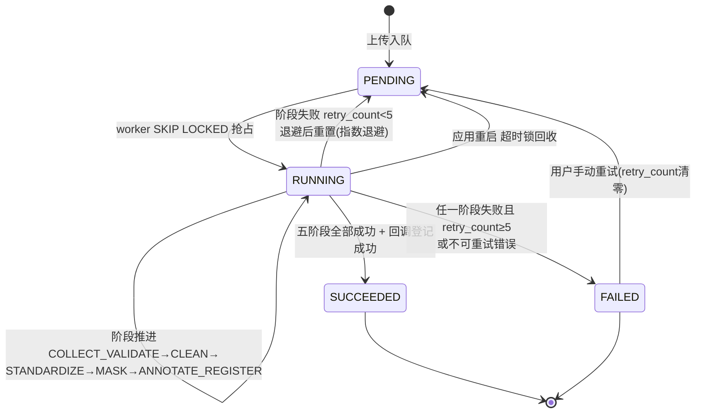
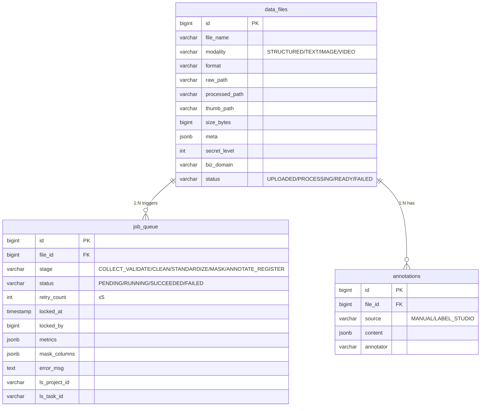

# DDL-PROC-001 proc Schema 数据库设计

> 版本：v1.0 ｜ 日期：2026-09-30
> 数据库：PostgreSQL 16
> Schema：proc
> 关联文档：MOD-PROC-001, API-PROC-001, API-PROC-002, API-PROC-003, SYS-005, 01-详细设计文档 §3.2/§4.2

---

## 1. 概述

### 1.1 Schema 用途

`proc` schema 是多模态数据处理模块（PROC）的唯一持久化层，承载三类核心数据：

1. **文件登记**（`data_files`）：上传文件的元数据、存储路径、模态、处理状态与处理指标；
2. **任务队列**（`job_queue`）：五阶段流水线的 PostgreSQL 任务队列表，是整个异步处理链路的调度核心，通过 `FOR UPDATE SKIP LOCKED` 实现多 worker 无锁竞争抢占；
3. **标注结果**（`annotations`）：人工标注与 Label Studio 回拉的标注内容。

**设计原则**：
- **单写者原则**：`proc` schema 仅由 `processing-app`（Python/FastAPI）直接读写；Java 侧（platform-app）**不直连** proc 表，资产登记通过内部接口 `POST /internal/assets/register` 完成（详见 01-详细设计文档 §8.2 约束 4）；
- **队列即表**：弃用 Kafka/Redis，任务队列直接落 PG 表，天然持久化、应用重启任务不丢；
- **状态机驱动**：任务生命周期 `PENDING → RUNNING → SUCCEEDED/FAILED` 由 `job_queue.status` 显式承载，五阶段进度由 `stage` 字段记录；
- **崩溃可恢复**：`locked_at/locked_by` 记录抢占痕迹，应用重启后将超时 RUNNING 任务重置回 PENDING；
- **路径不落库内容**：文件实体存宿主机挂载卷 `/data`（raw/processed/thumb 三目录），库中只存相对路径。

### 1.2 表清单

| 表名 | 中文名 | 用途 | 行量级 |
|---|---|---|---|
| data_files | 数据文件表 | 上传文件登记、模态/路径/指标/状态 | 万级（演示：百级） |
| job_queue | 任务队列表 | 五阶段流水线任务调度与状态跟踪 | 万级（每文件 1 条） |
| annotations | 标注结果表 | 人工/Label Studio 标注内容 | 万级（每文件 0~N 条） |

---

## 2. 公共字段规范

以下字段为三张表共有的审计与软删字段，统一定义：

| 字段名 | 类型 | 可空 | 默认 | 含义 |
|---|---|---|---|---|
| id | bigserial | 否 | — | 主键，自增 |
| created_at | timestamp | 否 | CURRENT_TIMESTAMP | 创建时间 |
| updated_at | timestamp | 否 | CURRENT_TIMESTAMP | 最后更新时间（应用层维护，PostgreSQL 无 ON UPDATE） |
| create_by | varchar(64) | 是 | NULL | 创建人（用户名或 `system`） |
| update_by | varchar(64) | 是 | NULL | 最后修改人 |
| deleted | smallint | 否 | 0 | 软删标志：0=正常，1=已删除 |

**命名与约定**：
- 表名：snake_case，proc schema 内不加额外前缀（schema 名本身即命名空间）；
- 枚举字段：统一使用 `varchar` + 应用层枚举校验 + `CHECK` 约束双保险，不使用 PostgreSQL `ENUM` 类型（避免迁移困难）；
- 索引名：`idx_<表名>_<字段名>`；唯一索引 `uk_<表名>_<字段名>`；部分唯一索引附加 `WHERE deleted = 0`；
- 外键：**不建立物理外键约束**（遵循 SYS-005 统一规范），关联完整性由应用层保证；
- JSON 字段：统一使用 `jsonb`（支持索引与高效查询）。

---

## 3. 表设计详情

### 3.1 data_files

- **中文名**：数据文件表
- **用途**：登记所有上传文件（结构化 CSV/JSON/Excel、文本、图像、视频）的元数据、存储路径、处理状态与处理指标
- **行量级**：万级（演示场景百级）
- **增长率**：取决于上传频率，演示场景日均十级；生产按业务规模线性增长

#### 字段定义

| 列名 | 类型 | 可空 | 默认 | 注释（业务含义） |
|---|---|---|---|---|
| id | bigserial | 否 | — | 主键，文件ID |
| file_name | varchar(255) | 否 | — | 原始文件名（用户上传时的文件名） |
| modality | varchar(20) | 否 | — | 模态枚举：`STRUCTURED`/`TEXT`/`IMAGE`/`VIDEO` |
| format | varchar(20) | 否 | — | 文件格式小写扩展名：`csv`/`json`/`xlsx`/`xls`/`txt`/`md`/`log`/`jpg`/`png`/`webp`/`mp4`/`mov`/`webm` |
| raw_path | varchar(512) | 否 | — | 原始文件路径，宿主机挂载卷 `/data` 下相对路径，如 `raw/2026/09/30/<uuid>.csv` |
| processed_path | varchar(512) | 是 | NULL | 处理后成品路径（`/data/processed/...`），处理成功后回填 |
| thumb_path | varchar(512) | 是 | NULL | 缩略图路径（`/data/thumb/...`），仅图像/视频模态有值 |
| size_bytes | bigint | 否 | 0 | 文件大小（字节） |
| meta | jsonb | 是 | NULL | 处理指标 JSON：行数/列数/缺失率/重复率/分辨率/时长/码率/敏感列数等（结构随模态不同） |
| secret_level | int | 否 | 1 | 数据密级：1=公开，2=内部，3=秘密，4=机密（用于 ABAC 判定） |
| biz_domain | varchar(64) | 是 | NULL | 业务域编码（如 `finance`/`hr`/`iot`），用于资产分类与热力图 |
| status | varchar(20) | 否 | `'UPLOADED'` | 文件级状态：`UPLOADED`→`PROCESSING`→`READY`/`FAILED` |
| created_at | timestamp | 否 | CURRENT_TIMESTAMP | 创建时间 |
| updated_at | timestamp | 否 | CURRENT_TIMESTAMP | 更新时间 |
| create_by | varchar(64) | 是 | NULL | 创建人（上传用户名） |
| update_by | varchar(64) | 是 | NULL | 修改人 |
| deleted | smallint | 否 | 0 | 软删标志：0=正常，1=已删除 |

#### 索引

| 索引名 | 类型 | 字段 | 命中场景 |
|---|---|---|---|
| pk_data_files | 主键 | id | 文件详情、受控下载 |
| idx_data_files_modality | B树 | modality | 按模态筛选文件列表、大屏模态分布统计 |
| idx_data_files_status | B树 | status | 处理中/失败文件筛选 |
| idx_data_files_biz_domain | B树 | biz_domain | 按业务域筛选 |
| idx_data_files_created_at | B树 | created_at DESC | 文件列表按时间倒序分页 |

#### DDL

```sql
CREATE TABLE IF NOT EXISTS proc.data_files (
    id             bigserial     PRIMARY KEY,
    file_name      varchar(255)  NOT NULL,
    modality       varchar(20)   NOT NULL,
    format         varchar(20)   NOT NULL,
    raw_path       varchar(512)  NOT NULL,
    processed_path varchar(512),
    thumb_path     varchar(512),
    size_bytes     bigint        NOT NULL DEFAULT 0,
    meta           jsonb,
    secret_level   int           NOT NULL DEFAULT 1,
    biz_domain     varchar(64),
    status         varchar(20)   NOT NULL DEFAULT 'UPLOADED',
    created_at     timestamp     NOT NULL DEFAULT CURRENT_TIMESTAMP,
    updated_at     timestamp     NOT NULL DEFAULT CURRENT_TIMESTAMP,
    create_by      varchar(64),
    update_by      varchar(64),
    deleted        smallint      NOT NULL DEFAULT 0,
    CONSTRAINT chk_data_files_modality
        CHECK (modality IN ('STRUCTURED','TEXT','IMAGE','VIDEO')),
    CONSTRAINT chk_data_files_status
        CHECK (status IN ('UPLOADED','PROCESSING','READY','FAILED')),
    CONSTRAINT chk_data_files_secret_level
        CHECK (secret_level BETWEEN 1 AND 4)
);

COMMENT ON TABLE  proc.data_files IS '数据文件表：上传文件登记、路径、模态、处理状态与指标';
COMMENT ON COLUMN proc.data_files.file_name      IS '原始文件名';
COMMENT ON COLUMN proc.data_files.modality       IS '模态枚举 STRUCTURED/TEXT/IMAGE/VIDEO';
COMMENT ON COLUMN proc.data_files.format         IS '文件格式小写扩展名 csv/json/xlsx/xls/txt/md/log/jpg/png/webp/mp4/mov/webm';
COMMENT ON COLUMN proc.data_files.raw_path       IS '原始文件路径 宿主机挂载卷 /data 下相对路径 raw/...';
COMMENT ON COLUMN proc.data_files.processed_path IS '处理后成品路径 /data/processed/... 处理成功后回填';
COMMENT ON COLUMN proc.data_files.thumb_path     IS '缩略图路径 /data/thumb/... 仅图像/视频有值';
COMMENT ON COLUMN proc.data_files.size_bytes     IS '文件大小 字节';
COMMENT ON COLUMN proc.data_files.meta           IS '处理指标 jsonb：行数/列数/缺失率/重复率/分辨率/时长/码率/敏感列数等，结构随模态不同';
COMMENT ON COLUMN proc.data_files.secret_level   IS '数据密级 1=公开 2=内部 3=秘密 4=机密，用于 ABAC';
COMMENT ON COLUMN proc.data_files.biz_domain     IS '业务域编码 finance/hr/iot 等';
COMMENT ON COLUMN proc.data_files.status         IS '文件级状态 UPLOADED/PROCESSING/READY/FAILED';

CREATE INDEX idx_data_files_modality   ON proc.data_files (modality)   WHERE deleted = 0;
CREATE INDEX idx_data_files_status     ON proc.data_files (status)     WHERE deleted = 0;
CREATE INDEX idx_data_files_biz_domain ON proc.data_files (biz_domain) WHERE deleted = 0;
CREATE INDEX idx_data_files_created_at ON proc.data_files (created_at DESC) WHERE deleted = 0;
```

#### 软删与唯一约束

- 软删：`deleted=1` 时文件对外不可见；删除文件时 raw/processed/thumb 三个物理文件由启动时清理任务同步清理（详见 01-详细设计文档 §7 剩余信息保护）；
- 唯一约束：**不建唯一索引**——同一用户允许上传同名文件（物理路径含 UUID 天然去重）。

#### meta 字段结构示例（按模态）

| 模态 | meta JSON 示例 |
|---|---|
| STRUCTURED | `{"rows":10000,"cols":12,"missing_rate":0.003,"dup_rate":0.01,"format_consistency":0.998,"sensitive_cols":3,"error_rows":5}` |
| TEXT | `{"char_count":52340,"valid_line_rate":0.97,"sensitive_hits":12}` |
| IMAGE | `{"width":1920,"height":1080,"format":"jpeg","had_exif":true}` |
| VIDEO | `{"duration_sec":125.5,"width":1280,"height":720,"bitrate_kbps":2500,"codec":"h264"}` |

#### 关联关系

| 关联表 | 关联字段 | 关系类型 | 说明 |
|---|---|---|---|
| job_queue | id ← file_id | 一对多 | 一个文件可对应多条任务记录（重试重新入队产生新任务） |
| annotations | id ← file_id | 一对多 | 一个文件可有多条标注（人工 + LS 回拉） |
| gov.assets | id → source_file_id | 一对一（跨 schema 逻辑关联） | 处理成功后经 `/internal/assets/register` 登记为资产，**无物理外键** |

#### 读写规则

- **写入方**：`processing-app` API 线程（上传登记、状态流转、meta 回填）
- **读取方**：`processing-app` API 线程（文件列表/详情/受控下载）、同容器 worker 线程（读取文件元数据执行流水线）
- **并发控制**：文件级状态流转由 worker 单写者完成，无并发写冲突；软删操作走 `UPDATE ... SET deleted=1`
- **归档策略**：演示场景不归档；生产建议按 `created_at` 按月分区，保留 12 个月热数据

---

### 3.2 job_queue

- **中文名**：任务队列表
- **用途**：五阶段处理流水线的任务调度核心。每条记录代表一次处理任务，承载状态机、阶段进度、重试计数、锁信息与错误原因。worker 线程通过 `FOR UPDATE SKIP LOCKED` 抢占任务
- **行量级**：万级（每文件 1~N 条，重试重新入队产生新行）
- **增长率**：与 data_files 同步，演示场景日均十级

#### 字段定义

| 列名 | 类型 | 可空 | 默认 | 注释（业务含义） |
|---|---|---|---|---|
| id | bigserial | 否 | — | 主键，任务ID |
| file_id | bigint | 否 | — | 关联文件ID（逻辑外键 → data_files.id） |
| stage | varchar(30) | 否 | `'COLLECT_VALIDATE'` | 当前处理阶段：`COLLECT_VALIDATE`/`CLEAN`/`STANDARDIZE`/`MASK`/`ANNOTATE_REGISTER` |
| status | varchar(20) | 否 | `'PENDING'` | 任务状态：`PENDING`/`RUNNING`/`SUCCEEDED`/`FAILED` |
| retry_count | int | 否 | 0 | 已重试次数，上限 5（达到 5 次仍失败则置 FAILED） |
| locked_at | timestamp | 是 | NULL | 任务被抢占时间（worker 抢锁时写入 now()），用于崩溃恢复超时判定 |
| locked_by | bigint | 是 | NULL | 抢占任务的 worker 标识（worker 线程编号，默认 2 线程：1/2） |
| metrics | jsonb | 是 | NULL | 各阶段执行指标与时间戳：`{"COLLECT_VALIDATE":{"ok":true,"ms":120},...}` |
| mask_columns | jsonb | 是 | NULL | 脱敏列配置与结果：`[{"col":"phone","strategy":"mask","hits":523}]` |
| error_msg | text | 是 | NULL | 最近一次失败原因（阶段+异常摘要），FAILED 时必填 |
| ls_project_id | varchar(64) | 是 | NULL | Label Studio 项目ID（ANNOTATE_REGISTER 阶段创建，可选 profile 开启时有值） |
| ls_task_id | varchar(64) | 是 | NULL | Label Studio 任务ID（回拉标注时关联） |
| created_at | timestamp | 否 | CURRENT_TIMESTAMP | 创建时间（入队时间） |
| updated_at | timestamp | 否 | CURRENT_TIMESTAMP | 更新时间（阶段推进/状态流转） |
| create_by | varchar(64) | 是 | NULL | 创建人（上传用户名或 `system`） |
| update_by | varchar(64) | 是 | NULL | 修改人（worker 更新时为 `worker-N`） |
| deleted | smallint | 否 | 0 | 软删标志：0=正常，1=已删除（文件删除时级联软删） |

#### 索引

| 索引名 | 类型 | 字段 | 命中场景 |
|---|---|---|---|
| pk_job_queue | 主键 | id | 任务详情、抢占后回写 |
| idx_job_queue_status_id | 复合B树 | status, id | **队列抢占核心索引**：`WHERE status='PENDING' ORDER BY id FOR UPDATE SKIP LOCKED LIMIT 1` |
| idx_job_queue_file_id | B树 | file_id | 按文件查询全部任务（含历史重试） |
| idx_job_queue_locked_at | 部分B树 | locked_at WHERE status='RUNNING' | 崩溃恢复扫描：查找超时 RUNNING 任务 |

#### DDL

```sql
CREATE TABLE IF NOT EXISTS proc.job_queue (
    id            bigserial    PRIMARY KEY,
    file_id       bigint       NOT NULL,
    stage         varchar(30)  NOT NULL DEFAULT 'COLLECT_VALIDATE',
    status        varchar(20)  NOT NULL DEFAULT 'PENDING',
    retry_count   int          NOT NULL DEFAULT 0,
    locked_at     timestamp,
    locked_by     bigint,
    metrics       jsonb,
    mask_columns  jsonb,
    error_msg     text,
    ls_project_id varchar(64),
    ls_task_id    varchar(64),
    created_at    timestamp    NOT NULL DEFAULT CURRENT_TIMESTAMP,
    updated_at    timestamp    NOT NULL DEFAULT CURRENT_TIMESTAMP,
    create_by     varchar(64),
    update_by     varchar(64),
    deleted       smallint     NOT NULL DEFAULT 0,
    CONSTRAINT chk_job_queue_status
        CHECK (status IN ('PENDING','RUNNING','SUCCEEDED','FAILED')),
    CONSTRAINT chk_job_queue_stage
        CHECK (stage IN ('COLLECT_VALIDATE','CLEAN','STANDARDIZE','MASK','ANNOTATE_REGISTER')),
    CONSTRAINT chk_job_queue_retry
        CHECK (retry_count >= 0 AND retry_count <= 5)
);

COMMENT ON TABLE  proc.job_queue IS '任务队列表：五阶段流水线调度核心，worker 以 FOR UPDATE SKIP LOCKED 抢占';
COMMENT ON COLUMN proc.job_queue.file_id       IS '关联文件ID 逻辑外键 → proc.data_files.id';
COMMENT ON COLUMN proc.job_queue.stage         IS '当前阶段 COLLECT_VALIDATE/CLEAN/STANDARDIZE/MASK/ANNOTATE_REGISTER';
COMMENT ON COLUMN proc.job_queue.status        IS '任务状态 PENDING/RUNNING/SUCCEEDED/FAILED';
COMMENT ON COLUMN proc.job_queue.retry_count   IS '已重试次数 上限5 达到5次仍失败置FAILED';
COMMENT ON COLUMN proc.job_queue.locked_at     IS '抢占时间 worker抢锁时写now() 用于崩溃恢复超时判定';
COMMENT ON COLUMN proc.job_queue.locked_by     IS '抢占worker标识 默认2线程编号1/2';
COMMENT ON COLUMN proc.job_queue.metrics       IS '各阶段执行指标 jsonb {"COLLECT_VALIDATE":{"ok":true,"ms":120},...}';
COMMENT ON COLUMN proc.job_queue.mask_columns  IS '脱敏列配置与结果 jsonb [{"col":"phone","strategy":"mask","hits":523}]';
COMMENT ON COLUMN proc.job_queue.error_msg     IS '最近一次失败原因 FAILED时必填';
COMMENT ON COLUMN proc.job_queue.ls_project_id IS 'Label Studio 项目ID ANNOTATE_REGISTER阶段创建 可选';
COMMENT ON COLUMN proc.job_queue.ls_task_id    IS 'Label Studio 任务ID 回拉标注时关联';

-- 队列抢占核心索引：status 过滤 + id 排序，配合 FOR UPDATE SKIP LOCKED
CREATE INDEX idx_job_queue_status_id ON proc.job_queue (status, id) WHERE deleted = 0;
CREATE INDEX idx_job_queue_file_id   ON proc.job_queue (file_id)   WHERE deleted = 0;
-- 崩溃恢复扫描：仅对 RUNNING 任务建部分索引
CREATE INDEX idx_job_queue_locked_at ON proc.job_queue (locked_at) WHERE status = 'RUNNING';
```

#### 队列抢占 SQL（核心机制）

worker 线程（默认 2 线程，环境变量 `WORKER_THREADS` 可调，轮询间隔 1–2s）按以下 SQL 抢占任务：

```sql
UPDATE proc.job_queue
SET status = 'RUNNING',
    locked_at = now(),
    locked_by = $worker_id,
    updated_at = now()
WHERE id = (
    SELECT id FROM proc.job_queue
    WHERE status = 'PENDING' AND deleted = 0
    ORDER BY id
    FOR UPDATE SKIP LOCKED
    LIMIT 1
)
RETURNING *;
```

- **写入方**：`processing-app` API 线程（入队 `INSERT`、重试重新入队、用户取消）；
- **消费方**：同容器 worker 线程（抢占、阶段推进 `UPDATE stage/metrics`、终态回写 `SUCCEEDED/FAILED`）；
- **SKIP LOCKED 语义**：多 worker 并发执行同一抢占 SQL 时，已被其他事务锁定的行被跳过，保证一个任务只被一个 worker 取走，无需分布式锁。

#### 状态机



#### 崩溃恢复

- worker 抢占任务后若进程崩溃，任务停留在 `RUNNING` 且 `locked_at` 不再更新；
- 应用重启时（或周期性清理任务）执行：

```sql
UPDATE proc.job_queue
SET status = 'PENDING',
    locked_at = NULL,
    locked_by = NULL,
    updated_at = now()
WHERE status = 'RUNNING'
  AND locked_at < now() - interval '10 minutes';
```

- 超时阈值默认 10 分钟（环境变量 `JOB_LOCK_TIMEOUT_MINUTES` 可调），需大于单任务最长处理时间。

#### 重试与退避

- 阶段失败且 `retry_count < 5`：`retry_count + 1`，状态重置为 `PENDING`，按指数退避（2^n 秒，n=retry_count）延迟后可被重新抢占；
- `retry_count = 5` 仍失败：状态置 `FAILED`，`error_msg` 记录最后失败阶段与异常摘要，前端展示并允许手动重试；
- 手动重试（`POST /api/processing/jobs/{id}/retry`）：`retry_count` 清零、状态重置 `PENDING`、重新入队；
- 资产登记回调失败同样走退避重试 5 次策略（详见 01-详细设计文档 §2.2）。

#### 软删与唯一约束

- 软删：文件删除时其名下任务级联置 `deleted=1`，不再被抢占扫描命中；
- 唯一约束：**不建唯一索引**——同一文件允许多条任务记录（每次重试入队为新行，保留完整历史轨迹）。

#### 关联关系

| 关联表 | 关联字段 | 关系类型 | 说明 |
|---|---|---|---|
| data_files | file_id → id | 多对一 | 多条任务（含重试历史）归属一个文件 |

#### 读写规则

- **写入方**：`processing-app` API 线程（入队/重试）；同容器 worker 线程（抢占、阶段推进、终态回写）
- **读取方**：`processing-app` API 线程（任务状态查询，前端 3s 轮询）；Java 大屏聚合 **不直读**，经 Python 侧接口或回调数据间接呈现
- **并发控制**：`FOR UPDATE SKIP LOCKED` 行锁抢占；单任务被抢占后由同一 worker 独占更新，无写冲突
- **归档策略**：演示场景不归档；生产建议 `SUCCEEDED/FAILED` 任务保留 90 天后归档至历史表

---

### 3.3 annotations

- **中文名**：标注结果表
- **用途**：存储文件的人工标注结果与 Label Studio 回拉的标注内容（文本实体、图像框选、视频片段标签等）
- **行量级**：万级（每文件 0~N 条）
- **增长率**：随标注业务量，演示场景低频

#### 字段定义

| 列名 | 类型 | 可空 | 默认 | 注释（业务含义） |
|---|---|---|---|---|
| id | bigserial | 否 | — | 主键，标注ID |
| file_id | bigint | 否 | — | 关联文件ID（逻辑外键 → data_files.id） |
| source | varchar(20) | 否 | — | 标注来源：`MANUAL`（门户人工标注）/`LABEL_STUDIO`（LS 回拉） |
| content | jsonb | 否 | — | 标注内容：LS 标准 result 数组或人工标注结构（随模态不同） |
| annotator | varchar(64) | 是 | NULL | 标注人用户名（真实平台用户，LS 回拉时记录触发回拉的用户） |
| created_at | timestamp | 否 | CURRENT_TIMESTAMP | 创建时间 |
| updated_at | timestamp | 否 | CURRENT_TIMESTAMP | 更新时间 |
| create_by | varchar(64) | 是 | NULL | 创建人 |
| update_by | varchar(64) | 是 | NULL | 修改人 |
| deleted | smallint | 否 | 0 | 软删标志：0=正常，1=已删除 |

#### 索引

| 索引名 | 类型 | 字段 | 命中场景 |
|---|---|---|---|
| pk_annotations | 主键 | id | 标注详情 |
| idx_annotations_file_id | B树 | file_id | 按文件查询全部标注（标注查询接口主路径） |
| idx_annotations_source | B树 | source | 按来源统计（人工 vs LS） |

#### DDL

```sql
CREATE TABLE IF NOT EXISTS proc.annotations (
    id         bigserial    PRIMARY KEY,
    file_id    bigint       NOT NULL,
    source     varchar(20)  NOT NULL,
    content    jsonb        NOT NULL,
    annotator  varchar(64),
    created_at timestamp    NOT NULL DEFAULT CURRENT_TIMESTAMP,
    updated_at timestamp    NOT NULL DEFAULT CURRENT_TIMESTAMP,
    create_by  varchar(64),
    update_by  varchar(64),
    deleted    smallint     NOT NULL DEFAULT 0,
    CONSTRAINT chk_annotations_source
        CHECK (source IN ('MANUAL','LABEL_STUDIO'))
);

COMMENT ON TABLE  proc.annotations IS '标注结果表：人工标注与 Label Studio 回拉内容';
COMMENT ON COLUMN proc.annotations.file_id   IS '关联文件ID 逻辑外键 → proc.data_files.id';
COMMENT ON COLUMN proc.annotations.source    IS '标注来源 MANUAL=门户人工 LABEL_STUDIO=LS回拉';
COMMENT ON COLUMN proc.annotations.content   IS '标注内容 jsonb LS标准result数组或人工标注结构 随模态不同';
COMMENT ON COLUMN proc.annotations.annotator IS '标注人用户名 真实平台用户 LS回拉时记录触发用户';

CREATE INDEX idx_annotations_file_id ON proc.annotations (file_id) WHERE deleted = 0;
CREATE INDEX idx_annotations_source  ON proc.annotations (source)  WHERE deleted = 0;
```

#### content 字段结构示例

| source / 模态 | content JSON 示例 |
|---|---|
| MANUAL / TEXT | `{"entities":[{"start":10,"end":21,"label":"PHONE","text":"138****0001"}]}` |
| LABEL_STUDIO / IMAGE | `[{"id":"r1","type":"rectanglelabels","value":{"x":12.5,"y":30.1,"width":20,"height":15,"rectanglelabels":["person"]}}]` |
| LABEL_STUDIO / VIDEO | `[{"id":"s1","type":"videorectangle","value":{"sequence":[{"frame":1,"x":10,"y":10,"width":30,"height":40}],"labels":["car"]}}]` |

#### 软删与唯一约束

- 软删：文件删除时标注级联置 `deleted=1`；
- 唯一约束：不建唯一索引——同一文件允许同一来源多条标注（版本演进以 `created_at` 区分，查询取最新或全量由应用层决定）。

#### 关联关系

| 关联表 | 关联字段 | 关系类型 | 说明 |
|---|---|---|---|
| data_files | file_id → id | 多对一 | 多条标注归属一个文件 |
| job_queue | ls_task_id（逻辑关联） | 多对一（弱关联） | LS 回拉的标注可通过任务记录的 `ls_task_id` 溯源到创建任务，**无物理外键** |

#### 读写规则

- **写入方**：`processing-app` API 线程（`PUT /api/processing/annotations/{fileId}` 人工保存；LS 回拉任务写 `LABEL_STUDIO` 记录）
- **读取方**：`processing-app` API 线程（标注查询接口）；数据集构建时由 Java 侧通过资产登记的指标间接感知标注存在性，**不直读本表**
- **并发控制**：同一文件同一来源的保存采用"后写覆盖"语义（应用层先软删旧记录再插入新记录，或按 id 更新），演示场景无高并发写
- **归档策略**：不归档，随文件生命周期保留

---

## 4. 种子数据

### 4.1 说明

`proc` schema **无业务种子数据**——三张表均为运行时动态写入（用户上传触发 `data_files`/`job_queue`，人工/LS 标注触发 `annotations`）。

枚举值通过 `CHECK` 约束在建表时固化，无需枚举字典表：

| 字段 | 枚举值 |
|---|---|
| data_files.modality | `STRUCTURED` / `TEXT` / `IMAGE` / `VIDEO` |
| data_files.status | `UPLOADED` / `PROCESSING` / `READY` / `FAILED` |
| job_queue.status | `PENDING` / `RUNNING` / `SUCCEEDED` / `FAILED` |
| job_queue.stage | `COLLECT_VALIDATE` / `CLEAN` / `STANDARDIZE` / `MASK` / `ANNOTATE_REGISTER` |
| annotations.source | `MANUAL` / `LABEL_STUDIO` |

运行参数（worker 线程数默认 2、轮询间隔 1–2s、锁超时 10min、重试上限 5）全部走环境变量，不落库，详见 MOD-PROC-001 §9 配置项。

---

## 5. ER 片图



> 跨 schema 逻辑关联（不建物理外键）：`data_files.id` → `gov.assets.source_file_id`，在处理成功后经 `/internal/assets/register` 内部接口建立，血缘边 `raw 文件 → processed 成品 → 标注任务` 落 `gov.lineage_edges`（详见 DDL-GOV-001）。

---

## 6. 迁移脚本

| 版本 | 文件名 | 变更内容 |
|---|---|---|
| V1 | V1__init_proc.sql | 创建 proc schema + 3 张表（data_files / job_queue / annotations）+ CHECK 约束 + COMMENT + 全部索引（占位，随 S0 阶段 Flyway 脚本落地） |

### 6.1 迁移脚本规范

- 迁移脚本存放目录：`infra/postgres/init/`（容器首启执行，幂等：`CREATE TABLE IF NOT EXISTS`）
- 应用侧演进迁移（processing-app）如引入 Flyway/Alembic，文件名格式：`V{序号}__{描述}.sql`
- proc schema 授权：仅授予 `processing-app` 所用数据库账号 `SELECT/INSERT/UPDATE/DELETE` 权限；`platform-app`（Java）账号**不授予** proc schema 任何权限，从数据库层强制"Java 不直连 proc 表"约束

---

## 7. 验收标准

- [ ] `proc` schema 创建成功，3 张表存在且字段与本节 §3 完全一致
- [ ] 全部枚举字段 `CHECK` 约束生效（非法值写入被拒绝）
- [ ] `job_queue.retry_count` CHECK 约束限定 0–5
- [ ] 队列抢占索引 `idx_job_queue_status_id(status, id)` 存在，`FOR UPDATE SKIP LOCKED` 抢占 SQL 可并发执行且同任务不被两个 worker 同时取走
- [ ] 部分索引 `idx_job_queue_locked_at WHERE status='RUNNING'` 存在，崩溃恢复 SQL 可命中
- [ ] 所有表均有 `COMMENT ON TABLE` 和关键字段 `COMMENT ON COLUMN`
- [ ] 验证：`platform-app` 数据库账号对 proc schema 无权限；`processing-app` 账号可正常读写
- [ ] 模拟 worker 崩溃（kill processing-app）：重启后超时 RUNNING 任务被重置回 PENDING 并可重新消费

---

## 8. 修订记录

| 版本 | 日期 | 修订人 | 修订内容 |
|---|---|---|---|
| v1.0 | 2026-09-30 | system | 初版：创建 proc schema 3 张表（data_files / job_queue / annotations），定义队列抢占、状态机、崩溃恢复机制 |
