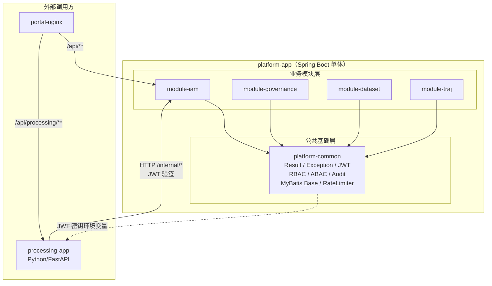
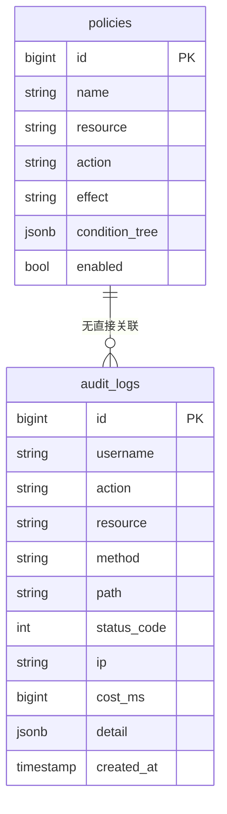
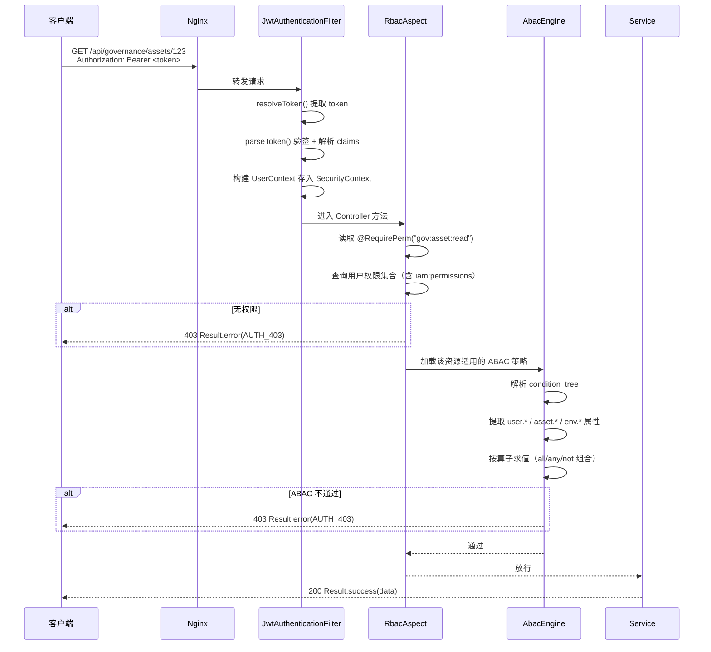
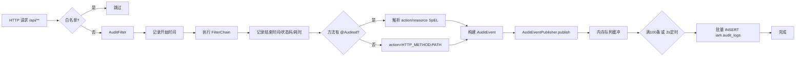
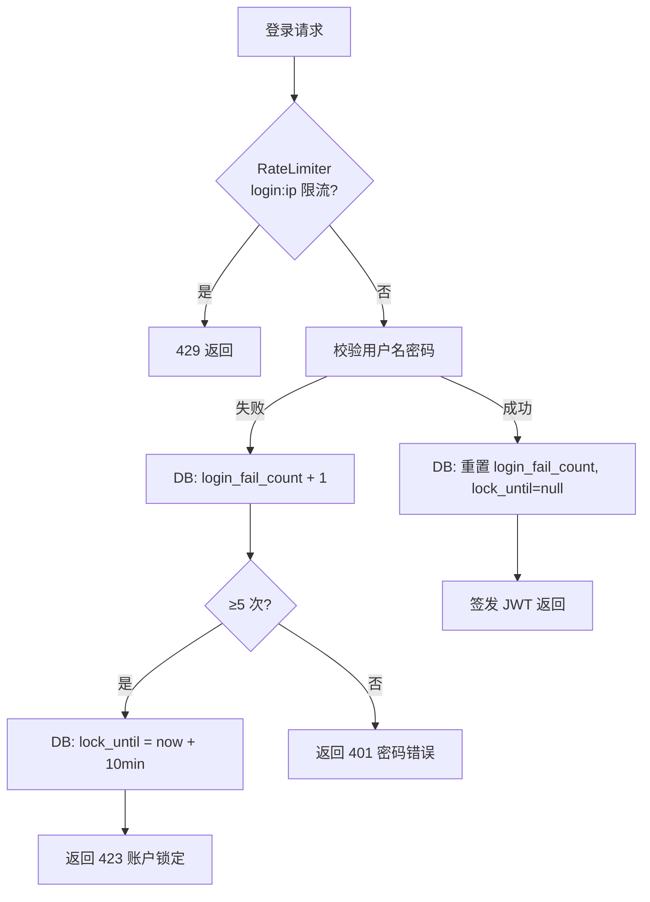

# MOD-COM-001 公共基础模块设计

> 版本：v1.0 ｜ 日期：2026-09-30
> 关联文档：SYS-001, SYS-003, SYS-004, API-COM-001

---

## 1. 模块概述

### 1.1 模块定位与职责边界

COM 模块（Maven 坐标 `platform-common`）是 platform-app 单体内所有业务模块的公共地基，提供横切非业务能力的统一实现。它是整个 Lite 演示架构中"可演进性"承诺的技术载体：模块边界清晰、零业务耦合、接口稳定，未来拆分为微服务时无需重写。

**职责边界**：
- ✅ 统一响应体 `Result<T>` 序列化规范
- ✅ 全局异常体系（`BizException` + `@RestControllerAdvice` 处理器）
- ✅ JWT 工具（HS256 签发/验签，access 2h / refresh 7d）
- ✅ RBAC 注解与 AOP 方法级拦截
- ✅ ABAC 条件引擎（解析 `iam.policies.condition_tree` jsonb）
- ✅ 审计框架（servlet 过滤器 + `@Audited` 动作标签 + 异步批量落库）
- ✅ MyBatis 基类（公共字段、逻辑删除、分页插件）
- ✅ 进程内限流器（Caffeine 令牌桶）
- ❌ 不负责业务表 DDL（`audit_logs`、`policies` 等表由 IAM 模块拥有，见 DDL-IAM-001）
- ❌ 不负责具体业务权限码定义（如 `traj:ingest`、`gov:asset:read` 由各自模块声明）
- ❌ 不负责脱敏算法执行（脱敏在 Python 处理侧，本模块仅提供策略定义 SPI）
- ❌ 不依赖任何业务模块（iam / governance / dataset / traj 均依赖 common，common 不反向依赖）

### 1.2 技术栈

| 层 | 技术 | 版本 | 用途 |
|---|---|---|---|
| 语言 | Java | 17 | 模块实现语言 |
| 框架 | Spring Boot | 3.2.x | 自动装配、AOP、Web MVC |
| 持久层 | MyBatis-Plus | 3.5.x | BaseEntity、分页、逻辑删除 |
| 缓存 | Caffeine | 3.x | 限流器令牌桶、短期缓存 |
| JWT | JJWT | 0.12.x | HS256 签发/验签 |
| 构建 | Maven | 3.9+ | 多模块聚合，platform-common 被其他模块依赖 |

### 1.3 模块在系统中的位置



---

## 2. 模块架构

### 2.1 内部分层结构

```mermaid
graph TD
    subgraph platform-common
        subgraph web["Web 支撑层"]
            Result[Result<T><br/>统一响应体]
            GlobalExceptionHandler[GlobalExceptionHandler<br/>@RestControllerAdvice]
            AuditFilter[AuditFilter<br/>servlet 过滤器]
            RateLimitFilter[RateLimitFilter<br/>servlet 过滤器]
        end

        subgraph security["安全支撑层"]
            JwtUtil[JwtUtil<br/>签发/验签]
            JwtAuthenticationFilter[JwtAuthenticationFilter<br/>OncePerRequestFilter]
            RequirePerm[@RequirePerm<br/>RBAC 注解]
            RbacAspect[RbacAspect<br/>AOP 拦截]
            AbacEngine[AbacEngine<br/>ABAC 条件引擎]
            Audited[@Audited<br/>审计动作标签]
        end

        subgraph persistence["持久化支撑层"]
            BaseEntity[BaseEntity<br/>公共字段]
            BaseMapperPlus[BaseMapperPlus<br/>继承 BaseMapper]
            MybatisPlusConfig[MybatisPlusConfig<br/>分页/逻辑删除]
        end

        subgraph infra["基础设施层"]
            RateLimiter[RateLimiter<br/>Caffeine 令牌桶]
            AuditEventPublisher[AuditEventPublisher<br/>异步批量写]
            MaskingStrategy[MaskingStrategy SPI<br/>脱敏策略定义]
        end
    end

    web --> security
    security --> persistence
    AuditFilter --> AuditEventPublisher
    RbacAspect --> AbacEngine
    RateLimitFilter --> RateLimiter
```

### 2.2 对外发布的接口（api 子包清单）

COM 模块不定义业务 Service 接口，其"对外发布"体现为**注解、基类、工具类与 SPI**，位于 `com.mydatama.common` 包下：

| 类型 | 名称 | 包路径 | 说明 |
|---|---|---|---|
| 响应体 | `Result<T>` | `com.mydatama.common.web` | 统一响应结构 |
| 异常 | `BizException` | `com.mydatama.common.exception` | 业务异常基类 |
| 注解 | `@RequirePerm` | `com.mydatama.common.security.annotation` | RBAC 权限码声明 |
| 注解 | `@Audited` | `com.mydatama.common.security.annotation` | 审计动作标签 |
| 工具类 | `JwtUtil` | `com.mydatama.common.security.jwt` | JWT 签发/验签 |
| 引擎 | `AbacEngine` | `com.mydatama.common.security.abac` | ABAC 条件求值 |
| 基类 | `BaseEntity` | `com.mydatama.common.persistence` | 公共字段实体基类 |
| 基类 | `BaseServiceImpl` | `com.mydatama.common.persistence` | MyBatis-Plus 通用 CRUD |
| 过滤器 | `AuditFilter` | `com.mydatama.common.web.filter` | 全请求审计 |
| 过滤器 | `RateLimitFilter` | `com.mydatama.common.web.filter` | 限流拦截 |
| SPI | `MaskingStrategy` | `com.mydatama.common.spi` | 脱敏策略定义（Python 侧执行） |
| SPI | `AbacOperator` | `com.mydatama.common.security.abac` | ABAC 算子扩展接口 |

### 2.3 依赖的其他模块接口

COM 模块**不依赖任何业务模块的接口**。它被 IAM、GOVERNANCE、DATASET、TRAJ 依赖，但自身保持零业务耦合。

### 2.4 模块依赖规则（ArchUnit 约束）

```java
@ArchTest
static final ArchRule common_should_not_depend_on_business_modules =
    noClasses().that().resideInAPackage("..common..")
        .should().dependOnClassesThat().resideInAnyPackage(
            "..iam..", "..governance..", "..dataset..", "..traj..");

@ArchTest
static final ArchRule business_modules_should_only_call_common_api =
    noClasses().that().resideInAnyPackage("..iam..", "..governance..", "..dataset..", "..traj..")
        .should().dependOnClassesThat().resideInAPackage("..common.impl..")
        .orShould().dependOnClassesThat().resideInAPackage("..common.internal..");

@ArchTest
static final ArchRule business_modules_should_not_access_other_mappers =
    noClasses().that().resideInAPackage("..iam..")
        .should().dependOnClassesThat().resideInAnyPackage(
            "..governance.mapper..", "..dataset.mapper..", "..traj.mapper..");
```

---

## 3. 核心类与组件设计

### 3.1 Result<T>（统一响应体）

- **职责**：规范所有 Java 侧 REST 接口的响应结构，确保前端/调用方解析一致性
- **接口定义**：

```java
public class Result<T> {
    private int code;        // 0=成功，非 0=错误码（见 SYS-004）
    private String message;  // 提示信息
    private T data;          // 业务数据

    public static <T> Result<T> success(T data);
    public static <T> Result<T> success();
    public static <T> Result<T> error(int code, String message);
    public static <T> Result<T> error(ErrorCode errorCode);
}
```

- **实现类**：`Result`（POJO，Jackson 序列化）
- **实现策略**：`code=0` 表示成功；错误码分段定义，模块前缀 + 三位序号，详见 SYS-004
- **依赖**：无
- **被依赖**：所有 `@RestController` 方法返回值、全局异常处理器、开放 API

### 3.2 BizException 与全局异常体系

- **职责**：统一业务异常表达，将 Java 异常映射为标准 `Result` 响应
- **接口定义**：

```java
public class BizException extends RuntimeException {
    private final int code;
    public BizException(int code, String message);
    public BizException(ErrorCode errorCode);
    public BizException(ErrorCode errorCode, String customMessage);
}

@RestControllerAdvice
public class GlobalExceptionHandler {
    @ExceptionHandler(BizException.class)
    public Result<Void> handleBizException(BizException e);

    @ExceptionHandler(AccessDeniedException.class)
    public Result<Void> handleAccessDenied(AccessDeniedException e);

    @ExceptionHandler(MethodArgumentNotValidException.class)
    public Result<Void> handleValidation(MethodArgumentNotValidException e);

    @ExceptionHandler(Exception.class)
    public Result<Void> handleUnknown(Exception e);
}
```

- **实现类**：`GlobalExceptionHandler`
- **实现策略**：
  - `BizException` → 直接返回其 code/message
  - `AccessDeniedException` → `403 / AUTH_403`
  - 参数校验失败 → `400 / PARAM_400`，提取首个字段错误
  - 未知异常 → `500 / SYS_500`，日志打印堆栈，响应不暴露内部信息
- **依赖**：`Result`、SYS-004 错误码规范
- **被依赖**：所有 Controller（无需显式 try-catch）

### 3.3 JwtUtil（JWT 工具）

- **职责**：HS256 算法签发与验签 JWT，支持 access/refresh 双令牌
- **接口定义**：

```java
public class JwtUtil {
    /**
     * 签发 access token（2h）。
     * @param userId 用户ID
     * @param username 用户名
     * @param roles 角色编码列表
     * @param secretLevel 密级（用于 ABAC）
     * @return JWT 字符串
     */
    public String generateAccessToken(Long userId, String username,
                                      List<String> roles, Integer secretLevel);

    /**
     * 签发 refresh token（7d）。
     */
    public String generateRefreshToken(Long userId, String username);

    /**
     * 验签并解析 claims。
     * @throws BizException 若过期或签名非法（AUTH_401）
     */
    public Claims parseToken(String token);

    /**
     * 从请求头提取 Bearer token。
     */
    public String resolveToken(HttpServletRequest request);
}
```

- **实现类**：`JwtUtil`（JJWT 库封装）
- **实现策略**：
  - 密钥来自环境变量 `JWT_SECRET`，未配置时启动失败
  - `accessToken` 过期时间 `JWT_ACCESS_EXPIRE_HOURS=2`（默认 2h）
  - `refreshToken` 过期时间 `JWT_REFRESH_EXPIRE_DAYS=7`（默认 7d）
  - Claims 包含：`sub`(userId), `username`, `roles`, `secret_level`, `type`(access/refresh)
- **依赖**：环境变量、JJWT
- **被依赖**：`JwtAuthenticationFilter`、IAM 登录服务、Python 端验签约定

> **Python 端验签约定**：processing-app 使用 PyJWT 库，以**同一 HMAC 密钥** `JWT_SECRET` 对 `/api/processing/**` 请求进行本地验签。Python 侧仅做角色粗鉴权（viewer/operator/admin），细粒度 ABAC 判定通过调用 Java `/internal/authz`（服务令牌）完成。密钥仅通过容器环境变量注入，不落盘、不进入代码库。

### 3.4 @RequirePerm 与 RbacAspect（RBAC 注解与 AOP）

- **职责**：在方法级声明所需权限码，AOP 拦截并校验当前用户是否拥有该权限
- **接口定义**：

```java
@Target(ElementType.METHOD)
@Retention(RetentionPolicy.RUNTIME)
public @interface RequirePerm {
    /**
     * 权限码，格式：module:resource:action
     * 示例："iam:user:create"、"traj:ingest"、"gov:asset:read"
     */
    String value();
}

@Aspect
@Component
public class RbacAspect {
    @Around("@annotation(requirePerm)")
    public Object checkPermission(ProceedingJoinPoint pjp,
                                  RequirePerm requirePerm) throws Throwable;
}
```

- **实现类**：`RbacAspect`
- **实现策略**：
  1. 从 `SecurityContextHolder` 获取当前认证用户
  2. 未认证 → 抛 `BizException(AUTH_401)`
  3. 查询用户权限集合（IAM 模块提供 `PermissionService` 接口，common 通过 Spring 上下文调用，避免编译期依赖）
  4. 无权限 → 抛 `BizException(AUTH_403)`
  5. 有权限 → 放行，继续执行目标方法
- **依赖**：Spring Security Context、`PermissionService`（运行时注入）
- **被依赖**：各业务模块 Controller 方法

### 3.5 AbacEngine（ABAC 条件引擎）

- **职责**：解析 `iam.policies.condition_tree`（jsonb）中的 ABAC 策略，对资源访问请求进行条件判定
- **接口定义**：

```java
public interface AbacEngine {
    /**
     * 评估当前用户对目标资源是否满足 ABAC 策略。
     * @param user 当前用户上下文（含 user.* 属性）
     * @param asset 目标资源属性（asset.*）
     * @param env 环境属性（env.*，如 time、ip）
     * @param conditionTree 策略条件树 JSON
     * @return true=允许访问
     */
    boolean evaluate(UserContext user, Map<String, Object> asset,
                     Map<String, Object> env, JsonNode conditionTree);
}
```

- **实现类**：`AbacEngineImpl`
- **实现策略**：
  - **属性来源**：`user.*`（id, username, dept_code, secret_level, roles）、`asset.*`（owner_dept, secret_level, biz_domain, modality）、`env.*`（time_hour, ip）
  - **支持算子**：`eq`、`neq`、`gt`、`gte`、`lt`、`lte`、`in`、`dept_eq`
  - **组合逻辑**：`all`（与）、`any`（或）、`not`（非）
  - **求值流程**：
    1. 解析 conditionTree 根节点：若为 `all/any/not` 则递归求值子节点
    2. 若为叶子节点，提取 `op`、`left`、`right`
    3. 根据前缀解析属性值：`user.xxx` / `asset.xxx` / `env.xxx` / 字面量
    4. 按算子执行比较，返回布尔结果
    5. `dept_eq` 为特殊算子：判断 user.dept_code 是否等于 asset.owner_dept（或资产部门在用户部门子树内，预留扩展）
  - 条件树示例见 SYS-001 §4.1
- **依赖**：Jackson（JSON 解析）
- **被依赖**：`RbacAspect`（RBAC 通过后执行 ABAC）、IAM 策略管理模块

### 3.6 审计框架（AuditFilter + @Audited + AuditEventPublisher）

- **职责**：记录 `/api/**` 全量请求审计与关键业务动作，异步批量写入 `iam.audit_logs`
- **接口定义**：

```java
@Target(ElementType.METHOD)
@Retention(RetentionPolicy.RUNTIME)
public @interface Audited {
    /** 审计动作标签，如 "USER_LOGIN"、"ASSET_EXPORT" */
    String action();
    /** 资源描述 SpEL 表达式，如 "#userId + ':' + #fileName" */
    String resource() default "";
}

@Component
public class AuditFilter extends OncePerRequestFilter {
    // 拦截 /api/**，记录用户/IP/方法/路径/状态码/耗时
}

@Component
public class AuditEventPublisher {
    /** 异步批量提交审计事件 */
    public void publish(AuditEvent event);
}
```

- **实现类**：`AuditFilter`、`AuditEventPublisher`、`AuditBatchWriter`
- **实现策略**：
  - **过滤器范围**：`/api/**`，白名单排除 `/api/auth/login`、`/api/auth/refresh`、`/api/health`
  - **记录字段**：username（从 JWT 解析）、ip、method、path、status_code、cost_ms、query_string（截断 500 字符）
  - **动作标签**：若目标方法有 `@Audited`，覆盖 action 字段并记录 resource（SpEL 求值）
  - **异步批量**：内存队列（`ArrayBlockingQueue`，容量 10000）缓冲，定时 2s 或满 100 条批量 `INSERT` 到 `iam.audit_logs`
  - **降级**：队列满时丢弃新事件并记录 WARN 日志，不阻塞业务请求
  - **Python 侧上报**：Python 处理动作（上传、重试、标注保存）调用 Java `/internal/audit`（服务令牌认证），由本模块接收后走同一批量写入通道
- **依赖**：`JwtUtil`（解析用户）、Spring `ApplicationEventPublisher`（解耦）、`JdbcTemplate`（批量写）
- **被依赖**：所有业务模块 Controller（自动被过滤器覆盖）、IAM 审计查询接口

### 3.7 BaseEntity 与 MyBatis 基类

- **职责**：统一实体公共字段、逻辑删除、分页配置，减少重复代码
- **接口定义**：

```java
@Data
public abstract class BaseEntity implements Serializable {
    @TableId(type = IdType.ASSIGN_ID)
    private Long id;

    @TableField(fill = FieldFill.INSERT)
    private LocalDateTime createdAt;

    @TableField(fill = FieldFill.INSERT_UPDATE)
    private LocalDateTime updatedAt;

    @TableField(fill = FieldFill.INSERT)
    private String createBy;

    @TableField(fill = FieldFill.INSERT_UPDATE)
    private String updateBy;

    @TableLogic
    @TableField(select = false)
    private Integer deleted;
}

@Configuration
public class MybatisPlusConfig {
    @Bean
    public MybatisPlusInterceptor mybatisPlusInterceptor() {
        MybatisPlusInterceptor interceptor = new MybatisPlusInterceptor();
        interceptor.addInnerInterceptor(new PaginationInnerInterceptor(DbType.POSTGRE_SQL));
        interceptor.addInnerInterceptor(new BlockAttackInnerInterceptor());
        return interceptor;
    }

    @Bean
    public MetaObjectHandler metaObjectHandler() {
        return new AuditMetaObjectHandler(); // 自动填充 created_at/updated_at/create_by/update_by
    }
}
```

- **实现类**：`BaseEntity`、`MybatisPlusConfig`、`AuditMetaObjectHandler`
- **实现策略**：
  - 逻辑删除：MyBatis-Plus `@TableLogic`，`deleted=0` 正常，`deleted=1` 删除；查询自动追加 `deleted=0`
  - 公共字段自动填充：`AuditMetaObjectHandler` 从 SecurityContext 获取当前用户名填充 `create_by/update_by`
  - 分页插件：PostgreSQL 方言，支持 `Page<T>` 分页对象
- **依赖**：MyBatis-Plus、Spring Security Context
- **被依赖**：所有业务模块的 Entity 与 Mapper

### 3.8 RateLimiter（进程内限流器）

- **职责**：基于 Caffeine 的进程内令牌桶限流，保护敏感接口（登录、上传等）
- **接口定义**：

```java
@Component
public class RateLimiter {
    /**
     * 尝试获取令牌。
     * @param key 限流键（如 "login:" + ip、"upload:" + userId）
     * @param capacity 桶容量
     * @param refillTokens 每次补充令牌数
     * @param refillDuration 补充周期
     * @return true=允许通过
     */
    public boolean tryAcquire(String key, int capacity,
                              int refillTokens, Duration refillDuration);

    /**
     * 登录失败计数（配合 DB 实现锁定）。
     */
    public boolean recordLoginFailure(String username);
    public void resetLoginFailure(String username);
    public int getLoginFailureCount(String username);
}
```

- **实现类**：`RateLimiter`（Caffeine `LoadingCache` 封装令牌桶）
- **实现策略**：
  - 令牌桶算法：桶容量 = 突发上限，按固定速率补充
  - 登录锁定：连续 5 次失败锁定 10 分钟；失败计数持久化到 `iam.users.login_fail_count` 与 `lock_until`（DB 计数，防重启失效）
  - 限流阈值走环境变量，见 §9 配置项
- **依赖**：Caffeine、IamUserMapper（DB 计数，通过 Spring 上下文运行时获取）
- **被依赖**：`RateLimitFilter`、IAM 登录服务

---

## 4. 数据模型

### 4.1 涉及的表

COM 模块**不拥有任何业务数据表**。以下表由 IAM 模块定义并维护，COM 仅作为**写入方**（审计日志）或**读取方**（ABAC 策略）使用：

| 表名 | 所属 Schema | 用途 | COM 模块角色 |
|---|---|---|---|
| `iam.audit_logs` | iam | 审计日志存储 | **写入方**（异步批量写） |
| `iam.policies` | iam | ABAC 策略定义 | **读取方**（AbacEngine 查询） |
| `iam.users` | iam | 用户表 | **写入方**（登录失败计数更新） |

> 表结构详见 [DDL-IAM-001](../ddl/DDL-IAM-001-IAM-Schema数据库设计.md)。

### 4.2 实体关系（ER 片图）

不涉及本模块自有表，引用 IAM schema 相关片段：



### 4.3 读写规则与并发控制

- **audit_logs**：纯追加，无更新；批量插入使用 `JdbcTemplate.batchUpdate`，单批次 ≤ 100 条；无并发冲突
- **policies**：读取走 MyBatis 缓存（Caffeine，TTL 30s），策略变更后主动失效缓存；更新由 IAM 模块管理
- **users.login_fail_count**：并发更新使用 `UPDATE ... SET login_fail_count = login_fail_count + 1` 原子操作；锁定状态查询走主键索引

---

## 5. 业务流程

### 5.1 统一响应与异常处理流程

- **触发条件**：任意 Controller 方法抛出异常或返回 `Result`
- **前置条件**：请求已到达 Java 后端
- **正常流程**：

```mermaid
flowchart LR
    A[Controller 方法] --> B{返回 Result?}
    B -- 是 --> C[直接序列化返回]
    B -- 否/抛异常 --> D[GlobalExceptionHandler]
    D --> E{异常类型}
    E -->|BizException| F[Result.error(code, message)]
    E -->|AccessDeniedException| G[Result.error(403, AUTH_403)]
    E -->|参数校验失败| H[Result.error(400, PARAM_400)]
    E -->|未知异常| I[Result.error(500, SYS_500)]
    F --> C
    G --> C
    H --> C
    I --> C
```

- **异常流程**：`GlobalExceptionHandler` 自身异常 → Spring 默认错误页（配置关闭，返回固定 JSON）
- **后置条件**：客户端收到统一结构 `{code, message, data}`
- **关联用例**：UC-IAM-001（登录认证）、所有业务用例

### 5.2 JWT 认证与 RBAC+ABAC 鉴权流程

- **触发条件**：请求携带 Bearer Token 访问受保护接口
- **前置条件**：用户已登录，JWT 未过期
- **正常流程**：



- **异常流程**：Token 过期 → `AUTH_401`；Token 非法 → `AUTH_401`；无权限 → `AUTH_403`
- **后置条件**：请求通过认证与鉴权，进入业务逻辑
- **关联用例**：UC-IAM-001、UC-IAM-002、UC-IAM-003

### 5.3 审计记录流程

- **触发条件**：请求进入 `/api/**` 或 Python 侧调用 `/internal/audit`
- **前置条件**：AuditFilter 已启用（`audit.enabled=true`）
- **正常流程**：



- **异常流程**：队列满 → 丢弃事件 + WARN 日志；DB 写入失败 → 重试 3 次后丢弃 + ERROR 日志
- **后置条件**：审计日志持久化到 `iam.audit_logs`
- **关联用例**：UC-IAM-004

### 5.4 登录限流与锁定流程

- **触发条件**：POST /api/auth/login
- **前置条件**：RateLimiter 已初始化
- **正常流程**：



- **关联用例**：UC-IAM-001

---

## 6. 接口清单

COM 模块自身**不暴露业务 REST 接口**，其能力通过以下方式被消费：

| 方式 | 说明 | 详细文档 |
|---|---|---|
| Java 注解 | `@RequirePerm`、`@Audited` | 本文档 §3.4、§3.6 |
| Java 基类 | `BaseEntity`、`BaseServiceImpl` | 本文档 §3.7 |
| Java 工具 | `JwtUtil`、`Result`、`BizException` | 本文档 §3.1~§3.3 |
| 内部接口 | `/internal/audit`（审计上报）、`/internal/authz`（细粒度鉴权） | API-COM-001 |
| SPI | `MaskingStrategy`、`AbacOperator` | 本文档 §10 |

---

## 7. 异常处理

### 7.1 模块特有异常

| 异常码 | 异常消息 | 触发条件 | 处理策略 |
|---|---|---|---|
| COM_001 | JWT_SECRET 未配置 | 启动时环境变量缺失 | 启动失败，提示配置 |
| COM_002 | JWT 解析失败: {reason} | Token 签名非法或格式错误 | 返回 401 AUTH_401 |
| COM_003 | 令牌桶初始化失败 | Caffeine 缓存创建异常 | 降级为无锁计数器，记录 ERROR |
| COM_004 | 审计队列已满，丢弃事件 | 队列容量 > 10000 | 记录 WARN，不阻塞请求 |
| COM_005 | ABAC 条件树解析失败 | condition_tree 不是合法 JSON | 返回 500 SYS_500，记录 ERROR |
| COM_006 | 不支持的 ABAC 算子: {op} | 条件树含未注册算子 | 返回 500 SYS_500，提示扩展算子 |

### 7.2 降级策略

| 场景 | 降级策略 |
|---|---|
| Caffeine 缓存异常 | 限流器降级为 `ConcurrentHashMap` + 简单计数 |
| 审计批量写失败 | 单条写入重试 3 次，仍失败则丢弃并 ERROR |
| ABAC 引擎异常 | 策略默认拒绝（fail-close），返回 403 |
| JWT 密钥轮换中 | 支持双密钥并行验签（`JWT_SECRET` + `JWT_SECRET_PREV`），24h 后移除旧密钥 |

---

## 8. 安全设计

### 8.1 权限控制点

| 控制点 | 机制 | 说明 |
|---|---|---|
| 所有 `/api/**` | JwtAuthenticationFilter | 验签并构建 SecurityContext |
| Controller 方法 | @RequirePerm + RbacAspect | 方法级 RBAC 校验 |
| 资源访问 | AbacEngine | 条件级数据权限（部门、密级） |
| 登录接口 | RateLimiter | IP 级限流 + DB 失败锁定 |
| 内部接口 `/internal/**` | X-Service-Token 校验 | 仅容器网络可达，令牌环境变量注入 |

### 8.2 数据脱敏点

COM 模块**不执行脱敏算法**，仅定义脱敏策略 SPI。规则定义在 Java 侧（数据库 `gov.metadata_columns.mask_strategy`），执行在 Python 处理侧（见 MOD-PROC-001）。

| 策略类型 | 规则示例 | 定义位置 |
|---|---|---|
| 掩码 | `138****1234` | Java 侧策略定义 |
| 哈希 | `sha256(原始值)` | Java 侧策略定义 |
| 置空 | `NULL` | Java 侧策略定义 |

### 8.3 审计点

| 审计动作 | 触发方式 | 记录内容 |
|---|---|---|
| 全量请求 | AuditFilter 自动记录 | user/IP/method/path/status/cost |
| 用户登录 | @Audited("USER_LOGIN") | 登录结果、IP、耗时 |
| 用户登出 | @Audited("USER_LOGOUT") | 用户、时间 |
| 权限变更 | @Audited("PERMISSION_CHANGE") | 操作人、目标角色、变更内容 |
| 数据导出 | @Audited("DATA_EXPORT") | 用户、导出范围、行数 |
| 脱敏策略变更 | @Audited("MASK_POLICY_CHANGE") | 用户、策略内容 |
| 数据集发布 | @Audited("DATASET_PUBLISH") | 用户、数据集ID、版本 |

---

## 9. 配置项

| 配置键 | 类型 | 默认值 | 说明 |
|---|---|---|---|
| JWT_SECRET | string | —（必填） | HS256 签名密钥，生产必须 ≥ 32 字符 |
| JWT_ACCESS_EXPIRE_HOURS | int | 2 | access token 有效期（小时） |
| JWT_REFRESH_EXPIRE_DAYS | int | 7 | refresh token 有效期（天） |
| AUDIT_ENABLED | boolean | true | 审计总开关 |
| AUDIT_BATCH_SIZE | int | 100 | 审计批量写入条数 |
| AUDIT_FLUSH_INTERVAL_MS | int | 2000 | 审计队列强制刷写间隔（毫秒） |
| AUDIT_QUEUE_CAPACITY | int | 10000 | 审计内存队列容量 |
| AUDIT_RETENTION_DAYS | int | 180 | 审计日志保留天数（查询提示用） |
| RATE_LIMIT_LOGIN_CAPACITY | int | 5 | 登录接口令牌桶容量 |
| RATE_LIMIT_LOGIN_REFILL | int | 5 | 登录接口每周期补充令牌数 |
| RATE_LIMIT_LOGIN_DURATION_MIN | int | 1 | 登录限流补充周期（分钟） |
| RATE_LIMIT_UPLOAD_CAPACITY | int | 20 | 上传接口令牌桶容量 |
| RATE_LIMIT_UPLOAD_REFILL | int | 20 | 上传接口每周期补充令牌数 |
| RATE_LIMIT_UPLOAD_DURATION_MIN | int | 1 | 上传限流补充周期（分钟） |
| LOGIN_MAX_FAILURE | int | 5 | 登录失败锁定阈值 |
| LOGIN_LOCK_MINUTES | int | 10 | 登录锁定时长（分钟） |
| MYBATIS_LOGIC_DELETE_VALUE | int | 1 | 逻辑删除标记值 |
| MYBATIS_LOGIC_NOT_DELETE_VALUE | int | 0 | 逻辑未删除标记值 |

---

## 10. 扩展点

### 10.1 ABAC 算子注册

- **接口**：`AbacOperator`（函数式接口）
- **现有实现**：`EqOperator`、`NeqOperator`、`GtOperator`、`GteOperator`、`LtOperator`、`LteOperator`、`InOperator`、`DeptEqOperator`
- **如何新增实现**：
  1. 实现 `AbacOperator` 接口，声明算子编码（如 `"geo_within"`）
  2. 注册为 Spring Bean
  3. `AbacEngine` 自动扫描并加入算子注册表
  4. 策略 JSON 中即可使用新算子

```java
public interface AbacOperator {
    String getCode(); // 算子编码，如 "geo_within"
    boolean evaluate(Object left, Object right);
}
```

### 10.2 审计动作标签

- **接口**：`@Audited` 注解（无需实现接口，声明式扩展）
- **现有动作**：`USER_LOGIN`、`USER_LOGOUT`、`PERMISSION_CHANGE`、`DATA_EXPORT`、`MASK_POLICY_CHANGE`、`DATASET_PUBLISH`
- **如何新增**：在目标方法上添加 `@Audited(action = "YOUR_ACTION", resource = "#paramName")`

### 10.3 脱敏策略 SPI

- **接口**：`MaskingStrategy`（Java 侧定义，Python 侧实现）
- **现有实现**：`MaskingStrategy.MASK`、`MaskingStrategy.HASH`、`MaskingStrategy.NULL`
- **如何新增**：
  1. Java 侧在策略枚举/注册表中新增策略编码（如 `"ENCRYPT_AES"`）
  2. 更新 `gov.metadata_columns.mask_strategy` 可选值
  3. Python 侧处理引擎实现对应算法（见 MOD-PROC-001）
  4. 策略元数据通过 `/internal/assets/register` 回调同步给 Java

---

## 11. 验收标准

- [ ] `Result<T>` 统一响应体被所有 Java Controller 使用，序列化字段为 `code/message/data`
- [ ] 全局异常处理器覆盖 `BizException`、`AccessDeniedException`、参数校验异常、未知异常，响应不暴露内部堆栈
- [ ] JWT access token 2h、refresh token 7d 可正确签发与验签；Python 端 PyJWT 同密钥验签通过
- [ ] `@RequirePerm("xxx")` 注解可正确拦截无权限请求并返回 403
- [ ] ABAC 引擎支持 `eq/neq/gt/gte/lt/lte/in/dept_eq` 算子与 `all/any/not` 组合，条件树求值正确
- [ ] 审计过滤器覆盖 `/api/**`（除白名单），记录用户/IP/方法/路径/状态码/耗时；`@Audited` 动作标签正确落库
- [ ] 审计异步批量写入 `iam.audit_logs`，单次批量 ≤ 100 条，队列满时降级不阻塞业务
- [ ] `BaseEntity` 公共字段（created_at/updated_at/create_by/update_by/deleted）自动填充正确
- [ ] 逻辑删除生效：查询自动过滤 `deleted=0`，删除操作为 UPDATE
- [ ] 分页插件支持 PostgreSQL，`Page<T>` 返回 total/pages/records
- [ ] 登录限流生效：连续 5 次失败锁定 10 分钟；限流阈值可通过环境变量调整
- [ ] ArchUnit 测试通过：common 不依赖业务模块；业务模块不互访 mapper
- [ ] 所有配置项均可通过环境变量覆盖，无硬编码默认值（除文档标注）

---

## 12. 修订记录

| 版本 | 日期 | 修订人 | 修订内容 |
|---|---|---|---|
| v1.0 | 2026-09-30 | system | 初版：8 个核心组件、4 条业务流程、统一异常/安全/审计设计、配置与扩展点 |
