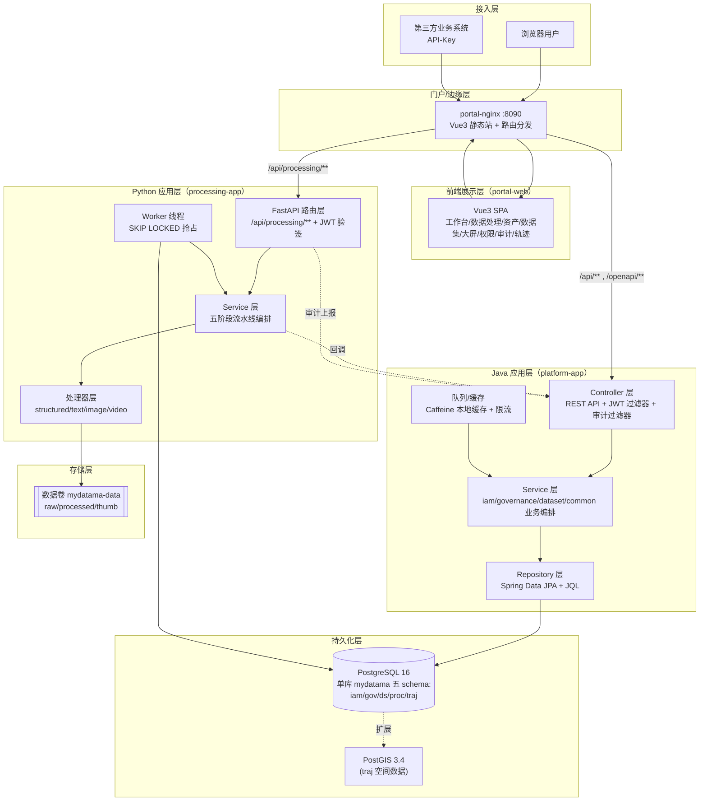

# SYS-001 系统总体架构设计

> 版本：v1.0 ｜ 日期：2026-09-30
> 关联文档：SYS-002, SYS-003, SYS-004, SYS-005, SYS-006, MOD-COM-001, MOD-IAM-001, MOD-PROC-001, MOD-GOV-001, MOD-DS-001, MOD-SCR-001, MOD-TRAJ-001

---

## 1. 概述

### 1.1 文档目的

本文档从系统层面定义企业多模态数据中台 MVP（Lite 演示架构）的总体架构，明确分层结构、模块划分、技术选型与部署拓扑，作为后续所有模块级、用例级、接口级与数据库级设计文档的顶层依据。

### 1.2 读者对象

- 架构师与系统设计师：作为评审与下钻设计的依据
- 后端/前端/数据工程师：理解自身模块在整体中的位置与边界
- 测试与运维工程师：理解部署形态、依赖关系与可观测性策略

### 1.3 术语与缩略语

| 术语 | 含义 |
|---|---|
| Lite 架构 | 面向 8GB 内存单机演示优化的极简部署形态，仅 4 个核心容器 |
| MVP | Minimum Viable Product，最小可行产品 |
| PG 队列 | 使用 PostgreSQL `FOR UPDATE SKIP LOCKED` 实现的轻量任务队列 |
| schema 隔离 | 同一 PG 实例内通过 schema 划分逻辑库，应用账号按 schema 授权 |
| ABAC | Attribute-Based Access Control，基于属性的访问控制 |
| 五阶段流水线 | 上传数据经过 ①采集校验 ②清洗 ③标准化 ④脱敏 ⑤标注登记 的处理链 |
| core / label 档 | Docker Compose 部署 profile，core 为必启，label 为可选 |

---

## 2. 设计目标与约束

### 2.1 功能目标

MVP 范围内必交付的 12 项核心功能：

1. 用户登录认证（JWT）+ RBAC + ABAC 简单条件判定 + 操作审计
2. 结构化数据上传与解析（CSV / JSON / Excel）
3. 多模态数据上传与基础处理（文本 / 图像 / 视频）
4. 列级脱敏引擎（掩码/哈希/置空三策略）
5. 资产目录（自动盘点、检索、分类、密级）
6. 两级数据血缘（raw → processed → dataset）
7. 训练数据集构建与版本管理
8. 三维质量报告（完整性/一致性/准确性）+ 评分建议
9. 自研可视化大屏（4 聚合接口 + 7 实时图表）
10. 审计日志（多条件检索 + CSV 导出，保留 180 天）
11. 三角色 RBAC（管理员 / 数据工程师 / 普通_viewer）
12. 北斗轨迹数据模拟接入与可视化（TRAJ 模块）

### 2.2 非功能目标

| 类别 | 目标 |
|---|---|
| 内存 | core 档容器稳态 ≤ 2.5GB；+label 档 ≤ 3.5GB；整机 ≤ 6GB（8GB 机器流畅） |
| 启动 | `docker compose up -d` 到可登录 ≤ 3 分钟（含首次建表） |
| 性能 | 常规接口 P95 < 300ms；小文件任务 ≥ 20 个/分钟 |
| 可靠性 | 任务持久化到 PG 队列，应用重启自动续跑；回调失败指数退避 5 次 |
| 可移植 | docker compose 一条命令；数据卷可整体拷贝迁移 |
| 可演进 | 模块边界清晰，存储/队列/检索均走接口，可平滑演进到微服务版 |

### 2.3 技术约束

- **8GB 内存硬约束**：拒绝 OpenMetadata/DataHub（4GB+）、Kafka/RabbitMQ/XXL-JOB（1-1.5GB）、Redis（150MB）、MinIO（300MB）
- **单 PG 实例**：业务库 + 任务队列（SKIP LOCKED）+ 审计存储三合一
- **PostgreSQL 16**：业务库 + PostGIS 3.4 扩展（轨迹空间数据）
- **容器化**：Docker Compose 编排，core 档仅 4 个容器
- **后端**：Spring Boot 3 + Spring Security + Spring Data JPA + jjwt + Caffeine
- **处理服务**：Python 3.11 + FastAPI + pandas/openpyxl + Pillow + ffmpeg
- **前端**：Vue 3.4 + Vite + TS + Element Plus + Pinia + Vue Router + ECharts 5 + Leaflet
- **Java 模块化**：Maven 多模块，模块间仅通过 api 子包接口交互
- **三层架构**：Controller → Service → Repository，跨层调用由 ArchUnit 拦截

---

## 3. 详细设计

### 3.1 分层架构



### 3.2 模块划分

| 逻辑模块 | 所在部署单元 | 主要职责 | 详情文档 |
|---|---|---|---|
| common | platform-app | 统一响应/异常/JWT/RBAC 注解/ABAC 引擎/审计/MyBatis 基类 | MOD-COM-001 |
| iam | platform-app | 用户、角色、权限、ABAC 策略、API Key、登录、审计落库与检索 | MOD-IAM-001 |
| processing-api | processing-app | 上传、文件/任务/标注查询、重试、受控文件下载 | MOD-PROC-001 |
| processing-worker | processing-app | 抢队列任务、执行五阶段流水线、回调资产登记 | MOD-PROC-001 |
| governance | platform-app | 资产目录、元数据、标准、血缘、热力、质量规则、开放 API、大屏聚合接口 | MOD-GOV-001 |
| dataset | platform-app | 数据集选取、版本快照、质检引擎、评分建议、版本对比 | MOD-DS-001 |
| screen | platform-app + portal-web | 大屏聚合接口 + 前端 ECharts 大屏 | MOD-SCR-001 |
| traj | platform-app + processing-app + portal-web | 模拟器/数据接入/PostGIS/Leaflet/回放/查询/大屏/指标 | MOD-TRAJ-001 |
| portal-web | portal-nginx | Vue3 门户 + ECharts 大屏 + Leaflet 地图 | MOD-SCR-001 |

### 3.3 技术栈选型

| 层 | 技术 | 版本 | 选型理由 |
|---|---|---|---|
| 反向代理 | Nginx | 1.27 | 静态托管 + 路径分流 + LS 代理，单进程内存 < 20MB |
| 后端框架 | Spring Boot | 3.2.x | 生态成熟，JPA + Security + Validation 一体 |
| 安全框架 | Spring Security | 6.2.x | 过滤器链可定制，JWT 过滤器接入 |
| ORM | Spring Data JPA | 3.2.x | 方法名查询 + Example 简化开发 |
| JWT | jjwt | 0.12.x | HS256 对称签名，Java/Python 双端验签 |
| 缓存 | Caffeine | 3.1.x | 进程内缓存，Token 黑名单/会话/10s 大屏缓存 |
| 数据库 | PostgreSQL | 16 | 单实例三合一（业务+队列+审计），pg_trgm 加速 ILIKE |
| 空间扩展 | PostGIS | 3.4 | 轨迹点存储与空间范围查询 |
| 处理服务 | FastAPI | 0.110+ | 异步 IO + Pydantic 校验，单容器内存 < 200MB |
| 数据处理 | pandas / openpyxl | 2.x / 3.x | CSV/JSON/Excel 解析 |
| 图像处理 | Pillow | 10.x | 缩放、EXIF、缩略图 |
| 视频处理 | ffmpeg | 6.x | 抽帧、转码、元数据 |
| 前端框架 | Vue | 3.4 | Composition API + `<script setup>` |
| 构建工具 | Vite | 5.x | HMR 快，构建产物由 Nginx 托管 |
| UI 组件库 | Element Plus | 2.6+ | 与 Vue 3 原生集成 |
| 状态管理 | Pinia | 2.x | 类型友好，组合式 API |
| 图表库 | ECharts | 5.x | 大屏 7 图表统一渲染 |
| 地图引擎 | Leaflet | 1.9 + 高德栅格瓦片 | 轻量（< 40KB），轨迹可视化 |
| 容器化 | Docker Compose | v2.x | 一键编排，profiles 控制 label 档 |
| 构建工具 | Maven / Vite | 3.9 / 5.x | 后端多模块构建 / 前端打包 |
| 标注（可选） | Label Studio | 1.10+ | 独立容器，自带 SQLite |

### 3.4 部署拓扑

```mermaid
flowchart LR
    subgraph Host["宿主机（8GB 内存）"]
        subgraph Compose["docker compose（core 档）"
            NGINX["portal-nginx<br/>:8090<br/>~30MB"]
            JAVA["platform-app<br/>:8080<br/>Xmx640m"]
            PY["processing-app<br/>:8000<br/>~200MB"]
            PG["postgres<br/>:5432<br/>shared_buffers=512MB"]
            VOL[["named volume<br/>mydatama-data"]]
        end
        subgraph Label["docker compose（label profile，可选）"
            LS["label-studio<br/>:8081 内部<br/>~800MB"]
        end
    end

    NGINX -->|/api/processing/**| PY
    NGINX -->|/api/**, /openapi/**| JAVA
    NGINX -.label profile.-> LS
    JAVA --> PG
    PY --> PG
    PY --> VOL
    PY -.REST + 服务令牌.-> LS
    PY -.处理完成回调.-> JAVA
```

**容器资源配额**：

| 容器 | 内存限制 | CPU 限制 | 说明 |
|---|---|---|---|
| postgres | 1.0GB | 1.0 | shared_buffers=512MB，work_mem=4MB |
| platform-app | 768MB（Xmx640m） | 1.0 | Spring Boot + Caffeine |
| processing-app | 384MB | 1.0 | FastAPI + 2 worker 线程 |
| portal-nginx | 64MB | 0.2 | 静态托管 + 反代 |
| label-studio（可选） | 1.0GB | 0.5 | 仅 label profile 启用 |
| **core 合计** | **≤ 2.5GB** | — | 8GB 机器流畅运行 |
| **+label 合计** | **≤ 3.5GB** | — | 整机 ≤ 6GB |

### 3.5 Nginx 路由规则

| 路径模式 | 转发目标 | 说明 |
|---|---|---|
| `/` | 静态文件（Vue3 SPA） | `try_files $uri /index.html` |
| `/api/processing/**` | `processing-app:8000` | 文件上传、任务查询、标注 |
| `/api/**` | `platform-app:8080` | 业务接口 |
| `/openapi/**` | `platform-app:8080` | 第三方开放 API |
| `/internal/**` | 仅容器网络可达 | 服务令牌鉴权，不对外暴露 |
| `/label-studio/**` | `label-studio:8080`（label profile） | Nginx 注入服务令牌 |

### 3.6 跨模块协作机制

MVP 拒绝引入消息中间件，跨模块协作采用以下两种轻量方式：

| 机制 | 适用场景 | 实现 |
|---|---|---|
| HTTP 同步回调 | Python 处理完成 → Java 资产登记 / 审计上报 | 失败指数退避重试 5 次（1s/2s/4s/8s/16s） |
| 数据库共享 | Java 各模块间共享数据 | 通过 Repository 按账号授权 schema 访问 |

**服务间认证**：内部接口（`/internal/**`）使用 `X-Service-Token` 请求头，token 由环境变量 `SERVICE_TOKEN` 配置，仅容器网络可达。

### 3.7 可演进性设计

为保证从 Lite 架构平滑演进到微服务版，本期代码必须遵守以下约束：

| 演进方向 | 当前实现 | 接口抽象 | 演进替换 |
|---|---|---|---|
| 存储层 | `LocalDiskStorage` | `Storage.save/read/presign/delete` | S3/OSS/MinIO |
| 任务队列 | `PostgresQueue` | `JobQueue.enqueue/claim/complete/fail` | Kafka/RabbitMQ |
| 检索 | PG ILIKE + pg_trgm | `SearchService.search` | Elasticsearch |
| 缓存 | Caffeine 进程内 | `CacheService.get/put` | Redis |
| 跨模块调用 | Java 内部 service 接口 | api 子包接口 | REST/gRPC |
| 文件回调 | HTTP 内部接口 | `AssetRegisterClient` | Kafka 事件 |

---

## 4. 与其他模块/文档的关系

| 关联模块 | 关系类型 | 关联文档 | 说明 |
|---|---|---|---|
| 部署 | 详化 | SYS-002 | 部署拓扑的容器/网络/卷细节 |
| 安全 | 详化 | SYS-003 | 等保三级对标、加密、脱敏、审计 |
| 异常 | 详化 | SYS-004 | 异常分类、错误码、降级 |
| 数据模型 | 详化 | SYS-005 | schema 总览、ER 全图、公共字段 |
| 业务流程 | 详化 | SYS-006 | 端到端主链路、跨模块时序 |
| 公共模块 | 实现 | MOD-COM-001 | 统一响应/异常/JWT/ABAC/审计 |
| IAM | 实现 | MOD-IAM-001 | 登录/权限/审计 |
| PROC | 实现 | MOD-PROC-001 | 上传/流水线/脱敏 |
| GOV | 实现 | MOD-GOV-001 | 资产/血缘/热力 |
| DS | 实现 | MOD-DS-001 | 数据集/质检 |
| SCR | 实现 | MOD-SCR-001 | 大屏聚合 |
| TRAJ | 实现 | MOD-TRAJ-001 | 轨迹模拟/可视化 |

---

## 5. 设计决策记录

| 决策编号 | 决策内容 | 理由 | 关联 ADR |
|---|---|---|---|
| ADR-001 | 单 Java 可执行 Jar + Maven 多模块 | 省 1.5GB 内存与启动时间，模块边界由包级隔离 + ArchUnit 守护 | — |
| ADR-002 | 单 Python 容器同时承担 API 与 Worker | 演示任务量小，避免独立 worker 容器开销 | — |
| ADR-003 | PG 队列代替 Kafka | 演示量级下 PG 行锁足够，天然持久化；演进时仅替换 JobQueue 实现 | — |
| ADR-004 | Caffeine 代替 Redis | 单实例无分布式诉求，省 150MB 内存 | — |
| ADR-005 | 本地磁盘卷代替 MinIO | 单机演示足够；Storage 接口保证可替换 | — |
| ADR-006 | Nginx 路径分流代替网关 | 仅 2 个后端，路径分流最简；网关在微服务阶段引入 | — |
| ADR-007 | PostGIS 扩展支持轨迹空间数据 | 复用现有 PG 实例，避免引入新中间件 | — |
| ADR-008 | Python 与 Java 共享 JWT HMAC 密钥 | 对称密钥仅容器内持有，免跨服务鉴权调用 | — |
| ADR-009 | HTTP 同步回调代替 Kafka 事件 | 仅两个应用，同步回调最简可观测；演进时换为事件 | — |
| ADR-010 | schema 隔离代替多库 | 应用账号按 schema 授权，逻辑隔离，未来拆库仅改连接配置 | — |

---

## 6. 验收标准

- [ ] core 档 4 容器在 8GB 内存机器上稳态 ≤ 2.5GB
- [ ] `docker compose up -d` 在 3 分钟内全部 healthy
- [ ] Nginx 路径分流规则正确：`/api/processing/**` → Python，其余 → Java
- [ ] Java 模块边界由 ArchUnit 守护，跨模块调用仅通过 api 子包接口
- [ ] Storage / JobQueue / SearchService 接口抽象到位，本地实现可运行
- [ ] 内部接口（`/internal/**`）仅容器网络可达，要求 `X-Service-Token`
- [ ] 演进路线 5 阶段均有明确接口替换方案

---

## 7. 修订记录

| 版本 | 日期 | 修订人 | 修订内容 |
|---|---|---|---|
| v1.0 | 2026-09-30 | 系统设计组 | 初版，定义分层、模块、技术栈、部署与演进路线 |
