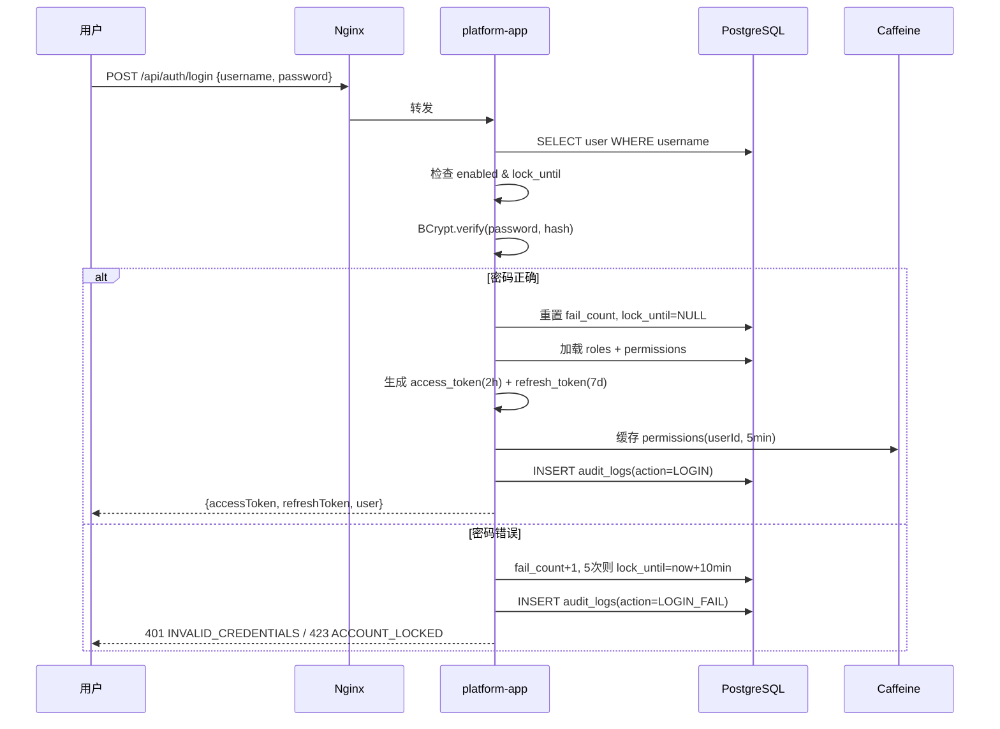
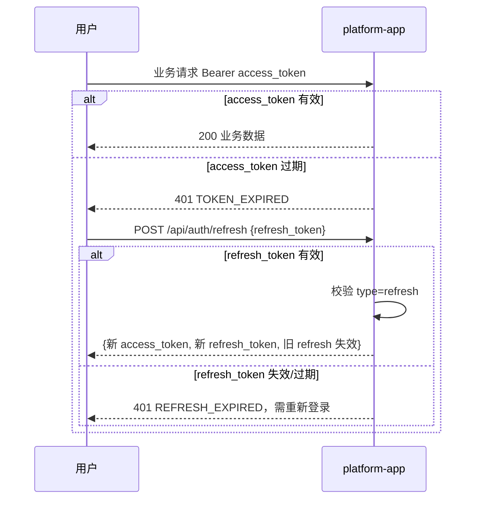
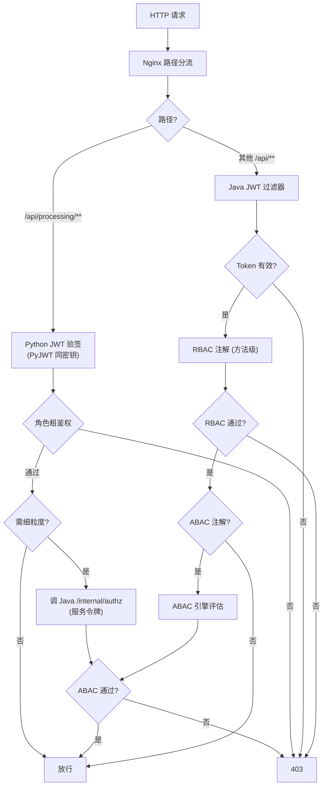

# SYS-003 系统安全设计

> 版本：v1.0 ｜ 日期：2026-09-30
> 关联文档：SYS-001, SYS-002, SYS-004, MOD-IAM-001, MOD-PROC-001, MOD-GOV-001, DDL-IAM-001

---

## 1. 概述

### 1.1 文档目的

定义企业多模态数据中台 MVP 的系统级安全设计，对等保三级技术控制项进行落地，明确认证授权体系、数据加密、脱敏策略、审计与隐私保护，作为各模块安全实现的统一依据。

### 1.2 读者对象

- 安全工程师：评审控制项覆盖完整性
- 后端工程师：实现认证/授权/审计/加密
- 数据工程师：实现脱敏引擎与隐私保护
- 测试工程师：安全验收用例设计

### 1.3 术语与缩略语

| 术语 | 含义 |
|---|---|
| 等保三级 | 信息系统安全等级保护第三级，强制要求 |
| RBAC | Role-Based Access Control，基于角色的访问控制 |
| ABAC | Attribute-Based Access Control，基于属性的访问控制 |
| JWT | JSON Web Token，无状态认证令牌 |
| HMAC | Hash-based Message Authentication Code，对称签名 |
| PII | Personally Identifiable Information，个人身份信息 |
| 密级 | 数据资产敏感等级（1=公开 / 2=内部 / 3=秘密 / 4=机密） |

---

## 2. 设计目标与约束

### 2.1 功能目标

- 实现等保三级技术控制项：身份鉴别、访问控制、安全审计、数据保密性、数据完整性、入侵防范、剩余信息保护
- 支持 BCrypt 口令 + JWT 双 Token（access 2h + refresh 7d）
- 支持 RBAC（三角色）+ ABAC（条件引擎）双层授权
- 支持列级脱敏（掩码/哈希/置空三策略）
- 支持操作审计全留痕，保留 180 天
- 支持图像 EXIF 剥离与视频元数据清除

### 2.2 非功能目标

- 登录响应 < 500ms（BCrypt cost=10）
- 鉴权决策 < 10ms（Caffeine 缓存权限）
- 审计写入不影响业务响应（异步落库 + 批量）
- 脱敏不影响处理吞吐（流式处理）

### 2.3 技术约束

- 演示 HTTP 仅绑 localhost；生产启用 HTTPS（Nginx 证书已预留）
- DB 中无明文密码，密钥全走环境变量
- 内部接口（`/internal/**`）仅容器网络可达
- 上传文件类型/大小白名单（≤ 200MB）

---

## 3. 详细设计

### 3.1 等保三级控制项映射

| 控制项 | 等保要求 | 落地设计 |
|---|---|---|
| 身份鉴别 | 双因素 / 复杂口令 / 失败锁定 | BCrypt(cost=10) + JWT；登录失败 5 次锁 10 分钟（DB 计数） |
| 访问控制 | 最小权限 / 默认拒绝 | RBAC 注解（方法级）+ ABAC 条件引擎；viewer 默认只读 |
| 安全审计 | 全量记录 / 不可篡改 / 防删除 | Java 全请求审计过滤器；审计表只追加 + 应用层禁止 UPDATE/DELETE |
| 数据保密性 | 传输加密 / 存储加密 / 脱敏 | 生产 HTTPS；DB 密码字段 BCrypt；敏感列脱敏；密钥环境变量 |
| 数据完整性 | 校验和 / 防篡改 | 上传 SHA-256；处理前后指标留痕；数据集版本快照不可变 |
| 入侵防范 | 限流 / 白名单 / 端口收敛 | Nginx + Java 双层令牌桶限流；上传白名单；内部接口仅容器网络 |
| 剩余信息保护 | 删除即清理 | 删除文件同步清理 raw/processed/thumb；DB 软删除 + 定期清理 |

### 3.2 认证体系

#### 3.2.1 登录流程



#### 3.2.2 JWT 设计

| 字段 | 类型 | 说明 |
|---|---|---|
| iss | string | 固定 `mydatama` |
| sub | int | userId |
| username | string | 用户名 |
| roles | string[] | 角色代码列表 |
| type | string | `access` 或 `refresh` |
| iat | long | 签发时间戳 |
| exp | long | 过期时间戳 |
| jti | string | 唯一 ID，用于黑名单 |

- **算法**：HS256（HMAC-SHA256）
- **密钥**：环境变量 `JWT_HMAC_SECRET`（≥ 32 字节），Java 与 Python 共享
- **签发**：Java `JwtUtil.sign(userId, username, roles, type)`
- **验签**：Java `JwtAuthFilter`；Python `PyJWT.decode` 同密钥
- **黑名单**：用户登出 / 修改密码时，将 jti 加入 Caffeine 黑名单（TTL = token 剩余有效期）

#### 3.2.3 双 Token 流程



### 3.3 授权体系

#### 3.3.1 RBAC 三角色

| 角色 code | 角色名 | 默认权限 | 默认密级上限 |
|---|---|---|---|
| `ADMIN` | 系统管理员 | 全部模块读写 + 用户/角色/策略/审计管理 | 4（机密） |
| `ENGINEER` | 数据工程师 | 数据处理/资产/数据集/质量规则读写；权限管理只读 | 3（秘密） |
| `VIEWER` | 普通 viewer | 全部模块只读；无审计/权限管理 | 2（内部） |

权限粒度：`module:resource:action`，如 `proc:files:upload`、`gov:assets:read`、`iam:users:write`。

#### 3.3.2 ABAC 条件引擎

适用场景：基于用户属性（部门、密级）与资源属性（所属部门、密级）的细粒度控制，例如"用户只能读同部门且密级 ≤ 自身密级上限的资产"。

**条件树 JSON 结构**：

```json
{
  "all": [
    {"op": "dept_eq", "left": "user.dept_code", "right": "asset.owner_dept"},
    {"op": "lte", "left": "asset.secret_level", "right": "user.secret_level"}
  ]
}
```

**支持的算子**：`eq` / `neq` / `lt` / `lte` / `gt` / `gte` / `in` / `not_in` / `dept_eq` / `regex`。

**逻辑组合**：`all`（AND）/ `any`（OR）/ `not`（NOT）。

**执行流程**：Java `AbacEngine.evaluate(policy, userContext, resourceContext) → boolean`，在 RBAC 通过后执行；任何条件失败即 403。

#### 3.3.3 鉴权链路



### 3.4 数据加密

#### 3.4.1 传输加密

| 场景 | 实现 |
|---|---|
| 浏览器 ↔ Nginx | 演示 HTTP 仅绑 localhost；生产 Nginx 终止 HTTPS（TLS 1.2+） |
| Nginx ↔ 后端 | 容器网络内 HTTP，无需 TLS |
| 后端 ↔ PG | 容器网络内明文；生产可启用 PG SSL（`sslmode=require`） |

#### 3.4.2 存储加密

| 数据 | 加密方式 |
|---|---|
| 用户密码 | BCrypt(cost=10) |
| API Key | SHA-256 哈希存储，明文仅创建时返回一次 |
| JWT 密钥 | 环境变量 `JWT_HMAC_SECRET` |
| 服务令牌 | 环境变量 `SERVICE_TOKEN` |
| Label Studio 令牌 | 环境变量 `LS_SERVICE_TOKEN` |
| DB 备份 | `pg_dump` 输出可选 GPG 加密（生产） |

### 3.5 脱敏策略

#### 3.5.1 敏感列识别

**双识别机制**：

1. **列名识别**：正则匹配列名，命中即标记为敏感列
   - 手机：`phone|mobile|tel`
   - 身份证：`id_card|idcard|sfz`
   - 银行卡：`bank_card|card_no|bankcard`
   - 邮箱：`email|mail`
   - 姓名：`name|real_name|person_name`

2. **内容识别**：采样前 100 行，正则匹配单元格内容
   - 手机号：`^1[3-9]\d{9}$`
   - 身份证：`^\d{17}[\dXx]$`
   - 银行卡：`^\d{16,19}$`（Luhn 校验）
   - 邮箱：`^[\w.-]+@[\w.-]+\.\w+$`

#### 3.5.2 脱敏策略

| 策略 code | 处理方式 | 适用场景 |
|---|---|---|
| `MASK` | 保留首尾，中间用 `*` 替换（如 `138****1234`） | 默认策略，保留可读性 |
| `HASH` | SHA-256 哈希后取前 16 位 | 需要关联比对但不可逆 |
| `NULL` | 置空 | 不需要该字段 |

**逐列可配**：`proc.job_queue.mask_columns` 字段 JSON 记录每列策略，由用户上传时指定或自动识别后回填。

#### 3.5.3 多模态脱敏

| 模态 | 脱敏动作 |
|---|---|
| 结构化 | 列名+内容双识别 → 三策略 |
| 文本 | 正则识别手机/身份证/银行卡/邮箱 → 掩码 |
| 图像 | Pillow 剥离全部 EXIF/GPS 元数据 |
| 视频 | ffmpeg `-map_metadata -1` 清除容器/流元数据标签 |

### 3.6 审计设计

#### 3.6.1 审计范围

| 来源 | 记录方式 | 内容 |
|---|---|---|
| Java 所有 `/api/**`（除白名单） | servlet 过滤器自动记录 | 用户、IP、方法、路径、状态码、耗时、动作标签 |
| Python 关键动作 | 调 `/internal/audit` 上报 | 上传、重试、人工标注保存 |
| Label Studio 操作 | 标注回拉时由 Python 落审计 | 真实平台用户、动作 |
| 内部接口调用 | Java 过滤器记录 | 服务令牌来源、动作 |

**动作标签（action）**：`LOGIN` / `LOGIN_FAIL` / `LOGOUT` / `UPLOAD` / `PROCESS_RETRY` / `PERMISSION_CHANGE` / `DATASET_PUBLISH` / `MASK_POLICY_CHANGE` / `ANNOTATION_SAVE` / `API_CALL`。

#### 3.6.2 审计表约束

- **只追加**：`audit_logs` 表应用层禁止 UPDATE/DELETE
- **不可篡改**：每条记录含 `hash_prev`（链式哈希），异常检测脚本扫描链完整性
- **保留期**：默认 180 天，配置项 `AUDIT_RETENTION_DAYS`
- **归档**：超期数据 `pg_dump` 导出后清理

#### 3.6.3 审计查询与导出

- 多条件检索：用户名、动作、资源、状态码、IP、时间范围
- 分页：默认 20 条/页，最大 100
- 导出：CSV 流式输出，单次最多 10 万条

### 3.7 隐私保护

| 数据类型 | 保护措施 |
|---|---|
| 用户密码 | BCrypt 哈希，不存明文 |
| API Key 明文 | 仅创建时返回，DB 仅存 SHA-256 |
| 用户真实姓名 | 列表展示按角色脱敏（viewer 看姓 + *） |
| 身份证号 | 全链路掩码，DB 不存原始上传值 |
| 上传文件中的 PII | 脱敏引擎处理后成品不含原始 PII |
| 轨迹数据中的车牌/驾驶员 | 查询接口按角色脱敏，viewer 仅看车辆代号 |
| 审计日志中的 IP | 仅记录不展示给 viewer |

### 3.8 入侵防范

| 防范点 | 实现 |
|---|---|
| 登录暴力破解 | 同账号 5 次失败锁 10 分钟；同 IP 10 次/分钟限流 |
| API 限流 | Nginx 令牌桶 20 req/s/IP；Java 方法级令牌桶 |
| 上传攻击 | 类型/大小白名单（≤ 200MB）；magic number 二次校验 |
| SQL 注入 | JPA 参数化查询；禁用字符串拼接 SQL |
| XSS | Vue3 默认转义；CSP 头（生产） |
| CSRF | JWT 不走 cookie，无 CSRF 风险 |
| 文件下载越权 | 服务端校验权限 + 路径白名单（防 `../` 攻击） |
| 内部接口 | `/internal/**` 仅容器网络可达 + `X-Service-Token` |

### 3.9 剩余信息保护

- **文件删除**：删除 data_files 记录时同步清理 raw/processed/thumb 物理文件
- **DB 软删除**：`deleted=true`，启动时清理任务定期物理删除超 30 天的软删记录
- **会话登出**：JWT jti 加入黑名单至过期；Caffeine 自动清理
- **API Key 失效**：`expire_at` 到期或主动停用后立即拒绝；DB 仅保留 hash 用于审计

---

## 4. 与其他模块/文档的关系

| 关联模块 | 关系类型 | 关联文档 | 说明 |
|---|---|---|---|
| 总体架构 | 上游 | SYS-001 | 安全设计是总体架构的横切关注点 |
| 部署 | 协同 | SYS-002 | 端口暴露、服务令牌、HTTPS 终止 |
| 异常 | 协同 | SYS-004 | 安全异常码与降级策略 |
| IAM | 实现 | MOD-IAM-001 | 登录/RBAC/ABAC/审计/API Key 实现 |
| PROC | 实现 | MOD-PROC-001 | 脱敏引擎、文件下载越权防护 |
| GOV | 实现 | MOD-GOV-001 | 资产密级、ABAC 资源上下文 |
| DB | 实现 | DDL-IAM-001 | users/policies/audit_logs 表设计 |

---

## 5. 设计决策记录

| 决策编号 | 决策内容 | 理由 |
|---|---|---|
| ADR-003-01 | BCrypt cost=10 | 等保三级要求，单次校验 ~100ms |
| ADR-003-02 | JWT HS256 而非 RS256 | 演示场景单密钥足够；演进时可换 RS256 |
| ADR-003-03 | access 2h + refresh 7d | 平衡安全与体验 |
| ADR-003-04 | ABAC 条件树 JSON 而非 DSL | 易于存储与可视化编辑 |
| ADR-003-05 | 审计表链式哈希 | 防篡改，等保三级要求 |
| ADR-003-06 | 服务令牌仅容器网络 | 最简可观测，演进时换 mTLS |
| ADR-003-07 | 上传 magic number 校验 | 防止扩展名伪造 |
| ADR-003-08 | 三脱敏策略而非任意函数 | 演示足够，扩展点支持新增 |

---

## 6. 验收标准

- [ ] BCrypt 密码校验正确，错误密码登录失败
- [ ] JWT 双 Token 流程通过，refresh 失效后需重新登录
- [ ] 登录失败 5 次后账号锁定 10 分钟
- [ ] RBAC 三角色权限边界正确（viewer 无法写、engineer 无法管理权限）
- [ ] ABAC 条件引擎可正确评估同部门+密级约束
- [ ] CSV 手机/身份证/银行卡列掩码正确
- [ ] 图像 EXIF 剥离、视频元数据清除
- [ ] 审计表记录所有 `/api/**` 请求，动作标签正确
- [ ] 审计表链式哈希完整性校验通过
- [ ] 内部接口从宿主机访问 404 / 401
- [ ] viewer 越权访问机密资产返回 403
- [ ] 上传超 200MB 或非白名单类型被拒绝

---

## 7. 修订记录

| 版本 | 日期 | 修订人 | 修订内容 |
|---|---|---|---|
| v1.0 | 2026-09-30 | 系统设计组 | 初版，对等保三级 7 项控制项落地 |
