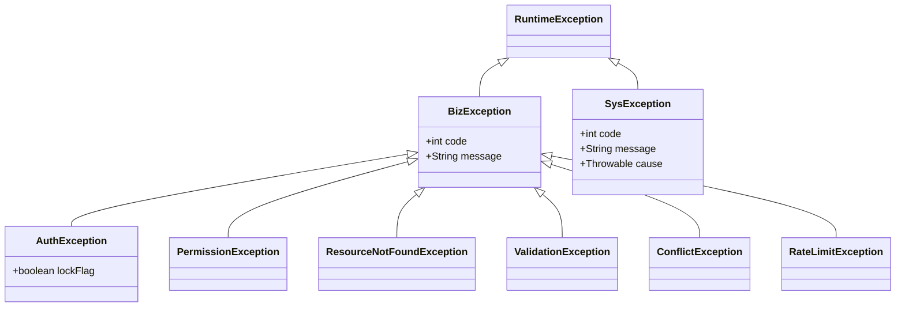

# SYS-004 系统异常处理设计

> 版本：v1.0 ｜ 日期：2026-09-30
> 关联文档：SYS-001, SYS-003, MOD-COM-001, MOD-IAM-001, MOD-PROC-001, MOD-GOV-001, MOD-DS-001, MOD-SCR-001, MOD-TRAJ-001

---

## 1. 概述

### 1.1 文档目的

定义企业多模态数据中台 MVP 的统一异常分类体系、错误码规范、全局异常处理、降级策略与告警机制，保证前端获得一致的错误反馈、运维获得清晰的故障定位信息、用户在系统异常时仍能获得可用的服务。

### 1.2 读者对象

- 后端工程师：实现异常类与全局处理器
- 前端工程师：基于错误码统一处理 UI 提示
- 运维工程师：基于告警机制配置监控
- 测试工程师：异常路径用例设计

### 1.3 术语与缩略语

| 术语 | 含义 |
|---|---|
| BizException | 业务异常，可预期、可向用户暴露 |
| SysException | 系统异常，不可预期，需运维介入 |
| 错误码 | 6 位整数，前 3 位标识模块，后 3 位标识具体错误 |
| 降级 | 在依赖故障时返回兜底数据或简化功能，而非直接报错 |
| 熔断 | 连续失败达阈值后短路一段时间，避免雪崩 |

---

## 2. 设计目标与约束

### 2.1 功能目标

- 统一异常体系：所有异常归为 BizException / SysException 两类
- 统一错误码：6 位编码，覆盖所有模块预期错误
- 统一响应体：`{code, message, data, traceId}`
- 全局异常处理器：捕获所有未处理异常并返回标准响应
- 降级策略：关键依赖故障时返回兜底
- 告警机制：系统异常与连续失败触发告警

### 2.2 非功能目标

- 异常处理不影响响应性能（< 5ms）
- 错误日志包含 traceId，便于跨服务追踪
- 前端基于 code 统一展示，message 可直接展示给用户

### 2.3 技术约束

- 业务异常抛 `BizException(code, message)`，不静默吞异常
- 系统异常抛 `SysException(code, message, cause)`
- 所有可变阈值走配置项
- TODO 必须包含 issue 号

---

## 3. 详细设计

### 3.1 异常分类体系



| 异常类 | 触发场景 | HTTP 状态 | 是否重试 |
|---|---|---|---|
| AuthException | 登录失败、Token 过期、账号锁定 | 401 / 423 | 否 |
| PermissionException | RBAC 拒绝、ABAC 拒绝 | 403 | 否 |
| ResourceNotFoundException | 资源不存在 | 404 | 否 |
| ValidationException | 参数校验失败 | 400 | 否 |
| ConflictException | 唯一约束冲突、状态冲突 | 409 | 否 |
| RateLimitException | 限流触发 | 429 | 是（退避） |
| BizException（其他） | 业务规则违反 | 400 | 视场景 |
| SysException | DB 故障、外部接口失败、NPE | 500 | 是（退避） |

### 3.2 错误码规范

**6 位编码**：`MMMNNN`

- `MMM`：模块代码
  - `000` 公共
  - `100` IAM
  - `200` PROC
  - `300` GOV
  - `400` DS
  - `500` SCR
  - `600` PROD
  - `700` TRAJ
- `NNN`：模块内序号

**错误码总表**：

| code | 异常类 | HTTP | message | 场景 |
|---|---|---|---|---|
| 000001 | ValidationException | 400 | 参数校验失败 | 任何参数 @Valid 失败 |
| 000002 | AuthException | 401 | 未认证 | 未携带 Token |
| 000003 | AuthException | 401 | Token 已过期 | access_token 过期且未刷新 |
| 000004 | AuthException | 401 | Token 无效 | 签名错误 / 黑名单 |
| 000005 | AuthException | 423 | 账号已锁定 | 登录失败 5 次 |
| 000006 | PermissionException | 403 | 无访问权限 | RBAC / ABAC 拒绝 |
| 000007 | ResourceNotFoundException | 404 | 资源不存在 | 任何 GET 不命中 |
| 000008 | ConflictException | 409 | 资源已存在 | 唯一约束冲突 |
| 000009 | RateLimitException | 429 | 请求过于频繁 | 限流触发 |
| 000010 | BizException | 400 | 操作不允许 | 状态机非法转移 |
| 000099 | SysException | 500 | 系统繁忙 | 兜底系统异常 |
| 100001 | AuthException | 401 | 用户名或密码错误 | 登录失败 |
| 100002 | AuthException | 401 | refresh_token 失效 | 刷新失败需重新登录 |
| 100003 | BizException | 400 | 用户名已存在 | 注册/创建用户 |
| 100004 | BizException | 400 | 角色代码已存在 | 创建角色 |
| 100005 | BizException | 400 | API Key 已停用 | 调用开放 API |
| 100006 | BizException | 400 | 审计导出超限 | 单次 > 10 万条 |
| 200001 | ValidationException | 400 | 文件类型不允许 | 上传非白名单类型 |
| 200002 | ValidationException | 400 | 文件大小超限 | 单文件 > 200MB |
| 200003 | BizException | 400 | 任务状态不允许重试 | 非 FAILED 状态 |
| 200004 | BizException | 400 | 文件已被删除 | 下载已删文件 |
| 200005 | BizException | 400 | 脱敏策略无效 | 未知策略 code |
| 200006 | SysException | 500 | 处理流水线异常 | 处理器内部错误 |
| 300001 | BizException | 400 | 资产已下架 | 操作已下架资产 |
| 300002 | BizException | 400 | 标准代码已存在 | 创建数据标准 |
| 300003 | BizException | 400 | 血缘循环检测 | 编辑血缘边 |
| 400001 | BizException | 400 | 数据集已发布 | 修改已发布版本 |
| 400002 | BizException | 400 | 版本号不连续 | 生成版本 |
| 400003 | BizException | 400 | 质检规则未启用 | 生成质量报告 |
| 500001 | BizException | 400 | 大屏参数无效 | 时间范围非法 |
| 700001 | ValidationException | 400 | 设备ID不存在 | 查询轨迹 |
| 700002 | BizException | 400 | 模拟器已在运行 | 重复启动 |
| 700003 | BizException | 400 | 时间范围超限 | 查询跨度 > 30 天 |
| 700004 | SysException | 500 | PostGIS 查询失败 | 空间索引异常 |

### 3.3 全局异常处理

#### 3.3.1 Java 侧 `@RestControllerAdvice`

```java
@RestControllerAdvice
public class GlobalExceptionHandler {

    @ExceptionHandler(BizException.class)
    public ResponseEntity<ApiResult<Void>> handleBiz(BizException e) {
        log.warn("业务异常 code={} msg={}", e.getCode(), e.getMessage());
        HttpStatus status = mapHttpStatus(e);
        return ResponseEntity.status(status).body(ApiResult.fail(e.getCode(), e.getMessage()));
    }

    @ExceptionHandler(SysException.class)
    public ResponseEntity<ApiResult<Void>> handleSys(SysException e) {
        log.error("系统异常 code={} msg={}", e.getCode(), e.getMessage(), e);
        alertIfNecessary(e);
        return ResponseEntity.status(500).body(ApiResult.fail(e.getCode(), "系统繁忙，请稍后重试"));
    }

    @ExceptionHandler(MethodArgumentNotValidException.class)
    public ResponseEntity<ApiResult<Void>> handleValid(MethodArgumentNotValidException e) {
        String msg = e.getBindingResult().getFieldErrors().stream()
            .map(f -> f.getField() + ": " + f.getDefaultMessage())
            .collect(Collectors.joining("; "));
        return ResponseEntity.badRequest().body(ApiResult.fail(1, msg));
    }

    @ExceptionHandler(Exception.class)
    public ResponseEntity<ApiResult<Void>> handleUnknown(Exception e) {
        log.error("未捕获异常", e);
        alertIfNecessary(e);
        return ResponseEntity.status(500).body(ApiResult.fail(99, "系统繁忙"));
    }

    private void alertIfNecessary(Exception e) {
        // 累计 5 分钟内系统异常 > 10 次触发告警
    }
}
```

#### 3.3.2 Python 侧 FastAPI 异常处理

```python
@app.exception_handler(BizException)
async def biz_handler(request, exc):
    return JSONResponse(
        status_code=map_http_status(exc),
        content={"code": exc.code, "message": exc.message, "data": None, "traceId": request.state.trace_id}
    )

@app.exception_handler(Exception)
async def unknown_handler(request, exc):
    logger.exception("未捕获异常 traceId=%s", request.state.trace_id)
    return JSONResponse(
        status_code=500,
        content={"code": 99, "message": "系统繁忙", "data": None, "traceId": request.state.trace_id}
    )
```

### 3.4 统一响应体

```json
{
  "code": 0,
  "message": "OK",
  "data": {},
  "traceId": "a1b2c3d4"
}
```

- `code = 0` 表示成功，非 0 表示失败
- `message` 可直接展示给用户（业务异常）或固定文案（系统异常）
- `traceId` 由网关/Nginx 注入 `X-Trace-Id`，全链路透传
- `data` 为业务数据，失败时为 `null`

### 3.5 降级策略

| 依赖故障 | 降级行为 | 触发条件 |
|---|---|---|
| Caffeine 缓存失败 | 直接穿透到 DB | 缓存 PUT 抛异常 |
| 资产登记回调失败（Python→Java） | 任务仍标 SUCCEEDED，资产登记入待补表，后台重试 | HTTP 5xx 或超时 |
| 审计上报失败（Python→Java） | 本地落 `proc.audit_buffer` 表，后台批量重试 | HTTP 5xx 或超时 |
| Label Studio 不可达 | 标注菜单隐藏，已有标注正常展示 | 健康检查失败 |
| 大屏聚合接口超时 | 前端使用上次缓存数据 + 提示"数据延迟" | 接口 5s 超时 |
| 轨迹查询超时 | 缩短时间范围或采样 | 单次 > 3s |
| pg_trgm 索引失效 | 退化为普通 ILIKE | 索引扫描失败 |

### 3.6 熔断与限流

| 控制点 | 阈值 | 行为 |
|---|---|---|
| 登录失败 | 同账号 5 次/10 分钟 | 锁定 10 分钟 |
| 登录失败 | 同 IP 10 次/分钟 | IP 限流 1 分钟 |
| API 请求 | 同 IP 20 req/s | 429 限流 |
| API 请求 | 同用户 100 req/分钟 | 429 限流 |
| 内部回调 | 连续 5 次失败 | 熔断 30s，期间直接入待补表 |
| 文件下载 | 同用户 10 次/分钟 | 429 限流 |
| 轨迹查询 | 同用户 30 次/分钟 | 429 限流 |

### 3.7 告警机制

| 告警项 | 触发条件 | 通道 |
|---|---|---|
| 系统异常激增 | 5 分钟内 SysException > 10 次 | 日志 + webhook（生产） |
| 内部回调熔断 | 熔断触发 | 日志 + webhook |
| 任务失败率 | 近 1h 失败率 > 20% | 日志 + webhook |
| 任务积压 | PENDING > 50 | 日志 |
| DB 连接池 | 活跃连接 > 80% | 日志 |
| 磁盘 | 使用率 > 80% | 日志 + webhook |
| 容器 | unhealthy 持续 1 分钟 | 日志 + webhook |

**告警抑制**：同类告警 5 分钟内仅发一次。

### 3.8 异常日志规范

| 异常类 | 日志级别 | 内容 |
|---|---|---|
| AuthException | INFO | code, message, username, ip |
| PermissionException | WARN | code, message, username, resource |
| ValidationException | INFO | code, message, fields |
| ResourceNotFoundException | INFO | code, message, resource |
| ConflictException | WARN | code, message, resource |
| RateLimitException | WARN | code, message, key, count |
| BizException | WARN | code, message, context |
| SysException | ERROR | code, message, stack trace |
| 未捕获 Exception | ERROR | 完整 stack trace + traceId |

---

## 4. 与其他模块/文档的关系

| 关联模块 | 关系类型 | 关联文档 | 说明 |
|---|---|---|---|
| 总体架构 | 上游 | SYS-001 | 异常处理是横切关注点 |
| 安全 | 协同 | SYS-003 | 安全异常码归属本表 |
| 公共模块 | 实现 | MOD-COM-001 | 异常类与全局处理器实现 |
| 各业务模块 | 实现 | 各 MOD-xxx | 抛出业务异常 |
| 部署 | 协同 | SYS-002 | 健康检查与告警 |

---

## 5. 设计决策记录

| 决策编号 | 决策内容 | 理由 |
|---|---|---|
| ADR-004-01 | 异常二分 Biz/Sys | 可预期 vs 不可预期，处理策略不同 |
| ADR-004-02 | 6 位错误码 | 3 位模块 + 3 位序号，可扩展 |
| ADR-004-03 | traceId 全链路透传 | 跨服务问题定位 |
| ADR-004-04 | 资产登记失败不阻断任务 | 业务优先，资产补登后台重试 |
| ADR-004-05 | 审计失败本地缓冲 | 审计不可丢，失败兜底落 PG |
| ADR-004-06 | 告警抑制 5 分钟 | 避免告警风暴 |

---

## 6. 验收标准

- [ ] 所有 BizException 返回 4xx + 错误码 + message
- [ ] 所有 SysException 返回 500 + "系统繁忙" + 错误码 + traceId
- [ ] 参数校验失败返回 400 + 字段错误明细
- [ ] 未捕获异常返回 500 + traceId，日志含完整堆栈
- [ ] 同账号登录失败 5 次锁定 10 分钟
- [ ] 限流触发返回 429
- [ ] 资产登记回调失败后任务仍 SUCCEEDED，资产入待补表
- [ ] 告警抑制 5 分钟内同类仅一次
- [ ] 前端基于 code 统一提示，message 可直接展示

---

## 7. 修订记录

| 版本 | 日期 | 修订人 | 修订内容 |
|---|---|---|---|
| v1.0 | 2026-09-30 | 系统设计组 | 初版，定义异常分类、错误码总表、全局处理器、降级与告警 |
