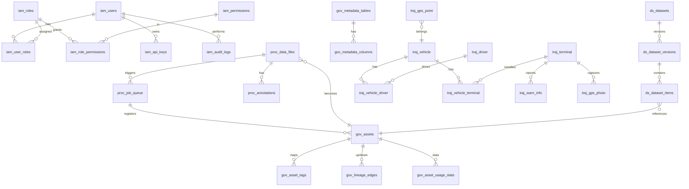

# SYS-005 数据模型总体设计

> 版本：v1.0 ｜ 日期：2026-09-30
> 关联文档：SYS-001, DDL-IAM-001, DDL-PROC-001, DDL-GOV-001, DDL-DS-001, DDL-TRAJ-001

---

## 1. 概述

### 1.1 文档目的

定义企业多模态数据中台 MVP 的数据模型总体设计，包含五 schema 总览、ER 全图、公共字段规范、命名规范与迁移策略，作为各 schema 级 DDL 文档的顶层依据。

### 1.2 读者对象

- 数据库设计者：按本规范细化各 schema DDL
- 后端工程师：实体类与 Repository 实现依据
- 运维工程师：数据库初始化与迁移操作依据

### 1.3 术语与缩略语

| 术语 | 含义 |
|---|---|
| schema 隔离 | 同一 PG 实例内通过 schema 划分逻辑库 |
| 软删除 | 使用 `deleted` 标志位而非物理删除 |
| 公共字段 | 所有业务表共有的审计字段 |
| 种子数据 | 系统初始化必须的数据（角色、权限、admin 用户等） |

---

## 2. 设计目标与约束

### 2.1 功能目标

- 五 schema 隔离：iam / gov / ds / proc / traj
- 公共字段规范统一
- 命名规范统一
- ER 关系清晰，跨 schema 引用通过应用层校验
- 支持 Flyway 风格的版本化迁移

### 2.2 非功能目标

- 单库 mydatama 容纳全部业务数据，简化运维
- 应用账号按 schema 授权，最小权限
- 索引覆盖高频查询，P95 < 300ms

### 2.3 技术约束

- PostgreSQL 16 + PostGIS 3.4 + pg_trgm 扩展
- 不建立物理外键约束（应用层校验关联完整性）
- 软删除使用 `deleted` boolean 字段（traj 模块遵循 `valid_mark` 历史约定）
- 所有表 snake_case 命名

---

## 3. 详细设计

### 3.1 五 Schema 总览

| schema | 用途 | 表数量 | DDL 文档 | 行量级（演示） |
|---|---|---|---|---|
| iam | 身份认证、权限、审计、API Key | 7 | DDL-IAM-001 | < 1 万 |
| proc | 文件、任务队列、标注 | 3 | DDL-PROC-001 | < 10 万 |
| gov | 资产、元数据、血缘、标准、质量规则、热力 | 8 | DDL-GOV-001 | < 10 万 |
| ds | 数据集、版本、项 | 3 | DDL-DS-001 | < 10 万 |
| traj | 轨迹点、车辆、终端、司机、报警、拍照 | 8 | DDL-TRAJ-001 | 百万级 |
| **合计** | — | **29** | — | — |

### 3.2 ER 全图



### 3.3 公共字段规范

所有业务表（traj 模块遵循其历史约定除外）共有的字段：

| 字段名 | 类型 | 可空 | 默认 | 含义 |
|---|---|---|---|---|
| id | bigserial | 否 | — | 主键，自增 |
| created_at | timestamp | 否 | CURRENT_TIMESTAMP | 创建时间 |
| updated_at | timestamp | 否 | CURRENT_TIMESTAMP | 最后修改时间（触发器自动更新） |
| created_by | varchar(64) | 否 | 'system' | 创建人（用户名或 system） |
| updated_by | varchar(64) | 是 | NULL | 最后修改人 |
| deleted | boolean | 否 | false | 软删除标志：true=已删除 |

**traj 模块例外**：沿用历史 `valid_mark smallint`（1=有效，0=无效）+ `creator/create_date/updater/update_date` 命名，遵循 DDL-TRAJ-001 约定。

**updated_at 自动更新触发器**：

```sql
CREATE OR REPLACE FUNCTION fn_set_updated_at()
RETURNS TRIGGER AS $$
BEGIN
    NEW.updated_at = CURRENT_TIMESTAMP;
    RETURN NEW;
END;
$$ LANGUAGE plpgsql;

-- 每个业务表创建触发器
CREATE TRIGGER trg_<table>_updated_at
    BEFORE UPDATE ON <schema>.<table>
    FOR EACH ROW EXECUTE FUNCTION fn_set_updated_at();
```

### 3.4 命名规范

| 对象 | 规范 | 示例 |
|---|---|---|
| schema | 小写英文，模块缩码 | `iam`, `proc`, `gov`, `ds`, `traj` |
| 表名 | `<schema>_<实体>` snake_case | `iam_users`, `proc_data_files` |
| 字段名 | snake_case | `created_at`, `secret_level` |
| 主键 | `id` | — |
| 外键字段 | `<实体>_id` | `user_id`, `asset_id` |
| 布尔字段 | 形容词或 is_xxx | `deleted`, `enabled`, `is_active` |
| 索引 | `idx_<表>_<字段>` 或 `uk_<表>_<字段>`（唯一） | `idx_iam_users_username` |
| 复合索引 | `idx_<表>_<字段1>_<字段2>` | `idx_traj_gps_point_identity_time` |
| 空间索引 | `idx_<表>_<字段>_gist` | `idx_traj_gps_point_location_gist` |
| 序列 | 默认 bigserial，不自定义序列名 | — |
| 约束 | `ck_<表>_<含义>` | `ck_iam_users_enabled_bool` |

### 3.5 跨 schema 引用规范

**不建立物理外键**，通过以下方式保证完整性：

1. 应用层 Service 调用前校验关联实体存在
2. 删除实体前校验无引用（如删除用户前校验无 audit_logs 引用）
3. 跨 schema 引用字段命名 `<被引实体>_id`，类型 bigint

**示例**：
- `proc.job_queue.file_id` → `proc.data_files.id`（同 schema，可不建外键）
- `gov.assets.source_file_id` → `proc.data_files.id`（跨 schema，应用层校验）
- `ds.dataset_items.asset_id` → `gov.assets.id`（跨 schema，应用层校验）

### 3.6 索引策略

| 查询模式 | 索引类型 | 示例 |
|---|---|---|
| 主键查询 | B-tree PK | `WHERE id = ?` |
| 唯一约束 | B-tree UNIQUE | `WHERE username = ?` |
| 外键关联 | B-tree | `WHERE user_id = ?` |
| 时间范围 | B-tree DESC | `WHERE created_at BETWEEN ? AND ?` |
| 模糊搜索 | GIN pg_trgm | `WHERE name ILIKE '%kw%'` |
| 空间范围 | GIST | `WHERE location && ST_MakeEnvelope(...)` |
| 复合条件 | B-tree 复合 | `WHERE identity_code=? AND gps_time BETWEEN ?` |
| 状态过滤 | 部分索引 | `WHERE status='PENDING'`（仅索引待处理） |

**任务队列抢占专用部分索引**：

```sql
CREATE INDEX idx_proc_job_queue_pending
    ON proc.job_queue (id)
    WHERE status = 'PENDING';
```

### 3.7 数据类型规范

| 业务类型 | PG 类型 | 说明 |
|---|---|---|
| 主键 | bigserial | 自增 64 位 |
| 字符串 | varchar(n) | 明确长度限制 |
| 长文本 | text | 无长度限制 |
| 金额 | numeric(14,2) | 避免浮点误差 |
| 经纬度（业务字段） | numeric(10,6) | 6 位小数足够 |
| 经纬度（空间字段） | geometry(Point, 4326) | PostGIS 专用 |
| 布尔 | boolean | traj 模块用 smallint（0/1） |
| 枚举 | varchar(32) + CHECK | 不使用 PG enum 类型，便于演进 |
| 时间 | timestamp | 不带时区，应用层统一 Asia/Shanghai |
| JSON | jsonb | 支持索引与查询 |
| 大整数 | bigint | — |
| 速率/计数 | integer | — |

### 3.8 种子数据规划

`infra/postgres/init/07-seed-data.sql` 包含：

| 数据组 | 内容 |
|---|---|
| 角色 | ADMIN / ENGINEER / VIEWER 三角色 |
| 权限 | 全部 `module:resource:action` 权限点 |
| 角色权限映射 | ADMIN=全部；ENGINEER=业务模块读写+权限只读；VIEWER=全部只读 |
| admin 用户 | 用户名 admin / 密码 BCrypt(admin@123) / 角色 ADMIN |
| ABAC 策略 | 默认"同部门 + 密级限制"策略 |
| 数据标准 | 5 条内置标准（手机/身份证/银行卡/邮箱/姓名脱敏规则） |
| 质量规则 | 3 条内置规则（NOT_NULL/REGEX/RANGE） |
| 轨迹车辆 | 5 辆演示车辆 + 5 台终端 + 5 名驾驶员 |

### 3.9 数据迁移策略

#### 3.9.1 初始化脚本

按字典序执行（详见 SYS-002 §3.7）：

```
infra/postgres/init/
├── 01-create-schemas.sql
├── 02-iam-tables.sql
├── 03-proc-tables.sql
├── 04-gov-tables.sql
├── 05-ds-tables.sql
├── 06-traj-tables.sql
└── 07-seed-data.sql
```

#### 3.9.2 版本化迁移

MVP 不引入 Flyway/Liquibase，采用约定式版本脚本：

```
infra/postgres/migrations/
├── V20261001_01__add_xxx_column.sql
├── V20261015_01__create_yyy_table.sql
└── ...
```

- 文件名 `V<日期>_<序号>__<描述>.sql`
- 升级时由运维按顺序执行，记录到 `iam.schema_migrations(version, applied_at)`
- 应用启动时检查 `schema_migrations` 与文件列表是否一致，缺失则告警

#### 3.9.3 备份恢复

详见 SYS-002 §3.10。

### 3.10 性能优化策略

| 优化点 | 策略 |
|---|---|
| 任务队列抢占 | 部分索引 `WHERE status='PENDING'` + SKIP LOCKED |
| 资产检索 | GIN pg_trgm 索引 `name` / `biz_domain` |
| 审计查询 | 复合索引 `(username, created_at DESC)` + `(action, created_at DESC)` |
| 轨迹回放 | 复合索引 `(identity_code, gps_time DESC)` |
| 空间范围查询 | GIST 索引 `location` |
| 大屏聚合 | 物化视图可选 + Caffeine 10s 缓存 |
| 数据集版本快照 | jsonb 存储资产快照，避免 JOIN |

---

## 4. 与其他模块/文档的关系

| 关联模块 | 关系类型 | 关联文档 | 说明 |
|---|---|---|---|
| 总体架构 | 上游 | SYS-001 | 数据模型是总体架构的持久化层 |
| 部署 | 协同 | SYS-002 | 初始化脚本与备份 |
| IAM schema | 详化 | DDL-IAM-001 | 7 表设计 |
| PROC schema | 详化 | DDL-PROC-001 | 3 表设计 |
| GOV schema | 详化 | DDL-GOV-001 | 8 表设计 |
| DS schema | 详化 | DDL-DS-001 | 3 表设计 |
| TRAJ schema | 详化 | DDL-TRAJ-001 | 8 表设计 |

---

## 5. 设计决策记录

| 决策编号 | 决策内容 | 理由 |
|---|---|---|
| ADR-005-01 | schema 隔离而非多库 | 应用账号按 schema 授权，逻辑隔离，未来拆库仅改连接配置 |
| ADR-005-02 | 不建立物理外键 | 跨 schema 引用 + 演进为微服务时拆库无外键包袱 |
| ADR-005-03 | 软删除而非物理删除 | 等保三级剩余信息保护要求可追溯 |
| ADR-005-04 | bigserial 主键 | 自增 64 位，演示足够 |
| ADR-005-05 | jsonb 存储快照与配置 | 灵活、可索引、便于演进 |
| ADR-005-06 | pg_trgm 加速 ILIKE | 替代 ES，演示量级毫秒响应 |
| ADR-005-07 | 部分索引优化队列抢占 | 减少索引体积，提升抢占性能 |
| ADR-005-08 | 约定式版本脚本而非 Flyway | 8GB 内存优先，避免引入工具 |
| ADR-005-09 | traj 模块沿用 valid_mark 命名 | 忠实迁移 langdi.sql 历史 |

---

## 6. 验收标准

- [ ] 五 schema 创建成功，应用账号仅能访问授权 schema
- [ ] 公共字段在所有业务表（traj 除外）一致
- [ ] `updated_at` 触发器自动更新生效
- [ ] 种子数据初始化后，admin/admin@123 可登录
- [ ] 三角色权限边界正确
- [ ] 任务队列抢占 SQL 在并发 2 worker 下无重复抢占
- [ ] pg_trgm 模糊检索 < 50ms
- [ ] PostGIS 空间范围查询 < 100ms
- [ ] 迁移脚本可重放（IF NOT EXISTS）

---

## 7. 修订记录

| 版本 | 日期 | 修订人 | 修订内容 |
|---|---|---|---|
| v1.0 | 2026-09-30 | 系统设计组 | 初版，定义五 schema、ER 全图、公共字段、命名、迁移与性能策略 |
