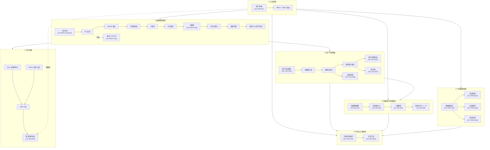
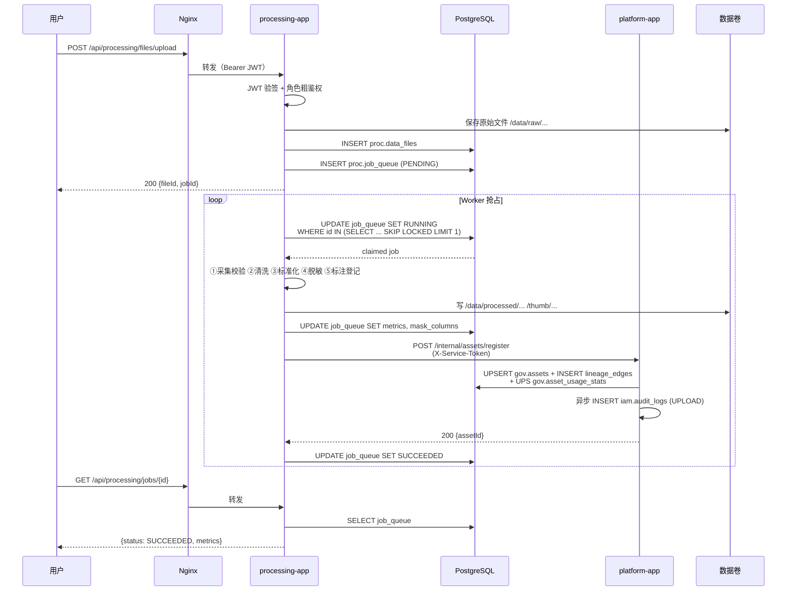
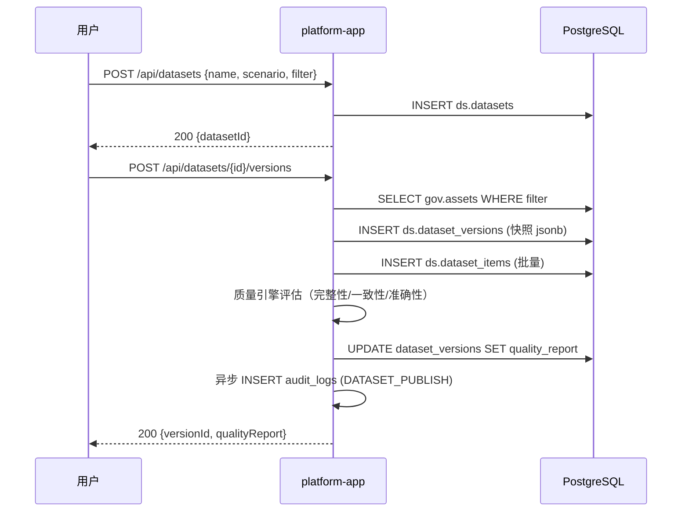
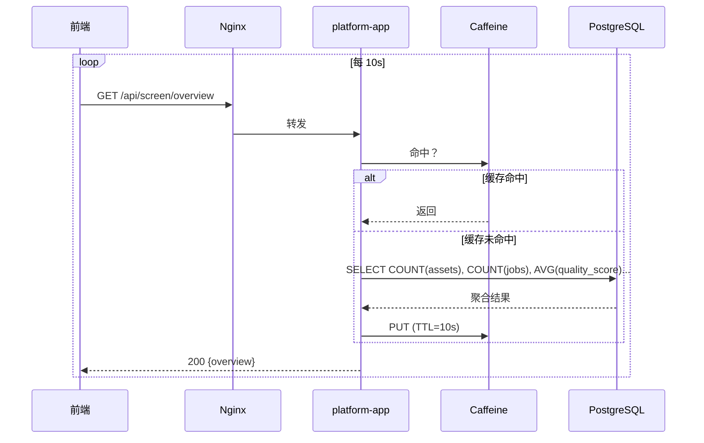
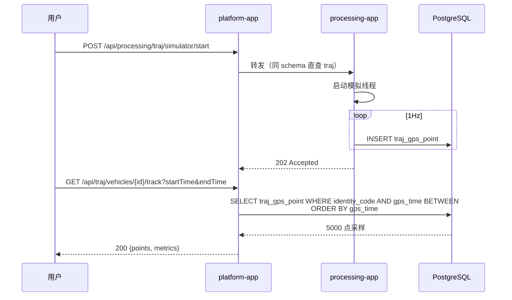
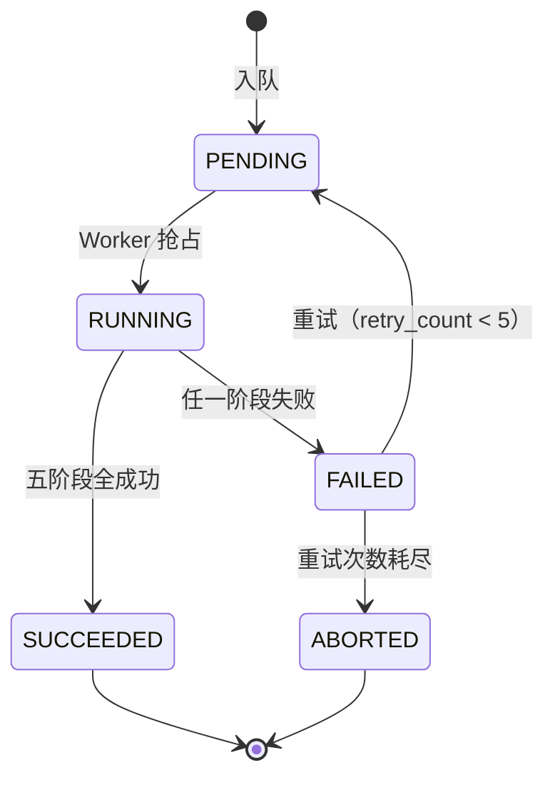
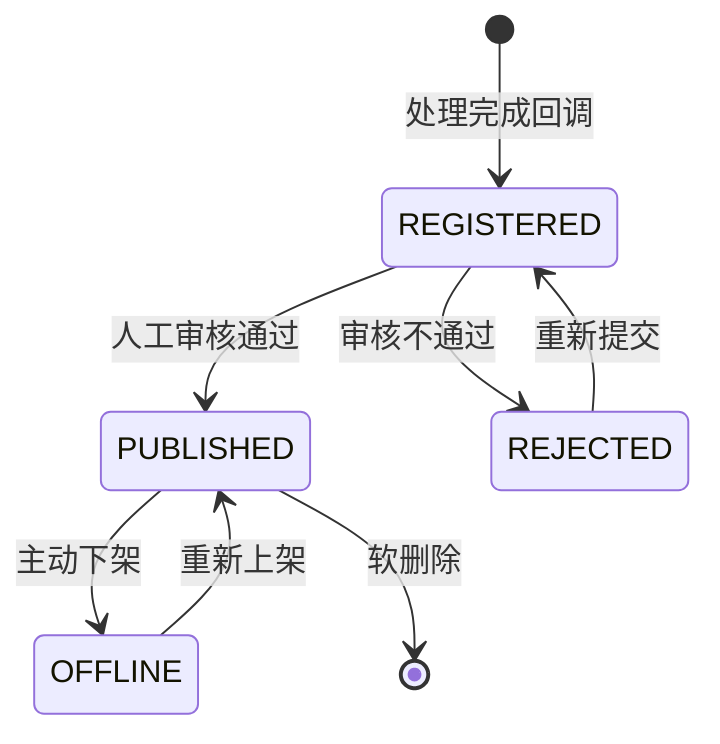
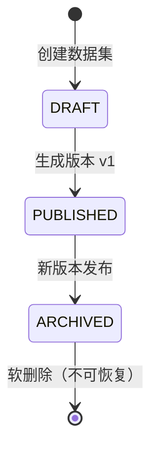
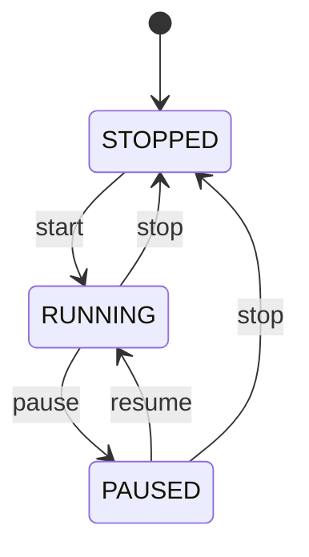
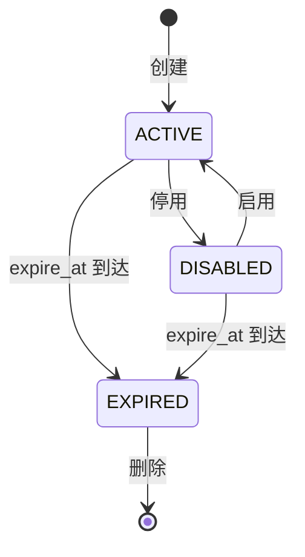

# SYS-006 系统业务流程总览

> 版本：v1.0 ｜ 日期：2026-09-30
> 关联文档：SYS-001, MOD-IAM-001, MOD-PROC-001, MOD-GOV-001, MOD-DS-001, MOD-SCR-001, MOD-TRAJ-001

---

## 1. 概述

### 1.1 文档目的

定义企业多模态数据中台 MVP 的端到端主链路、跨模块协作时序与状态机汇总，作为各用例级（UC）文档的顶层索引，帮助理解全系统业务流转。

### 1.2 读者对象

- 架构师：评审业务流程完整性
- 后端工程师：理解跨模块协作时序
- 测试工程师：端到端测试用例设计依据
- 产品/演示人员：15 分钟演示脚本依据

### 1.3 术语与缩略语

| 术语 | 含义 |
|---|---|
| 主链路 | 系统核心业务从触发到完成的完整路径 |
| 状态机 | 实体生命周期状态转移图 |
| 跨模块时序 | 多模块协作的时序图 |
| 演示脚本 | 15 分钟内向评审展示全部 MVP 功能的标准流程 |

---

## 2. 设计目标与约束

### 2.1 功能目标

- 覆盖 MVP 全部 12 项核心功能的端到端流程
- 明确跨模块协作的时序与触发条件
- 汇总关键实体的状态机
- 提供 15 分钟演示脚本

### 2.2 非功能目标

- 流程图使用 Mermaid，便于评审与维护
- 状态机明确定义非法转移
- 跨模块时序标注服务令牌与回调点

### 2.3 技术约束

- 跨模块协作仅 HTTP 同步回调或 DB 共享（无中间件）
- 流程异常分支与 SYS-004 错误码对应

---

## 3. 详细设计

### 3.1 端到端主链路

### 3.2 跨模块协作时序

#### 3.2.1 上传处理 → 资产登记（核心链路）

#### 3.2.2 数据集构建 → 质量报告

#### 3.2.3 大屏实时聚合

#### 3.2.4 轨迹模拟 → 可视化

### 3.3 状态机汇总

#### 3.3.1 处理任务状态机

| 当前状态 | 允许动作 | 触发条件 |
|---|---|---|
| PENDING | 抢占、取消 | Worker 轮询 / 用户主动 |
| RUNNING | 状态查询、阶段指标更新 | 自动 |
| SUCCEEDED | 详情查询、成品下载 | — |
| FAILED | 重试（→ PENDING）、详情查询 | 用户主动 |
| ABORTED | 详情查询、清理 | — |

非法转移：SUCCEEDED → PENDING、SUCCEEDED → FAILED、ABORTED → PENDING。

#### 3.3.2 资产状态机

#### 3.3.3 数据集版本状态机

已发布版本内容不可变，仅可下架。

#### 3.3.4 轨迹模拟器状态机

#### 3.3.5 API Key 状态机

### 3.4 跨模块协作矩阵

| 调用方 → 被调方 | 触发场景 | 方式 | 失败处理 |
|---|---|---|---|
| Python → Java `/internal/assets/register` | 处理完成资产登记 | HTTP + 服务令牌 | 退避重试 5 次，入待补表 |
| Python → Java `/internal/audit` | Python 关键动作审计 | HTTP + 服务令牌 | 本地缓冲表，后台重试 |
| Python → Java `/internal/authz` | 细粒度 ABAC 校验 | HTTP + 服务令牌 | 默认拒绝（fail-closed） |
| Java → Python `/internal/jobs/{id}/retry` | 任务重试 | HTTP + 服务令牌 | 退避重试 3 次 |
| Java → PostgreSQL | 业务读写 | JDBC | 抛 SysException |
| Python → PostgreSQL | 队列/文件/轨迹 | psycopg | 抛 SysException |
| Python → Label Studio | 标注任务 | REST + LS_SERVICE_TOKEN | 标注菜单隐藏（降级） |
| 前端 → Java | 业务 API | HTTP + JWT | 提示用户 |
| 前端 → Python | 处理 API | HTTP + JWT（Nginx 转发） | 提示用户 |

### 3.5 15 分钟演示脚本

| 时段 | 步骤 | 操作 | 预期 |
|---|---|---|---|
| 0-1 min | 登录 | admin/admin@123 登录 | 进入工作台 |
| 1-3 min | 上传 CSV | 上传 samples/customers.csv，自动识别手机/身份证列 | 任务进入处理流水线 |
| 3-4 min | 查看任务 | 任务列表看 PENDING → RUNNING → SUCCEEDED | 5 阶段时间线展示 |
| 4-5 min | 脱敏验证 | 下载 processed 成品 | 手机列掩码 138****1234 |
| 5-6 min | 上传图像 | 上传 samples/photo.jpg（含 EXIF GPS） | 处理后 EXIF 剥离 |
| 6-7 min | 上传视频 | 上传 samples/clip.mp4 | 生成缩略图 + 元数据清除 |
| 7-8 min | 资产目录 | 浏览资产列表，搜索 customers | 资产详情含指标、密级 |
| 8-9 min | 血缘 | 点击资产查看血缘 | raw → processed → dataset 链路 |
| 9-10 min | 热力图 | 切换热力图视图 | 域 × 日 heatmap |
| 10-11 min | 数据集 | 创建数据集"客户脱敏集"，生成 v1 | 三维质量报告 + 评分 |
| 11-12 min | 大屏 | 切换大屏 /screen | 7 图表实时刷新 |
| 12-13 min | 切换 viewer | 登出，使用 viewer 账号登录 | 仅读，无写权限按钮 |
| 13-14 min | 越权测试 | viewer 尝试访问权限管理 | 403 提示 |
| 14-15 min | 审计 | admin 登回，查看审计日志 | 全部动作可见，支持导出 |

**轨迹演示（附加 5 分钟）**：

| 时段 | 步骤 | 操作 | 预期 |
|---|---|---|---|
| +0-1 min | 启动模拟器 | 选择 5 辆车，启动模拟 | 1Hz 数据生成 |
| +1-2 min | 轨迹回放 | 选择车辆 + 时间范围 | Leaflet 地图动态播放 |
| +2-3 min | 轨迹查询 | 按车牌 + 时间筛选 | 表格 + 地图联动 |
| +3-4 min | 轨迹大屏 | 切换 /traj/screen | 实时车辆位置 + 里程 |
| +4-5 min | 停止模拟器 | 停止生成 | 数据保留可查 |

### 3.6 异常分支汇总

| 流程 | 异常分支 | 错误码 | 用户可见 |
|---|---|---|---|
| 登录 | 密码错误 | 100001 | 用户名或密码错误 |
| 登录 | 账号锁定 | 000005 | 账号已锁定 10 分钟 |
| 上传 | 类型不允许 | 200001 | 文件类型不允许 |
| 上传 | 大小超限 | 200002 | 文件大小超限 200MB |
| 处理 | 处理器异常 | 200006 | 系统繁忙，请稍后重试 |
| 重试 | 状态不允许 | 200003 | 仅 FAILED 任务可重试 |
| 资产登记 | 回调失败 | — | 任务仍 SUCCEEDED，资产延迟入库 |
| 数据集 | 已发布版本修改 | 400001 | 已发布版本不可修改 |
| 轨迹 | 时间跨度超限 | 700003 | 单次查询 ≤ 30 天 |
| 大屏 | 聚合超时 | — | 前端使用缓存 + 提示延迟 |

---

## 4. 与其他模块/文档的关系

| 关联模块 | 关系类型 | 关联文档 | 说明 |
|---|---|---|---|
| 总体架构 | 上游 | SYS-001 | 主链路是总体架构的动态视角 |
| 异常 | 协同 | SYS-004 | 异常分支对应错误码 |
| 各用例 | 下游 | 各 UC-xxx | 用例级流程详化 |
| 演示 | 协同 | SYS-002 | 演示脚本与部署环境一致 |

---

## 5. 设计决策记录

| 决策编号 | 决策内容 | 理由 |
|---|---|---|
| ADR-006-01 | HTTP 同步回调代替 Kafka 事件 | 仅两个应用，最简可观测 |
| ADR-006-02 | 资产登记失败不阻断任务 | 业务优先，资产补登后台重试 |
| ADR-006-03 | 大屏 10s 轮询 + 5s 缓存 | 平衡实时性与压力 |
| ADR-006-04 | 轨迹采样 5000 点 | 避免前端渲染压力 |
| ADR-006-05 | 状态机明确定义非法转移 | 防止业务数据异常 |
| ADR-006-06 | ABAC 失败默认拒绝 | 安全优先 |

---

## 6. 验收标准

- [ ] 端到端主链路 12 项核心功能全部走通
- [ ] 跨模块时序图与实际实现一致
- [ ] 5 类状态机非法转移被应用层拦截
- [ ] 15 分钟演示脚本可全程流畅演示
- [ ] 异常分支错误码与 SYS-004 一致
- [ ] 资产登记失败后任务仍 SUCCEEDED，资产入待补表
- [ ] 大屏聚合接口在缓存命中下 < 50ms

---

## 7. 修订记录

| 版本 | 日期 | 修订人 | 修订内容 |
|---|---|---|---|
| v1.0 | 2026-09-30 | 系统设计组 | 初版，定义主链路、跨模块时序、状态机汇总、演示脚本 |
