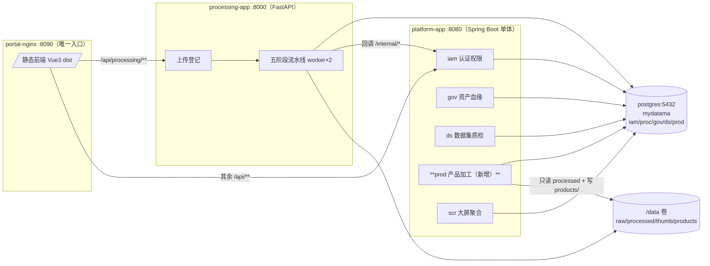
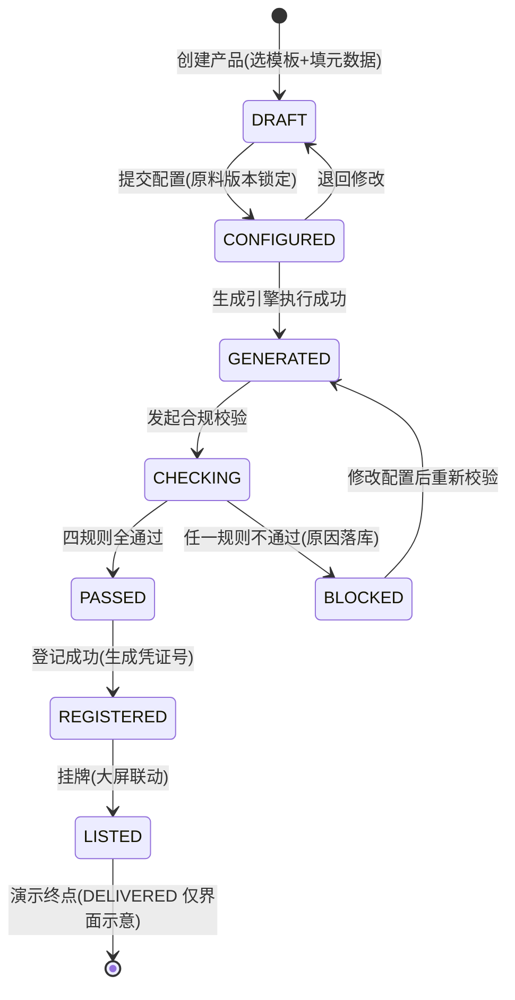
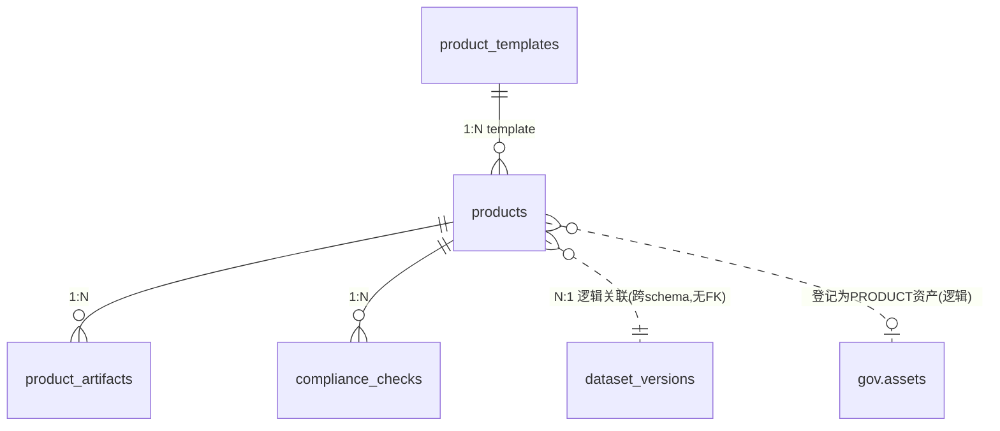

# SYS-007 MVP功能演示详细设计

> 版本：v1.0 ｜ 日期：2026-09-30
> 关联文档：05-MVP功能演示开发工作方案, SYS-001~006, MOD-COM-001, API-COM-001, DDL-IAM/PROC/GOV/DS-001

---

## 1. 概述

### 1.1 文档目的

本文档是 MVP 功能演示的**总集详细设计**，以《05-MVP功能演示开发工作方案》为输入，回答四个问题：

1. **演示什么**：15 步演示动线与功能点的逐项映射；
2. **怎么实现**：新增 PROD（数据产品加工生成）模块的功能设计、`prod` schema 完整 DDL、PROD API 规格、错误码、大屏产品板块扩展；
3. **交付什么**：前端页面清单、模拟数据方案、初始化脚本调整、部署调整；
4. **怎么算成**：演示完整性的验收 DoD 与保障措施。

本文档是对既有 SYS-001~006 体系的**范围增补**（不替代），凡与既有文档一致的部分仅引用不重复。SYS-007 定稿后即作为 S0~S6 编码开发的唯一功能基线。

### 1.2 读者对象

- 开发工程师：按 §3 详细设计实现 PROD 模块与全链路串联
- 演示负责人：按 §2.2 动线映射与 §3.11 演示保障彩排
- 评审人：按 §6 验收标准逐项打勾

### 1.3 术语与缩略语

| 术语 | 含义 |
|---|---|
| PROD | 数据产品加工生成模块（本期 MVP 新增核心） |
| 数据产品 | 以数据集版本为原料、按模板加工形成的可交易交付物（数据包/API服务/报告三形态） |
| 挂牌 | 产品在数据交易所（模拟）上架交易的登记动作 |
| 动线 | §2.2 定义的 15 步演示操作序列 |
| 三维质检 | 完整性/一致性/准确性三维质量评分（见 DDL-DS-001） |
| 密级 | 数据敏感等级 1公开/2内部/3秘密/4机密 |
| 说明书 | 面向交易所口径的产品说明文档（来源/规模/字段/质量/更新频率/交付方式） |

---

## 2. 设计目标与约束

### 2.1 功能目标

在 8GB 内存机器 `docker compose up -d` 一键启动后，浏览器完整走通 §2.2 的 15 步动线，覆盖六个模块：IAM（认证权限）→ PROC（五阶段治理）→ GOV（资产血缘热力）→ DS（数据集版本）→ **PROD（产品配置/生成/合规/挂牌，本期新增）** → SCR（大屏全程联动）。

### 2.2 演示动线与功能点映射

| # | 步骤 | 模块 | 功能点 | 关键接口/页面 | 演示看点 |
|---|---|---|---|---|---|
| 1 | admin 登录，大屏空态 | IAM/SCR | 登录 + JWT + 大屏骨架 | `/login` → `/screen` | 权限体系；大屏骨架 |
| 2 | 上传 `vehicle_gps_20260901.csv` | PROC | 结构化上传 + 入队 | `POST /api/processing/files` | 五阶段时间线逐格点亮 |
| 3 | 查看质检结果 | PROC | 质检规则 + 坏行隔离 | `GET /api/processing/files/{id}` | 漂移/重复/敏感列清单 |
| 4 | 一键修复 → 重跑对比 | PROC | 修复重入队 | `POST /api/processing/files/{id}/repair` | 质量闭环 |
| 5 | 上传 txt/图片/视频 | PROC | 多模态脱敏 | 同 #2 | EXIF 剥离、文本掩码、视频缩略图 |
| 6 | 资产目录检索 + 血缘图 | GOV | 自动盘点 + 血缘 | `/assets`、`GET /api/governance/assets/lineage/{id}` | raw→processed 自动入目录 |
| 7 | 热力图 + 质量规则页 | GOV | 域×日热力 | `GET /api/governance/assets/heatmap` | 治理运营视角 |
| 8 | 构建"驾驶行为样本集" v1 | DS | 数据集构建 + 三维质检 | `POST /api/dataset/datasets/{id}/versions` | 三维质检达标判定 |
| 9 | 追加 0902 数据生成 v2 并对比 | DS/PROC | 版本对比 | `GET /api/dataset/versions/{a}/compare/{b}` | 增删项与指标差异 |
| 10 | **产品配置**：以 v2 为原料建产品 | PROD | 模板选择 + 元数据 | `POST /api/product/products` | 模板选择与元数据填写 |
| 11 | **生成 + 合规校验通过** → 说明书预览 | PROD | 生成引擎 + 合规引擎 | `/generate`、`/compliance/run`、`/manual` | 产品诞生瞬间 |
| 12 | 导出产品包 zip + PDF 说明书 | PROD | 导出 | `GET /api/product/products/{id}/export` | 可交付物 |
| 13 | **反面演示**：密级倒挂 → 合规拦阻 | PROD | 合规规则 R1 拦阻 | 同 #11 | 合规内生，原因列表 |
| 14 | 登记挂牌，大屏产品板块跳动 | PROD/SCR | 登记 + 挂牌 + 大屏联动 | `/register`、`/listing`、`GET /api/screen/product` | 首尾呼应 |
| 15 | 审计页回放全程 | IAM | 审计检索 | `/audit` | 等保闭环 |

### 2.3 非功能目标

- core 档（4 容器）3 分钟内全部 healthy，稳态内存 ≤ 2.5GB（沿用 SYS-002 §2.1）
- 5 万行 CSV 全链路处理 < 60s（T01）
- 大屏聚合接口 P95 < 500ms，前端 10s 轮询
- 合规校验同步执行 < 2s（规则均为元数据级检查，不扫数据内容）
- 产品包导出（100 万行级以内）< 30s

### 2.4 技术约束

| 约束 | 来源 | 本文落实 |
|---|---|---|
| 4 容器 core 档，内存 core ≤ 2.5GB | SYS-002 | §3.10 仅调整 platform-app 挂载文件卷 |
| 单 PG16 库，schema iam/proc/gov/ds/prod | SYS-005 / 05§1.3 | §3.3 prod schema DDL；§3.10 init 脚本 |
| Java 不直连 proc 表；Python 不直连 gov/ds/prod | 01§8.2 | PROD 全部由 Java 实现（ADR-007-02） |
| 统一响应 `{code,message,data}`；错误码 6 位 MMMNNN | SYS-004 | §3.4、§3.5 |
| 模块间只走 api 子包接口 | MOD-COM-001 | PROD 通过 `module-dataset`/`module-governance` 的 api 包取数 |
| TRAJ 最低优先级，Label Studio 裁剪 | 05§1.2 | traj schema 建但无表依赖；LS 相关字段保留不启用 |

---

## 3. 详细设计

### 3.1 MVP 功能架构总览



与 SYS-001 架构的差异仅两点：① 新增 `module-product` Maven 模块；② platform-app 增挂 `/data` 卷（ADR-007-01）。其余容器、路由、内存预算不变。

### 3.2 PROD 数据产品加工生成模块设计

#### 3.2.1 职责边界

- ✅ 产品模板管理（三类内置模板 + 启停）
- ✅ 产品配置（选数据集版本为原料 + 填元数据 + 选模板）
- ✅ 生成引擎：数据包 zip / API 服务注册 / 报告 HTML→PDF 三形态
- ✅ 合规校验引擎（四规则，不合规即拦阻并给出原因）
- ✅ 说明书生成（交易所口径模板渲染，HTML 在线预览 + PDF）
- ✅ 导出（产品包 zip：数据 + README + 质量报告 + 说明书 PDF）
- ✅ 登记挂牌（模拟凭证号 + 状态推进至 LISTED，不对接真实交易所）
- ✅ 生成成功后向 gov 登记产品资产 + 写血缘边（dataset → product）
- ❌ 不负责文件五阶段处理（Python 侧职责）
- ❌ 不负责交易撮合/计费结算/真实交易所对接（演示到 LISTED 即止）
- ❌ 不直读 proc 表（原料均来自 ds.dataset_items 快照的 storage_ref）

#### 3.2.2 产品状态机



| 状态 | 含义 | 允许的操作 |
|---|---|---|
| DRAFT | 草稿，配置中 | 改配置 / 提交配置 / 删除 |
| CONFIGURED | 配置完成待生成 | 生成 / 退回修改 |
| GENERATED | 产品包已生成 | 发起合规 / 重新生成 |
| CHECKING | 合规校验中（同步，瞬时） | — |
| PASSED | 合规通过 | 登记 / 导出 |
| BLOCKED | 合规拦阻 | 查看原因 / 修改后重新校验 |
| REGISTERED | 已登记 | 挂牌 / 导出 |
| LISTED | 已挂牌 | 导出 / 大屏展示 |

#### 3.2.3 产品模板

三类内置模板（种子数据见 §3.10 07-seed）：

| form | 模板 code | 生成物 | 生成引擎行为 |
|---|---|---|---|
| DATA_PACKAGE | tpl-data-package-v1 | `product_{code}_v1.0.zip` | 逐资产复制 processed 文件 → 目录归并 → 附 README.txt + 质量报告.json + 说明书.pdf → zip |
| API_SERVICE | tpl-api-service-v1 | 注册开放路由 + 计量 Key | 在 `/openapi/v1/products/{code}/rows` 注册只读查询端点；创建 `iam.api_keys` 记录（scopes=`openapi:product:read`），Key 明文仅创建响应返回一次 |
| REPORT | tpl-report-v1 | 分析报告 HTML + PDF | 以数据集质量报告 + 资产指标为数据源，Jinja 风格占位符渲染 HTML → openhtmltopdf 出 PDF |

模板 `config_schema`（jsonb）声明该形态生成时需要的额外参数（如 DATA_PACKAGE 的 `includeReadme`、API_SERVICE 的 `rowLimit`、REPORT 的 `title`），前端按 schema 动态渲染表单。

#### 3.2.4 产品配置流程

1. 用户在 `/products/new` 选择模板 → 选择数据集 → 选择版本（前端下拉联动 `GET /api/dataset/datasets/{id}/versions`）；
2. 填写元数据：名称、产品编码（自动建议 `PRD-{YYYYMMDD}-{seq}` 可改、唯一）、分类、密级（默认=原料最大密级，可调高不可调低）、定价方式（按次/按月/买断 + 演示价格）、描述、更新频率、交付方式、来源说明（说明书四要素）；
3. 提交 → 后端校验：版本存在且未删除、产品编码唯一、密级 ≥ 原料最大密级（预检，正式拦阻在合规引擎）→ 状态 DRAFT→CONFIGURED，`products.manual_meta` 落库。

#### 3.2.5 生成引擎

`ProductGenerateService.generate(productId)`（同步执行，8GB 机器数据量内秒级完成）：

```
读取产品 + 原料版本 items(asset_snapshot.storage_ref)
  ├─ DATA_PACKAGE: 逐文件从 /data 读 processed 成品 → tmp 目录按 资产名 归位
  │   写 README.txt（产品名/来源/规模/密级/生成时间/交付方式）
  │   写 quality_report.json（原料版本 ds.quality_report 原样内嵌）
  │   渲染说明书 HTML → openhtmltopdf → manual.pdf
  │   zip 打包 → /data/products/{code}/product_{code}_v{ver}.zip
  │   写 product_artifacts(DATA_PACKAGE_ZIP / MANUAL_PDF / QUALITY_REPORT)
  ├─ API_SERVICE: api_keys INSERT（key_prefix+SHA256） + 返回 endpoint+明文Key 一次
  │   写 product_artifacts(API_KEY_REF, file_path 存 api_key_id)
  └─ REPORT: 渲染 report.html → report.pdf → /data/products/{code}/
      写 product_artifacts(REPORT_HTML / REPORT_PDF)
生成成功后（三形态统一）:
  → gov.assets 登记 PRODUCT 类型资产（storage_ref=zip/报告路径）
  → gov.lineage_edges 写 dataset_version → product（DERIVED_BY）
  → products.status=GENERATED
失败: status 保持 CONFIGURED，error 提示 600007
```

**关键实现约束**：Java 侧仅依赖 `module-dataset` 的 `DatasetApi#loadVersionDetail(versionId)` 与 `module-governance` 的 `GovernanceApi#registerProductAsset(...)`（api 子包接口），不跨模块直查 Mapper。

#### 3.2.6 合规校验引擎

`ComplianceEngine.check(productId)` 同步执行四规则，逐条写 `prod.compliance_checks`（同批 `batch_no`）：

| 规则 | rule_code | 检查逻辑 | 数据来源 |
|---|---|---|---|
| R1 密级合规 | SECRET_LEVEL | 原料版本内资产 `secret_level` 最大值 ≤ 产品 `secret_level` | ds.dataset_items.asset_snapshot |
| R2 敏感列脱敏 | SENSITIVE_MASKED | 原料全部结构化资产的敏感列均有 `mask_strategy` 且处理 meta `sensitiveColumnCount` 已处置 | gov.metadata_columns（经 GovernanceApi）+ snapshot |
| R3 质量达标 | QUALITY_THRESHOLD | 原料版本 `quality_report.overall_score ≥ 0.85`（阈值产品可配置，默认 0.85） | ds.dataset_versions.quality_report |
| R4 说明书完整 | MANUAL_COMPLETE | `manual_meta` 必填字段（来源/规模/字段说明/更新频率/交付方式）全部非空 | prod.products.manual_meta |

**判定与展示**：全部通过 → `PASSED`；任一失败 → `BLOCKED`，响应体携带失败项列表（rule_code + 原因文案），前端合规页红绿分项展示——即第 13 步"反面演示"的核心画面（故意选未脱敏原料 → R2 红 + R1 红并列展示）。

#### 3.2.7 说明书生成

交易所口径固定章节模板（HTML，`classpath:templates/manual-template.html`）：

```
一、产品基本信息（名称/编码/形态/版本/提供方/上架时间）
二、数据来源（原料数据集名称 + 版本 + 资产清单摘要）
三、数据规模（资产数/总行数/总字节/模态分布）
四、字段说明（结构化资产列名+类型+是否敏感+脱敏策略，来自 metadata_columns）
五、质量情况（三维得分 + overall_score + 达标结论，来自 quality_report）
六、更新频率（manual_meta.update_freq）
七、交付方式（manual_meta.delivery_mode + 形态对应说明）
八、合规声明（本次校验批次号 + 结论 + 凭证号占位）
```

数据全部由 `ManualAssembler` 从 api 子包聚合，无手工填写（manual_meta 四要素来自配置）。PDF 用 openhtmltopdf + 打包内嵌 Noto Sans SC 字体子集（纯 Java 无系统字体依赖，规避容器字体问题）。

#### 3.2.8 导出

`GET /api/product/products/{id}/export`（权限 `prod:product:export`，状态 ≥ PASSED）：
- DATA_PACKAGE：直接流式下载已生成的 zip；
- API_SERVICE：下载包含 endpoint/Key 使用说明/字段说明的对接包 zip；
- REPORT：下载报告 PDF。
响应头含 `Content-Disposition` 与 `X-Checksum-SHA256`。导出动作写审计（action=EXPORT）。

#### 3.2.9 登记挂牌

| 动作 | 接口 | 行为 |
|---|---|---|
| 登记 | `POST /{id}/register` | 校验 PASSED → 生成登记凭证号 `REG-{yyyyMMdd}-{6位随机}`（写 `products.reg_no`）→ 状态 REGISTERED → 审计 |
| 挂牌 | `POST /{id}/listing` | 校验 REGISTERED → 状态 LISTED → `listed_at` 落库 → 大屏产品板块立即计数变化（10s 轮询内可见）→ 审计 |

### 3.3 prod schema 数据库设计（完整 DDL）

> 补充 SYS-005 总体设计，第 6 个业务 schema。公共字段规范与全库一致（created_at/updated_at/create_by/update_by/deleted；无物理外键；部分唯一索引 WHERE deleted=0）。

#### 3.3.1 表清单

| 表名 | 中文名 | 用途 | 行量级 |
|---|---|---|---|
| prod.product_templates | 产品模板表 | 三形态模板定义与启停 | 十级 |
| prod.products | 产品实例表 | 产品主档 + 状态机 + 元数据 | 百级 |
| prod.product_artifacts | 产品产物表 | zip/PDF/HTML/APIKey 引用 | 百级 |
| prod.compliance_checks | 合规校验记录表 | 四规则逐条结果与拦阻原因 | 千级 |

#### 3.3.2 prod.product_templates

```sql
CREATE TABLE IF NOT EXISTS prod.product_templates (
    id            bigserial    PRIMARY KEY,
    code          varchar(64)  NOT NULL,
    name          varchar(128) NOT NULL,
    form          varchar(32)  NOT NULL,
    description   varchar(512),
    config_schema jsonb,
    version       varchar(32)  NOT NULL DEFAULT 'v1',
    builtin       smallint     NOT NULL DEFAULT 0,
    enabled       smallint     NOT NULL DEFAULT 1,
    created_at    timestamp    NOT NULL DEFAULT CURRENT_TIMESTAMP,
    updated_at    timestamp    NOT NULL DEFAULT CURRENT_TIMESTAMP,
    create_by     varchar(64),
    update_by     varchar(64),
    deleted       smallint     NOT NULL DEFAULT 0,
    CONSTRAINT chk_product_templates_form
        CHECK (form IN ('DATA_PACKAGE','API_SERVICE','REPORT'))
);

COMMENT ON TABLE  prod.product_templates        IS '产品模板表：数据包/API服务/报告三类';
COMMENT ON COLUMN prod.product_templates.code   IS '模板编码 唯一';
COMMENT ON COLUMN prod.product_templates.form   IS '模板形态 DATA_PACKAGE/API_SERVICE/REPORT';
COMMENT ON COLUMN prod.product_templates.config_schema IS '模板参数声明 jsonb 前端动态表单依据';

CREATE UNIQUE INDEX uk_product_templates_code
    ON prod.product_templates (code) WHERE deleted = 0;
```

#### 3.3.3 prod.products

```sql
CREATE TABLE IF NOT EXISTS prod.products (
    id                 bigserial     PRIMARY KEY,
    code               varchar(64)   NOT NULL,
    name               varchar(128)  NOT NULL,
    template_id        bigint        NOT NULL,
    form               varchar(32)   NOT NULL,
    dataset_id         bigint        NOT NULL,
    dataset_version_id bigint        NOT NULL,
    dataset_version_no integer       NOT NULL,
    secret_level       int           NOT NULL DEFAULT 1,
    category           varchar(64),
    pricing_model      varchar(32),
    price              numeric(12,2),
    description        varchar(512),
    provider           varchar(128)  NOT NULL DEFAULT 'mydatama',
    manual_meta        jsonb,
    config_params      jsonb,
    status             varchar(20)   NOT NULL DEFAULT 'DRAFT',
    reg_no             varchar(64),
    listed_at          timestamp,
    last_error         varchar(512),
    created_at         timestamp     NOT NULL DEFAULT CURRENT_TIMESTAMP,
    updated_at         timestamp     NOT NULL DEFAULT CURRENT_TIMESTAMP,
    create_by          varchar(64)   NOT NULL,
    update_by          varchar(64),
    deleted            smallint      NOT NULL DEFAULT 0,
    CONSTRAINT chk_products_form   CHECK (form IN ('DATA_PACKAGE','API_SERVICE','REPORT')),
    CONSTRAINT chk_products_status CHECK (status IN
        ('DRAFT','CONFIGURED','GENERATED','CHECKING','PASSED','BLOCKED','REGISTERED','LISTED','DELIVERED')),
    CONSTRAINT chk_products_pricing CHECK (pricing_model IS NULL OR
        pricing_model IN ('PER_CALL','PER_MONTH','ONE_TIME')),
    CONSTRAINT chk_products_secret CHECK (secret_level BETWEEN 1 AND 4)
);

COMMENT ON TABLE  prod.products                IS '产品实例表：状态机 DRAFT→CONFIGURED→GENERATED→CHECKING→PASSED/BLOCKED→REGISTERED→LISTED';
COMMENT ON COLUMN prod.products.code           IS '产品编码 唯一 建议 PRD-{日期}-{序号}';
COMMENT ON COLUMN prod.products.template_id    IS '模板ID 逻辑关联 prod.product_templates.id';
COMMENT ON COLUMN prod.products.form           IS '形态 冗余自模板 生成引擎分支依据';
COMMENT ON COLUMN prod.products.dataset_version_id IS '原料版本ID 逻辑关联 ds.dataset_versions.id';
COMMENT ON COLUMN prod.products.secret_level   IS '产品密级 1~4 必须≥原料最大密级(合规R1)';
COMMENT ON COLUMN prod.products.pricing_model  IS '定价方式 PER_CALL按次/PER_MONTH按月/ONE_TIME买断';
COMMENT ON COLUMN prod.products.manual_meta    IS '说明书四要素 jsonb: source_desc/field_desc/update_freq/delivery_mode';
COMMENT ON COLUMN prod.products.config_params  IS '模板参数 jsonb 按模板 config_schema 填写';
COMMENT ON COLUMN prod.products.status         IS '产品状态机';
COMMENT ON COLUMN prod.products.reg_no         IS '登记凭证号 REG-{yyyyMMdd}-{6位}';
COMMENT ON COLUMN prod.products.last_error     IS '最近一次生成/校验失败摘要';

CREATE UNIQUE INDEX uk_products_code
    ON prod.products (code) WHERE deleted = 0;
CREATE INDEX idx_products_status   ON prod.products (status)   WHERE deleted = 0;
CREATE INDEX idx_products_dataset  ON prod.products (dataset_id, dataset_version_id) WHERE deleted = 0;
CREATE INDEX idx_products_template ON prod.products (template_id) WHERE deleted = 0;
```

#### 3.3.4 prod.product_artifacts

```sql
CREATE TABLE IF NOT EXISTS prod.product_artifacts (
    id            bigserial     PRIMARY KEY,
    product_id    bigint        NOT NULL,
    artifact_type varchar(32)   NOT NULL,
    file_path     varchar(512),
    file_size     bigint        NOT NULL DEFAULT 0,
    checksum      varchar(64),
    ext           jsonb,
    created_at    timestamp     NOT NULL DEFAULT CURRENT_TIMESTAMP,
    updated_at    timestamp     NOT NULL DEFAULT CURRENT_TIMESTAMP,
    create_by     varchar(64)   NOT NULL,
    update_by     varchar(64),
    deleted       smallint      NOT NULL DEFAULT 0,
    CONSTRAINT chk_product_artifacts_type CHECK (artifact_type IN
        ('DATA_PACKAGE_ZIP','MANUAL_PDF','MANUAL_HTML','REPORT_HTML','REPORT_PDF','QUALITY_REPORT','API_KEY_REF'))
);

COMMENT ON TABLE  prod.product_artifacts             IS '产品产物表：zip/PDF/HTML/质量报告/APIKey引用';
COMMENT ON COLUMN prod.product_artifacts.artifact_type IS '产物类型';
COMMENT ON COLUMN prod.product_artifacts.file_path   IS '/data 卷相对路径 products/{code}/...；API_KEY_REF 时存 api_keys.id';
COMMENT ON COLUMN prod.product_artifacts.checksum    IS 'SHA-256 十六进制 64 字符';

CREATE INDEX idx_product_artifacts_product
    ON prod.product_artifacts (product_id) WHERE deleted = 0;
```

#### 3.3.5 prod.compliance_checks

```sql
CREATE TABLE IF NOT EXISTS prod.compliance_checks (
    id          bigserial    PRIMARY KEY,
    product_id  bigint       NOT NULL,
    batch_no    varchar(32)  NOT NULL,
    rule_code   varchar(32)  NOT NULL,
    rule_name   varchar(128) NOT NULL,
    passed      smallint     NOT NULL,
    detail      varchar(1024),
    run_at      timestamp    NOT NULL DEFAULT CURRENT_TIMESTAMP,
    create_by   varchar(64)  NOT NULL,
    created_at  timestamp    NOT NULL DEFAULT CURRENT_TIMESTAMP,
    CONSTRAINT chk_compliance_rule CHECK (rule_code IN
        ('SECRET_LEVEL','SENSITIVE_MASKED','QUALITY_THRESHOLD','MANUAL_COMPLETE'))
);

COMMENT ON TABLE  prod.compliance_checks            IS '合规校验记录表：四规则逐条结果 只追加';
COMMENT ON COLUMN prod.compliance_checks.batch_no   IS '校验批次号 同批四条一致 产品详情取最新批';
COMMENT ON COLUMN prod.compliance_checks.rule_code  IS '规则 SECRET_LEVEL/SENSITIVE_MASKED/QUALITY_THRESHOLD/MANUAL_COMPLETE';
COMMENT ON COLUMN prod.compliance_checks.passed     IS '结论 0=不通过 1=通过';
COMMENT ON COLUMN prod.compliance_checks.detail     IS '不通过原因文案(人可读)';

CREATE INDEX idx_compliance_product_batch
    ON prod.compliance_checks (product_id, batch_no, run_at DESC);
```

#### 3.3.6 ER 片图



### 3.4 PROD API 规格

> 基础路径 `/api/product`，JWT 认证，统一响应 `{code,message,data}`。完整接口级文档（API-PROD-001~003）随 P7 批次另行产出，此处为**实现基线**：路径/方法/权限码/请求响应骨架。

| # | 方法 | 路径 | 说明 | 权限码 |
|---|---|---|---|---|
| 1 | GET | /api/product/templates | 模板列表（enabled=1） | prod:template:read |
| 2 | POST | /api/product/products | 创建产品（DRAFT） | prod:product:write |
| 3 | GET | /api/product/products | 产品列表（分页，status/form/keyword 筛选） | prod:product:read |
| 4 | GET | /api/product/products/{id} | 产品详情（含最新合规结果 + 产物清单） | prod:product:read |
| 5 | PUT | /api/product/products/{id} | 更新配置（仅 DRAFT/BLOCKED） | prod:product:write |
| 6 | POST | /api/product/products/{id}/configure | 提交配置 → CONFIGURED | prod:product:write |
| 7 | POST | /api/product/products/{id}/generate | 执行生成引擎 → GENERATED | prod:product:generate |
| 8 | POST | /api/product/products/{id}/compliance/run | 执行合规校验 → PASSED/BLOCKED | prod:compliance:run |
| 9 | GET | /api/product/products/{id}/compliance | 最新批次合规明细 | prod:compliance:read |
| 10 | POST | /api/product/products/{id}/register | 登记 → REGISTERED（生成 reg_no） | prod:product:register |
| 11 | POST | /api/product/products/{id}/listing | 挂牌 → LISTED | prod:product:listing |
| 12 | GET | /api/product/products/{id}/export | 导出交付物（zip/pdf） | prod:product:export |
| 13 | GET | /api/product/products/{id}/manual | 说明书 HTML 在线预览 | prod:product:read |
| 14 | GET | /api/screen/product | 大屏产品板块聚合 | scr:screen:view |

**核心请求/响应骨架**：

```jsonc
// POST /api/product/products  请求体
{
  "templateId": 1,
  "name": "货运驾驶行为精算样本集",
  "code": "PRD-20260930-001",
  "datasetId": 1,
  "datasetVersionId": 2,
  "secretLevel": 2,
  "category": "交通物流",
  "pricingModel": "PER_MONTH",
  "price": 1999.00,
  "description": "基于五阶段治理后的北斗货运驾驶行为数据",
  "manualMeta": {
    "sourceDesc": "来源：mydatama 治理链路 驾驶行为样本集 v2",
    "fieldDesc": "含车牌(脱敏)/经纬度/速度/方向/事件码等 18 字段",
    "updateFreq": "MONTHLY",
    "deliveryMode": "数据包/API/报告"
  },
  "configParams": { "includeReadme": true }
}
// 成功响应 data: { "id": 101, "status": "DRAFT" }

// POST .../compliance/run  响应 data（BLOCKED 场景，演示第13步画面）
{
  "batchNo": "BC20260930AB12CD34",
  "status": "BLOCKED",
  "items": [
    { "ruleCode": "SECRET_LEVEL",      "passed": false, "detail": "原料最大密级 3(秘密) 高于产品密级 2(内部)" },
    { "ruleCode": "SENSITIVE_MASKED",  "passed": false, "detail": "资产 driver_raw.csv 存在未脱敏敏感列: phone, id_card" },
    { "ruleCode": "QUALITY_THRESHOLD", "passed": true,  "detail": "质量分 0.91 ≥ 阈值 0.85" },
    { "ruleCode": "MANUAL_COMPLETE",   "passed": true,  "detail": "说明书要素完整" }
  ]
}

// GET /api/screen/product  响应 data
{
  "totalProducts": 4, "listedProducts": 3, "blockedProducts": 1,
  "compliancePassRate": 75.0,
  "formDistribution": [{ "form": "DATA_PACKAGE", "count": 2 }, { "form": "API_SERVICE", "count": 1 }, { "form": "REPORT", "count": 1 }],
  "latest": [{ "code": "PRD-20260930-001", "name": "货运驾驶行为精算样本集", "status": "LISTED", "listedAt": "2026-09-30 15:20:00" }]
}
```

**新增权限点（并入 07-seed-data.sql）**：

| 权限码 | 说明 | admin | operator | viewer |
|---|---|---|---|---|
| prod:template:read | 查询产品模板 | ✓ | ✓ | — |
| prod:product:read | 查询产品 | ✓ | ✓ | — |
| prod:product:write | 创建/配置产品 | ✓ | ✓ | — |
| prod:product:generate | 执行生成 | ✓ | ✓ | — |
| prod:compliance:read | 查询合规结果 | ✓ | ✓ | — |
| prod:compliance:run | 执行合规校验 | ✓ | ✓ | — |
| prod:product:register | 产品登记 | ✓ | ✓ | — |
| prod:product:listing | 产品挂牌 | ✓ | — | — |
| prod:product:export | 导出交付物 | ✓ | ✓ | — |

### 3.5 PROD 错误码（600xxx）

衔接 SYS-004 六位编码（MMM=600）：

| code | HTTP | message | 场景 |
|---|---|---|---|
| 600001 | 404 | 产品不存在 | 详情/操作不命中 |
| 600002 | 400 | 当前状态不允许该操作 | 状态机非法转移（如 DRAFT 直接 generate） |
| 600003 | 409 | 产品编码已存在 | uk_products_code 冲突 |
| 600004 | 404 | 原料数据集版本不存在 | dataset_version_id 无效或已删 |
| 600005 | 404 | 模板不存在或已停用 | template_id 无效 |
| 600006 | 400 | 配置不完整，无法生成 | manual_meta 必填缺失 |
| 600007 | 500 | 产品生成失败 | 打包/文件读失败，last_error 落详情 |
| 600008 | 400 | 产品密级不能低于原料密级 | 配置提交预检（合规 R1 前置） |
| 600009 | 400 | 未通过合规校验，禁止登记/挂牌 | register/listing 前置校验 |
| 600010 | 409 | 产品已挂牌，禁止修改 | LISTED 状态写操作 |
| 600011 | 404 | 交付物文件不存在 | export 时 artifact 缺失 |
| 600012 | 500 | 计量 Key 签发失败 | API_SERVICE 生成时 api_keys 写入异常 |
| 600099 | 500 | 产品服务内部异常 | PROD 模块兜底 |

### 3.6 SCR 大屏产品板块扩展

现有四聚合接口（overview/trend/distribution/ops）不变，**新增第五聚合** `GET /api/screen/product`（骨架见 §3.4 #14）：

- 指标卡：产品总数、已挂牌数、合规通过率（PASSED/(PASSED+BLOCKED)）、最近挂牌时间
- 分布图：三形态占比（环形图）
- 滚动列表：最近 5 条产品状态（code/name/status/listedAt，LISTED 高亮）

大屏布局在右下新增"数据产品"板块（ECharts ring + list），10s 轮询与既有板块共用轮询器；第 14 步挂牌后 10s 内数字跳动。空态（动线第 1 步）显示"暂无产品，待加工"占位。

### 3.7 前端页面清单

Vue3 + Vite + TS + Element Plus + Pinia + ECharts，路由与权限码绑定：

| 路由 | 页面 | 关键组件/交互 | 权限 |
|---|---|---|---|
| /login | 登录页 | 三账号快捷填充（admin/operator/viewer） | 公开 |
| / | 工作台 | 待办统计 + 快捷入口 + 演示环节面包屑 | 登录 |
| /processing | 数据处理 | 上传拖拽区 + 任务表 + **五阶段时间线组件**（3s 轮询）+ 质检结果抽屉 + 一键修复 | proc:file:read |
| /assets | 资产目录 | 检索/筛选表 + 详情抽屉（结构/指标） | gov:asset:read |
| /assets/lineage/:id | 血缘图 | ECharts graph 有向图，raw→processed→dataset→product | gov:lineage:read |
| /assets/heatmap | 热力图 | ECharts heatmap 域×日 | gov:asset:read |
| /datasets | 数据集列表 | 构建向导（筛选条件表单） | ds:dataset:read |
| /datasets/:id | 版本管理 | 版本时间线 + 生成新版本 + 对比选择 | ds:dataset:read |
| /datasets/:id/report/:ver | 质量报告 | 三维雷达图 + 得分卡 + 建议 | ds:dataset:read |
| /products | 产品列表 | 状态机标签色（BLOCKED 红/PASSED 绿/LISTED 金） | prod:product:read |
| /products/new | 产品配置 | 模板卡片单选 + 数据集/版本级联 + 元数据表单 | prod:product:write |
| /products/:id | 产品详情 | 状态步骤条 + 合规四规则红绿列表 + 说明书预览 iframe + 导出/登记/挂牌按钮 | prod:product:read |
| /screen | 大屏 | 五板块（总览/趋势/分布/产品/运维流） | scr:screen:view |
| /iam/users /iam/roles /iam/policies | 权限管理 | 用户/角色/ABAC 策略 CRUD | iam:* |
| /audit | 审计日志 | 多条件检索 + 详情 | iam:audit:read |

### 3.8 模拟数据方案

对齐 05§2，`samples/generator/generate_all.py`（faker + `random.seed(20260930)` 固定种子，可重复生成）：

| 文件 | 模态 | 规模 | 异常注入点（"考题"） |
|---|---|---|---|
| vehicle_gps_20260901.csv | 结构化 | 5 万行 | 手机号/身份证敏感列；2% 缺失；1% 重复；漂移点 50；乱序 20 |
| vehicle_gps_20260902.csv | 结构化 | 5 万行 | 同上，列名顺序不同 + GBK 编码 |
| fleet_info.xlsx | 结构化 | 2 千行 | 多 sheet；车牌格式不一；空行；银行卡列 |
| driver_events.json | 结构化 | 1 万条 | 嵌套 JSON；厂商私有码与国标码混用 |
| driver_notes.txt | 文本 | 500 段 | 手机号/邮箱明文 |
| vehicle_photos.zip | 图像 20 张 | ~40MB | EXIF/GPS |
| dashcam_clips.zip | 视频 5 段 | ~100MB | mp4/mov 混合；元数据标签 |

- 字段语义对齐 JT/T 808-2019（车牌/经纬度/速度/方向/报警标志/ADAS/DSM 事件码）；
- `samples/README.md` 给出每个文件的"考题与答案"对照表（异常点 → 预期治理结果）；
- 反面演示专用：`unmasked_sample.csv`（含 phone/id_card 原文列，密级 3），上传后**不做脱敏修复**直接建产品 → 合规 R1+R2 拦阻（第 13 步）；
- 视频生成采用极小分辨率（320x240、3~5 秒）压码率，确保 zip 总量 ~100MB 且 ffmpeg 秒级处理。

### 3.9 各模块 MVP 实现要点（裁剪说明）

| 模块 | MVP 实现 | 明确裁剪 |
|---|---|---|
| IAM | 登录/刷新、用户/角色/权限页、ABAC 引擎（all/any/not + eq/neq/gt/gte/lt/lte/in/dept_eq）、审计过滤器+查询页、JWT HS256 双端验签 | API Key 管理页、会话管理页（api_keys 表保留给 API_SERVICE 产品使用） |
| PROC | 上传、PG 队列 SKIP LOCKED、五阶段流水线、四模态处理器、脱敏引擎（掩码/哈希/置空，列名+内容双识别）、质检规则+坏行隔离+一键修复、任务 3s 轮询 | Label Studio 集成（字段保留）、断点续传页（崩溃恢复自动机制保留） |
| GOV | internal/assets/register、目录检索（pg_trgm）、血缘递归 CTE、热力图、标准管理页 | 外部 JDBC 采集 |
| DS | 数据集构建、版本快照、三维质检、版本对比 | 数据集发布审批流 |
| PROD | §3.2 全部 | 真实交易所对接、计费结算 |
| SCR | 五聚合接口 + 大屏页 | 大屏主题切换 |

### 3.10 部署与初始化脚本调整

对 SYS-002 §3.7 init 脚本序表的**权威修订**（以本文为准）：

| 顺序 | 文件 | 内容 |
|---|---|---|
| 01 | 01-create-schemas.sql | 五 schema：iam/proc/gov/ds/**prod**（traj 建空 schema 预留）+ pg_trgm 扩展 |
| 02 | 02-iam-tables.sql | DDL-IAM-001 八张表 |
| 03 | 03-proc-tables.sql | DDL-PROC-001 三张表 |
| 04 | 04-gov-tables.sql | DDL-GOV-001 九张表 |
| 05 | 05-ds-tables.sql | DDL-DS-001 三张表 |
| 06 | 06-prod-tables.sql | **SYS-007 §3.3 四张表** |
| 07 | 07-seed-data.sql | 三角色 + 25+9 权限点（含 §3.4 PROD 九项）+ 三用户 + 3 ABAC 策略 + 5 数据标准 + 5 质量规则 + **3 条产品模板** |

Compose 调整（ADR-007-01）：platform-app 增加 `mydatama-data:/data` 挂载（读写，仅写 `/data/products/` 子目录）。portal.conf 路由不变：`/api/processing/**`→Python、其余 `/api/**` 与 `/openapi/**`→Java、`/internal/**` 不对外。

种子用户口令：admin/Admin@123、operator/Operator@123、viewer/Viewer@123（BCrypt cost=10，哈希值在脚本中写死预生成值）。

### 3.11 演示保障

- **预检脚本** `scripts/smoke-test.sh`：覆盖 T01~T10（05§7.1），登录→上传→轮询至 READY→资产检索→建数据集→建产品→合规→挂牌→大屏断言→审计断言，全绿即演示就绪；
- **还原快照**：`docker compose down -v` 后重启即空态；另备"动线进行到第 9 步"的 pg_dump + /data 卷 tar 快照一套，用于中途故障快速续演；
- **意外话术**：断网（演示本机运行无影响）/容器重启（SKIP LOCKED 队列任务不丢，自动续跑，即 T05 亮点）/误操作（口述跳过或还原快照）；
- **演示细节**：admin 自动登录书签；大屏 F11 全屏说明卡；每页右上角"当前环节"面包屑常驻。

---

## 4. 与其他模块/文档的关系

| 关联模块 | 关系类型 | 关联文档 | 说明 |
|---|---|---|---|
| 系统总体/部署/安全/异常/数据模型/流程 | 上游基线 | SYS-001~006 | 本文仅做范围增补，不改变既有约束 |
| 公共基础 | 依赖 | MOD-COM-001, API-COM-001 | PROD 复用 Result/异常/JWT/RBAC/审计；内部接口不变 |
| IAM/PROC/GOV/DS | 依赖 | DDL-IAM/PROC/GOV/DS-001 | init SQL 照抄其 DDL；PROD 经 api 子包消费 |
| PROD 模块细化 | 下游展开 | MOD-PROD-001, API-PROD-001~003, UC-PROD-001~006（待编写） | 以本文 §3.2~3.5 为基线展开 |
| MVP 方案 | 上游输入 | 05-MVP功能演示开发工作方案 | 本文是其工程化落地设计 |
| 部署文档 | 下游执行 | 02-部署文档与演示指南 | init 序表以本文 §3.10 为准 |

---

## 5. 设计决策记录

| 决策编号 | 决策内容 | 理由 |
|---|---|---|
| ADR-007-01 | platform-app 挂载 /data 卷（读写） | 产品打包需读 processed 文件；单机单卷无并发冲突，比跨服务代理文件简单可靠 |
| ADR-007-02 | 产品打包/说明书/合规全部在 Java 侧实现，Python 仅做文件五阶段处理 | 避免跨服务打包与二次回调；合规规则数据源（ds/gov 元数据）Java 直接可达 |
| ADR-007-03 | 合规校验同步执行 | 四规则均为元数据级检查（不扫数据内容），秒级完成，同步可省任务状态机复杂度 |
| ADR-007-04 | 说明书 PDF 用 openhtmltopdf + 内嵌 Noto Sans SC 字体 | 纯 Java 无系统字体依赖，规避容器字体问题；若字体过大可降级 HTML 预览（05 已有降级预案） |
| ADR-007-05 | 登记挂牌仅状态机 + 凭证号，不对接真实交易所 | 05§S5 明确"演示到 LISTED 即止"；保留 reg_no 字段与审计即可支撑故事完整性 |
| ADR-007-06 | API_SERVICE 产品复用 iam.api_keys 表签发计量 Key | 一套 Key 体系两用（开放 API 与产品计量），避免新增表；scopes 限定 openapi:product:read |
| ADR-007-07 | 产品生成后登记 gov.assets（asset_type=PRODUCT）+ 血缘边 | 实现 05 动线第 6 步"血缘 raw→processed→dataset→product"完整闭环 |
| ADR-007-08 | traj schema 预留建空、不建表 | DDL-TRAJ-001 保留文档但不落地，省内存与维护面；后续 S7 兜底时直接补表 |
| ADR-007-09 | SYS-007 作为 S0~S6 编码功能基线，替代按 P1~P7 分批的文档等待 | MVP 时间盒紧（05§6 倒排），一份总集设计 + 既有 19 份定稿文档足以支撑编码一致性 |

---

## 6. 验收标准

**演示完整性（DoD）**
- [ ] `docker compose up -d` 一键启动，4 容器 3 分钟内全部 healthy，`docker stats` core 稳态 ≤ 2.5GB
- [ ] §2.2 的 15 步动线全部走通且每步"演示看点"成立
- [ ] 第 11 步：DATA_PACKAGE/API_SERVICE/REPORT 三形态产品各生成成功 1 个
- [ ] 第 13 步反面演示：密级倒挂 + 未脱敏原料产品被拦阻，原因列表准确（R1/R2 红）
- [ ] 第 14 步：挂牌后大屏产品板块 10s 内数字变化
- [ ] T01~T10 冒烟用例（05§7.1）全部通过 `scripts/smoke-test.sh`

**PROD 模块**
- [ ] prod schema 四表与 §3.3 DDL 一致，CHECK 约束生效
- [ ] 产品状态机非法转移被拒（600002），编码重复 409（600003）
- [ ] 合规四规则逐条落库 compliance_checks，同批 batch_no 一致
- [ ] 导出 zip 内含：数据文件 + README.txt + quality_report.json + 说明书 PDF
- [ ] API_SERVICE 产品生成后可用返回的 Key 调通 `/openapi/v1/products/{code}/rows`
- [ ] 产品生成后 gov.assets 出现 PRODUCT 资产且血缘图可查 dataset→product 边

**全链路一致性**
- [ ] 全部接口响应符合 `{code,message,data}`，PROD 错误码命中 §3.5
- [ ] PROD 九个权限点：viewer 访问产品页返回 403；operator 可挂牌之外全部操作
- [ ] 全程操作（含 Python 上传与产品导出）在审计页可回放

---

## 7. 修订记录

| 版本 | 日期 | 修订人 | 修订内容 |
|---|---|---|---|
| v1.0 | 2026-09-30 | system | 初版：MVP 演示总集设计——动线映射、PROD 模块设计、prod schema DDL、PROD API/错误码、大屏扩展、页面清单、模拟数据、init 脚本修订、演示保障与 DoD |
